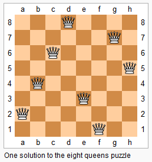

# [51. N 皇后](https://leetcode-cn.com/problems/n-queens)

[English Version](/solution/0000-0099/0051.N-Queens/README_EN.md)

## 题目描述

<!-- 这里写题目描述 -->
<p><em>n&nbsp;</em>皇后问题研究的是如何将 <em>n</em>&nbsp;个皇后放置在 <em>n</em>&times;<em>n</em> 的棋盘上，并且使皇后彼此之间不能相互攻击。</p>



<p><small>上图为 8 皇后问题的一种解法。</small></p>

<p>给定一个整数 <em>n</em>，返回所有不同的&nbsp;<em>n&nbsp;</em>皇后问题的解决方案。</p>

<p>每一种解法包含一个明确的&nbsp;<em>n</em> 皇后问题的棋子放置方案，该方案中 <code>&#39;Q&#39;</code> 和 <code>&#39;.&#39;</code> 分别代表了皇后和空位。</p>

<p><strong>示例:</strong></p>

<pre><strong>输入:</strong> 4
<strong>输出:</strong> [
 [&quot;.Q..&quot;,  // 解法 1
  &quot;...Q&quot;,
  &quot;Q...&quot;,
  &quot;..Q.&quot;],

 [&quot;..Q.&quot;,  // 解法 2
  &quot;Q...&quot;,
  &quot;...Q&quot;,
  &quot;.Q..&quot;]
]
<strong>解释:</strong> 4 皇后问题存在两个不同的解法。
</pre>

## 解法

<!-- 这里可写通用的实现逻辑 -->

<!-- tabs:start -->

### **Python3**

<!-- 这里可写当前语言的特殊实现逻辑 -->

```python

```

### **Java**

<!-- 这里可写当前语言的特殊实现逻辑 -->

```java
class Solution {
    private List<List<String>> solutions;
    private char[][] nQueens;
    private boolean[] colUsed;
    private boolean[] diagonals45Used;
    private boolean[] diagonals135Used;
    private int n;

    public List<List<String>> solveNQueens(int n) {
        solutions = new ArrayList<>();
        nQueens = new char[n][n];
        for (int i = 0; i < n; i++) Arrays.fill(nQueens[i], '.');
        colUsed = new boolean[n];
        diagonals45Used = new boolean[(2 * n) - 1];
        diagonals135Used = new boolean[(2 * n) - 1];
        this.n = n;
        backtracking(0);
        return solutions;
    }

    private void backtracking(int row) {
        if (row == n) {
            List<String> list = new ArrayList<>();
            for (char[] chars : nQueens) list.add(new String(chars));
            solutions.add(list);
            return;
        }
        for (int col = 0; col < n; col++) {
            int diagonals45Idx = row + col;
            int diagonals135Idx = n - 1 - (row - col);
            if (colUsed[col] || diagonals45Used[diagonals45Idx] || diagonals135Used[diagonals135Idx]) continue;
            nQueens[row][col] = 'Q';
            colUsed[col] = diagonals45Used[diagonals45Idx] = diagonals135Used[diagonals135Idx] = true;
            backtracking(row + 1);
            colUsed[col] = diagonals45Used[diagonals45Idx] = diagonals135Used[diagonals135Idx] = false;
            nQueens[row][col] = '.';
        }
    }
}
```

### **...**

```

```

<!-- tabs:end -->
