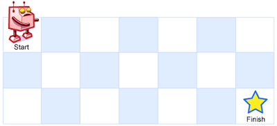

# [63. Unique Paths II](https://leetcode.com/problems/unique-paths-ii)

[中文文档](/solution/0000-0099/0063.Unique%20Paths%20II/README.md)

## Description

<p>A robot is located at the top-left corner of a <em>m</em> x <em>n</em> grid (marked &#39;Start&#39; in the diagram below).</p>

<p>The robot can only move either down or right at any point in time. The robot is trying to reach the bottom-right corner of the grid (marked &#39;Finish&#39; in the diagram below).</p>

<p>Now consider if some obstacles are added to the grids. How many unique paths would there be?</p>



<p>An obstacle and empty space is marked as <code>1</code> and <code>0</code> respectively in the grid.</p>

<p><strong>Note:</strong> <em>m</em> and <em>n</em> will be at most 100.</p>

<p><strong>Example 1:</strong></p>

<pre>

<strong>Input:

</strong>[

&nbsp; [0,0,0],

&nbsp; [0,1,0],

&nbsp; [0,0,0]

]

<strong>Output:</strong> 2

<strong>Explanation:</strong>

There is one obstacle in the middle of the 3x3 grid above.

There are two ways to reach the bottom-right corner:

1. Right -&gt; Right -&gt; Down -&gt; Down

2. Down -&gt; Down -&gt; Right -&gt; Right

</pre>

## Solutions

### **Go**

```go
func uniquePathsWithObstacles(obstacleGrid [][]int) int {
    m,n := len(obstacleGrid),len(obstacleGrid[0])
    dp := make([][]int,m)
    for i:=0; i < m;i++ {
        dp[i] = make([]int,n)
    }
    for i := 0; i < m; i++ {
        for j := 0; j < n; j++ {
            if obstacleGrid[i][j] == 0 {
                if i == 0 && j == 0 {
                    dp[i][j] = 1
                } else if i > 0 && j >0 {
                    dp[i][j] = dp[i][j-1]+dp[i-1][j]
                } else if i > 0 {
                    dp[i][j] = dp[i-1][j]
                } else {
                    dp[i][j] = dp[i][j-1]
                }
            }
        }
    }
    return dp[m-1][n-1]
}
```

<!-- tabs:start -->

### **Python3**

```python

```

### **Java**

```java

```

### **...**

```

```

<!-- tabs:end -->
