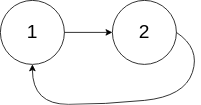

# [142. Linked List Cycle II](https://leetcode.com/problems/linked-list-cycle-ii)

[中文文档](/solution/0100-0199/0142.Linked%20List%20Cycle%20II/README.md)

## Description

<p>Given a linked list, return the node where the cycle begins. If there is no cycle, return <code>null</code>.</p>

<p>To represent a cycle in the given linked list, we use an integer <code>pos</code> which represents the position (0-indexed)&nbsp;in the linked list where tail connects to. If <code>pos</code> is <code>-1</code>, then there is no cycle in the linked list.</p>

<p><b>Note:</b> Do not modify the linked list.</p>

<p>&nbsp;</p>

<p><strong>Example 1:</strong></p>

<pre>
<strong>Input: </strong>head = [3,2,0,-4], pos = 1
<strong>Output: </strong>tail connects to node index 1
<strong>Explanation:</strong> There is a cycle in the linked list, where tail connects to the second node.
</pre>


<p><strong>Example 2:</strong></p>

<pre>
<strong>Input: </strong>head = [1,2], pos = 0
<strong>Output: </strong>tail connects to node index 0
<strong>Explanation:</strong> There is a cycle in the linked list, where tail connects to the first node.
</pre>



<p><strong>Example 3:</strong></p>

<pre>
<strong>Input: </strong>head = [1], pos = -1
<strong>Output: </strong>no cycle
<strong>Explanation:</strong> There is no cycle in the linked list.
</pre>


<p>&nbsp;</p>

<p><b>Follow-up</b>:<br />
Can you solve it without using extra space?</p>

## Solutions

<!-- tabs:start -->

### **Python3**

```python
# Definition for singly-linked list.
# class ListNode:
#     def __init__(self, x):
#         self.val = x
#         self.next = None

class Solution:
    def detectCycle(self, head: ListNode) -> ListNode:
        slow = fast = head
        has_cycle = False
        while fast and fast.next:
            slow, fast = slow.next, fast.next.next
            if slow == fast:
                has_cycle = True
                break
        if not has_cycle:
            return None
        p = head
        while p != slow:
            p, slow = p.next, slow.next
        return p
```

### **Java**

```java
/**
 * Definition for singly-linked list.
 * class ListNode {
 *     int val;
 *     ListNode next;
 *     ListNode(int x) {
 *         val = x;
 *         next = null;
 *     }
 * }
 */
import java.util.*;

public class Solution {
    public ListNode detectCycle(ListNode head) {
        ListNode slow = head, fast = head;
        boolean hasCycle = false;
        while (fast != null && fast.next != null) {
            slow = slow.next;
            fast = fast.next.next;
            if (slow == fast) {
                hasCycle = true;
                break;
            }
        }
        if (!hasCycle) {
            return null;
        }
        ListNode p = head;
        while (p != slow) {
            p = p.next;
            slow = slow.next;
        }
        return p;
    }
}
```

### **...**

```

```

<!-- tabs:end -->
