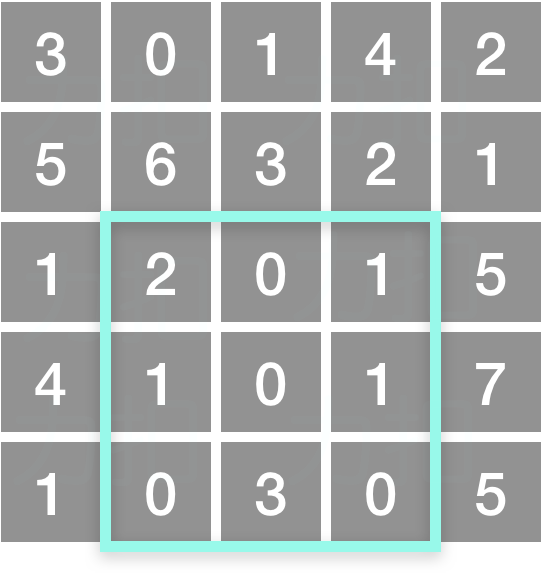

# [304. 二维区域和检索 - 矩阵不可变](https://leetcode-cn.com/problems/range-sum-query-2d-immutable)

[English Version](/solution/0300-0399/0304.Range%20Sum%20Query%202D%20-%20Immutable/README_EN.md)

## 题目描述

<!-- 这里写题目描述 -->
<p>给定一个二维矩阵，计算其子矩形范围内元素的总和，该子矩阵的左上角为 (<em>row</em>1,&nbsp;<em>col</em>1) ，右下角为 (<em>row</em>2,&nbsp;<em>col</em>2)。</p>



<small>上图子矩阵左上角&nbsp;(row1, col1) = <strong>(2, 1)</strong>&nbsp;，右下角(row2, col2) = <strong>(4, 3)，</strong>该子矩形内元素的总和为 8。</small></p>

<p><strong>示例:</strong></p>

<pre>给定 matrix = [
  [3, 0, 1, 4, 2],
  [5, 6, 3, 2, 1],
  [1, 2, 0, 1, 5],
  [4, 1, 0, 1, 7],
  [1, 0, 3, 0, 5]
]

sumRegion(2, 1, 4, 3) -&gt; 8
sumRegion(1, 1, 2, 2) -&gt; 11
sumRegion(1, 2, 2, 4) -&gt; 12
</pre>

<p><strong>说明:</strong></p>

<ol>
	<li>你可以假设矩阵不可变。</li>
	<li>会多次调用&nbsp;<em>sumRegion&nbsp;</em>方法<em>。</em></li>
	<li>你可以假设&nbsp;<em>row</em>1 &le; <em>row</em>2 且&nbsp;<em>col</em>1 &le; <em>col</em>2。</li>
</ol>

## 解法

<!-- 这里可写通用的实现逻辑 -->

<!-- tabs:start -->

### **Python3**

<!-- 这里可写当前语言的特殊实现逻辑 -->

```python

```

### **Java**

<!-- 这里可写当前语言的特殊实现逻辑 -->

```java
public class NumMatrix {

	public long[][] sumMatrix;

	public NumMatrix(int[][] matrix) {

		if (matrix == null || matrix.length == 0) {
			return;
		}

		sumMatrix = new long[matrix.length + 1][matrix[0].length + 1];

		for (int i = 0; i < matrix.length; i++) {
			for (int j = 0; j < matrix[0].length; j++) {
				sumMatrix[i][j + 1] = sumMatrix[i][j] + matrix[i][j];
			}
		}
	}

	public int sumRegion(int row1, int col1, int row2, int col2) {

		if (sumMatrix == null || row1 < 0 || row2 < 0 || col1 < 0
				|| col2 < 0 || row1 >= sumMatrix.length - 1
				|| row2 >= sumMatrix.length - 1
				|| col1 >= sumMatrix[0].length - 1
				|| col2 >= sumMatrix[0].length - 1 || row1 > row2
				|| col1 > col2) {
			return Integer.MIN_VALUE;
		}

		long rt = 0;

		for (int i = row1; i <= row2; i++) {
			rt += sumMatrix[i][col2 + 1] - sumMatrix[i][col1];
		}

		return (int) rt;
	}

}


// Your NumMatrix object will be instantiated and called as such:
// NumMatrix numMatrix = new NumMatrix(matrix);
// numMatrix.sumRegion(0, 1, 2, 3);
// numMatrix.sumRegion(1, 2, 3, 4);
```

### **...**

```

```

<!-- tabs:end -->
