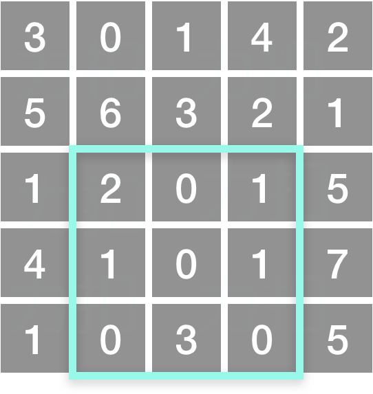

# [304. Range Sum Query 2D - Immutable](https://leetcode.com/problems/range-sum-query-2d-immutable)

[中文文档](/solution/0300-0399/0304.Range%20Sum%20Query%202D%20-%20Immutable/README.md)

## Description

<p>Given a 2D matrix <i>matrix</i>, find the sum of the elements inside the rectangle defined by its upper left corner (<i>row</i>1, <i>col</i>1) and lower right corner (<i>row</i>2, <i>col</i>2).</p>

<p>



<small>The above rectangle (with the red border) is defined by (row1, col1) = <b>(2, 1)</b> and (row2, col2) = <b>(4, 3)</b>, which contains sum = <b>8</b>.</small>

</p>

<p><b>Example:</b><br>

<pre>

Given matrix = [

  [3, 0, 1, 4, 2],

  [5, 6, 3, 2, 1],

  [1, 2, 0, 1, 5],

  [4, 1, 0, 1, 7],

  [1, 0, 3, 0, 5]

]


sumRegion(2, 1, 4, 3) -> 8

sumRegion(1, 1, 2, 2) -> 11

sumRegion(1, 2, 2, 4) -> 12

</pre>

</p>

<p><b>Note:</b><br>

<ol>

<li>You may assume that the matrix does not change.</li>

<li>There are many calls to <i>sumRegion</i> function.</li>

<li>You may assume that <i>row</i>1 &le; <i>row</i>2 and <i>col</i>1 &le; <i>col</i>2.</li>

</ol>

</p>

## Solutions

<!-- tabs:start -->

### **Python3**

```python

```

### **Java**

```java

```

### **...**

```

```

<!-- tabs:end -->
