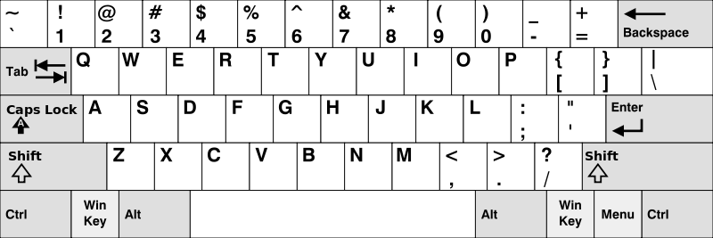

# [500. 键盘行](https://leetcode-cn.com/problems/keyboard-row)

[English Version](/solution/0500-0599/0500.Keyboard%20Row/README_EN.md)

## 题目描述

<!-- 这里写题目描述 -->
<p>给定一个单词列表，只返回可以使用在键盘同一行的字母打印出来的单词。键盘如下图所示。</p>

<p>&nbsp;</p>



<p>&nbsp;</p>

<p><strong>示例：</strong></p>

<pre><strong>输入:</strong> [&quot;Hello&quot;, &quot;Alaska&quot;, &quot;Dad&quot;, &quot;Peace&quot;]

<strong>输出:</strong> [&quot;Alaska&quot;, &quot;Dad&quot;]

</pre>

<p>&nbsp;</p>

<p><strong>注意：</strong></p>

<ol>
	<li>你可以重复使用键盘上同一字符。</li>
	<li>你可以假设输入的字符串将只包含字母。</li>
</ol>

## 解法

<!-- 这里可写通用的实现逻辑 -->

<!-- tabs:start -->

### **Python3**

<!-- 这里可写当前语言的特殊实现逻辑 -->

```python

```

### **Java**

<!-- 这里可写当前语言的特殊实现逻辑 -->

```java
class Solution {

    public String[] findWords(String[] words) {
        if (words == null) {
            return null;
        }
        ArrayList<String> list = new ArrayList<>();
        String[] keyboards = {"qwertyuiop", "asdfghjkl", "zxcvbnm"};
        for (int i = 0; i < words.length; i++) {
            String word = words[i].toLowerCase();
            for (int j = 0; j < keyboards.length; j++) {
                // 先用word首字符确定属于哪一行
                if (keyboards[j].indexOf(word.charAt(0)) > -1) {
                    // 判断word字符串所有字符是否都属于同一行
                    boolean match = match(keyboards[j], word, list);
                    if (match) {
                        list.add(words[i]);
                    }
                    break;
                }
            }
        }
        return list.toArray(new String[list.size()]);
    }

    private boolean match(String keyboard, String word, ArrayList<String> list) {
        for (int i = 1; i < word.length(); i++) {
            if (keyboard.indexOf(word.charAt(i)) < 0) {
                return false;
            }
        }
        return true;
    }
}

```

### **...**

```

```

<!-- tabs:end -->
