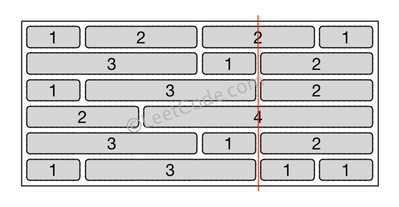

# [554. Brick Wall](https://leetcode.com/problems/brick-wall)

[中文文档](/solution/0500-0599/0554.Brick%20Wall/README.md)

## Description

<p>There is a brick wall in front of you. The wall is rectangular and has several rows of bricks. The bricks have the same height but different width. You want to draw a vertical line from the <b>top</b> to the <b>bottom</b> and cross the <b>least</b> bricks.</p>

<p>The brick wall is represented by a list of rows. Each row is a list of integers representing the width of each brick in this row from left to right.</p>

<p>If your line go through the edge of a brick, then the brick is not considered as crossed. You need to find out how to draw the line to cross the least bricks and return the number of crossed bricks.</p>

<p><b>You cannot draw a line just along one of the two vertical edges of the wall, in which case the line will obviously cross no bricks. </b></p>

<p>&nbsp;</p>

<p><b>Example:</b></p>

<pre>

<b>Input:</b> [[1,2,2,1],

        [3,1,2],

        [1,3,2],

        [2,4],

        [3,1,2],

        [1,3,1,1]]


<b>Output:</b> 2


<b>Explanation:</b> 

</pre>



<p>&nbsp;</p>

<p><b>Note:</b></p>

<ol>
	<li>The width sum of bricks in different rows are the same and won&#39;t exceed INT_MAX.</li>
	<li>The number of bricks in each row is in range [1,10,000]. The height of wall is in range [1,10,000]. Total number of bricks of the wall won&#39;t exceed 20,000.</li>
</ol>

## Solutions

<!-- tabs:start -->

### **Python3**

```python

```

### **Java**

```java

```

### **...**

```

```

<!-- tabs:end -->
