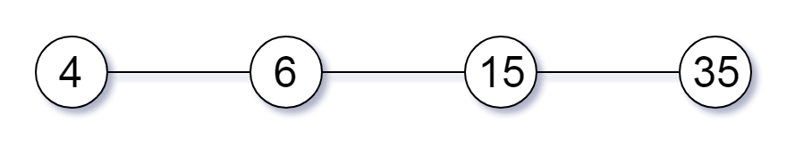
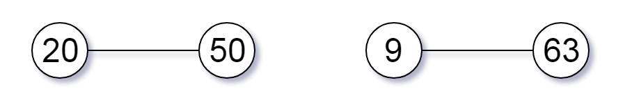
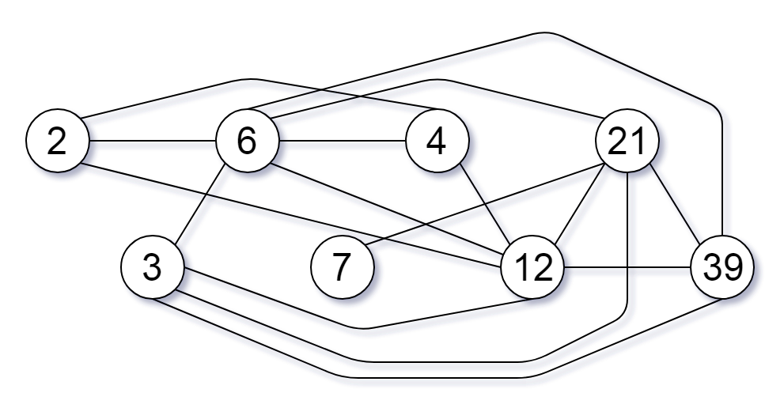

# [952. 按公因数计算最大组件大小](https://leetcode-cn.com/problems/largest-component-size-by-common-factor)

[English Version](/solution/0900-0999/0952.Largest%20Component%20Size%20by%20Common%20Factor/README_EN.md)

## 题目描述

<!-- 这里写题目描述 -->
<p>给定一个由不同正整数的组成的非空数组 <code>A</code>，考虑下面的图：</p>

<ul>
	<li>有&nbsp;<code>A.length</code>&nbsp;个节点，按从&nbsp;<code>A[0]</code>&nbsp;到&nbsp;<code>A[A.length - 1]</code>&nbsp;标记；</li>
	<li>只有当 <code>A[i]</code> 和 <code>A[j]</code> 共用一个大于 1 的公因数时，<code>A[i]</code>&nbsp;和 <code>A[j]</code> 之间才有一条边。</li>
</ul>

<p>返回图中最大连通组件的大小。</p>

<p>&nbsp;</p>

<ol>
</ol>

<p><strong>示例 1：</strong></p>

<pre><strong>输入：</strong>[4,6,15,35]
<strong>输出：</strong>4
</pre>



<p><strong>示例 2：</strong></p>

<pre><strong>输入：</strong>[20,50,9,63]
<strong>输出：</strong>2
</pre>



<p><strong>示例 3：</strong></p>

<pre><strong>输入：</strong>[2,3,6,7,4,12,21,39]
<strong>输出：</strong>8
</pre>



<p>&nbsp;</p>

<p><strong>提示：</strong></p>

<ol>
	<li><code>1 &lt;= A.length &lt;= 20000</code></li>
	<li><code>1 &lt;= A[i] &lt;= 100000</code></li>
</ol>

## 解法

<!-- 这里可写通用的实现逻辑 -->

<!-- tabs:start -->

### **Python3**

<!-- 这里可写当前语言的特殊实现逻辑 -->

```python

```

### **Java**

<!-- 这里可写当前语言的特殊实现逻辑 -->

```java
class Solution {
    public int largestComponentSize(int[] A) {
        int n = A.length, num = 100000 + 1, max = 0;
        Set<Integer> primes = findPrime(num);
        int[] root = new int[n];
        int[] size = new int[n];
        int[] primeToNode = new int[num];
        // 一开始 prime 没有和数组 A 中的 node 连在一起
        Arrays.fill(primeToNode, -1);
        // 初始化 root 和 size array
        for (int i = 0; i < n; i++) {
            root[i] = i;
            size[i] = 1;
        }
        for (int i = 0; i < n; i++) {
            int curr = A[i];
            // find all of its prime factors
            for (Integer prime: primes) {
                if (primes.contains(curr)) {
                    prime = curr;
                }
                if (curr % prime == 0) {
                    // 我们为 curr 找到一个质因数，则需要将该节点加入该 prime 已经连接到的根节点上
                    if (primeToNode[prime] != -1) {
                        // 该 prime 已经与数组 A 中 node 相连
                        union(size, root, primeToNode[prime], i);
                    }
                    primeToNode[prime] = find(root, i);
                    while (curr % prime == 0) {
                        // 将质因数 prime 全部剔除
                        curr = curr / prime;
                    }
                }
                if (curr == 1) {
                    break;
                }
            }
        }
        for (int i = 0; i < n; i++) {
            max = Math.max(size[i], max);
        }
        return max;
    }
    
    public Set<Integer> findPrime(int num) {
        boolean[] isPrime = new boolean[num];
        Arrays.fill(isPrime, true);
        Set<Integer> primes = new HashSet<>();
        for (int i = 2; i < isPrime.length; i++) {
            if (isPrime[i]) {
                primes.add(i);
                for (int j = 0; i * j < isPrime.length; j++) {
                    isPrime[i * j] = false;
                }
            }
        }
        return primes;
    }
    
    public void union(int[] size, int[] root, int i, int j) {
        int rootI = find(root, i);
        int rootJ = find(root, j);
        if (rootI == rootJ) {
            // 它们已经属于同一个 root
            return;
        }
        if (size[rootI] > size[rootJ]) {
            root[rootJ] = rootI;
            size[rootI] += size[rootJ];
        } else {
            root[rootI] = rootJ;
            size[rootJ] += size[rootI];
        }
    }
    
    public int find(int[] root, int i) {
        // 当某节点的根不是他自己时，则需要继续找到其 root
        List<Integer> records = new LinkedList<>();
        while (root[i] != i) {
            records.add(i);
            i = root[i];
        }
        // 将这些节点均指向其 root
        for (Integer record: records) {
            root[record] = i;
        }
        
        return i;
    }
}
```

### **...**

```

```

<!-- tabs:end -->
