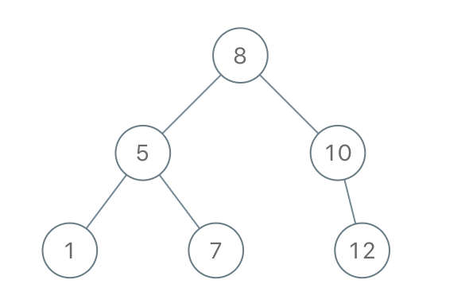

# [1008. 先序遍历构造二叉树](https://leetcode-cn.com/problems/construct-binary-search-tree-from-preorder-traversal)

[English Version](/solution/1000-1099/1008.Construct%20Binary%20Search%20Tree%20from%20Preorder%20Traversal/README_EN.md)

## 题目描述

<!-- 这里写题目描述 -->
<p>返回与给定先序遍历&nbsp;<code>preorder</code> 相匹配的二叉搜索树（binary <strong>search</strong> tree）的根结点。</p>

<p><em>(回想一下，二叉搜索树是二叉树的一种，其每个节点都满足以下规则，对于&nbsp;<code>node.left</code>&nbsp;的任何后代，值总 <code>&lt;</code> <code>node.val</code>，而 <code>node.right</code> 的任何后代，值总 <code>&gt;</code> <code>node.val</code>。此外，先序遍历首先显示节点的值，然后遍历 <code>node.left</code>，接着遍历 <code>node.right</code>。）</em></p>

<p>&nbsp;</p>

<p><strong>示例：</strong></p>

<pre><strong>输入：</strong>[8,5,1,7,10,12]
<strong>输出：</strong>[8,5,10,1,7,null,12]
</pre>



<p>&nbsp;</p>

<p><strong>提示：</strong></p>

<ol>
	<li><code>1 &lt;= preorder.length &lt;= 100</code></li>
	<li>先序&nbsp;<code>preorder</code>&nbsp;中的值是不同的。</li>
</ol>

## 解法

<!-- 这里可写通用的实现逻辑 -->

<!-- tabs:start -->

### **Python3**

<!-- 这里可写当前语言的特殊实现逻辑 -->

```python

```

### **Java**

<!-- 这里可写当前语言的特殊实现逻辑 -->

```java
/**
 * Definition for a binary tree node.
 * public class TreeNode {
 *     int val;
 *     TreeNode left;
 *     TreeNode right;
 *     TreeNode(int x) { val = x; }
 * }
 */
class Solution {
    public TreeNode bstFromPreorder(int[] preorder) {
        if (preorder == null || preorder.length == 0) {
            return null;
        }
        // 进入分治法的递归
        return helper(preorder, 0, preorder.length - 1);
    }
    
    private TreeNode helper(int[] preorder, int start, int end) {
        // System.out.println("start: " + start + " end: " + end);
        // 确认递归结束的标志，当 start == end 时，表示该区间只剩下一个 subRoot 节点
        if (start > end) {
            return null;
        }
        if (start == end) {
            return new TreeNode(preorder[start]);
        }
        // 前序遍历，首先遍历到的为根
        TreeNode root = new TreeNode(preorder[start]);
        int leftEnd = start;
        while (leftEnd <= end) {
            if (preorder[leftEnd] > preorder[start]) {
                break;
            }
            leftEnd++;
        }
        // System.out.println("leftEnd:" + leftEnd + " num: " + preorder[leftEnd]);
        root.left = helper(preorder, start + 1, leftEnd - 1);
        root.right = helper(preorder, leftEnd, end);
        return root;
    }
}
```

### **...**

```

```

<!-- tabs:end -->
<!-- tabs:end -->
