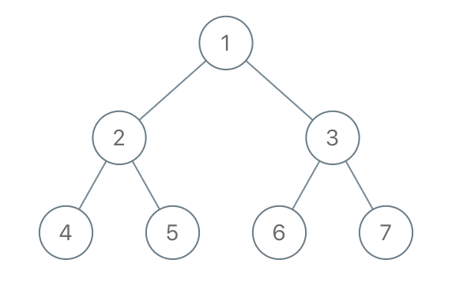

# [1110. 删点成林](https://leetcode-cn.com/problems/delete-nodes-and-return-forest)

[English Version](/solution/1100-1199/1110.Delete%20Nodes%20And%20Return%20Forest/README_EN.md)

## 题目描述

<!-- 这里写题目描述 -->
<p>给出二叉树的根节点&nbsp;<code>root</code>，树上每个节点都有一个不同的值。</p>

<p>如果节点值在&nbsp;<code>to_delete</code>&nbsp;中出现，我们就把该节点从树上删去，最后得到一个森林（一些不相交的树构成的集合）。</p>

<p>返回森林中的每棵树。你可以按任意顺序组织答案。</p>

<p>&nbsp;</p>

<p><strong>示例：</strong></p>



<pre><strong>输入：</strong>root = [1,2,3,4,5,6,7], to_delete = [3,5]
<strong>输出：</strong>[[1,2,null,4],[6],[7]]
</pre>

<p>&nbsp;</p>

<p><strong>提示：</strong></p>

<ul>
	<li>树中的节点数最大为&nbsp;<code>1000</code>。</li>
	<li>每个节点都有一个介于&nbsp;<code>1</code> 到&nbsp;<code>1000</code>&nbsp;之间的值，且各不相同。</li>
	<li><code>to_delete.length &lt;= 1000</code></li>
	<li><code>to_delete</code> 包含一些从&nbsp;<code>1</code> 到&nbsp;<code>1000</code>、各不相同的值。</li>
</ul>

## 解法

<!-- 这里可写通用的实现逻辑 -->

<!-- tabs:start -->

### **Python3**

<!-- 这里可写当前语言的特殊实现逻辑 -->

```python

```

### **Java**

<!-- 这里可写当前语言的特殊实现逻辑 -->

```java
class Solution {
    public List<TreeNode> delNodes(TreeNode root, int[] to_delete) {
        boolean[] del = new boolean[1001];
        for (int d : to_delete) {
            del[d] = true;
        }
        List<TreeNode> res = new ArrayList<>();
        dfs(root, true, del, res);
        return res;
    }

    private TreeNode dfs(TreeNode root, boolean isRoot, boolean[] del, List<TreeNode> res) {
        if (root == null) {
            return null;
        }
        boolean flag = del[root.val];
        if (!flag && isRoot) {
            res.add(root);
        }
        root.left = dfs(root.left, flag, del, res);
        root.right = dfs(root.right, flag, del, res);
        return flag ? null : root;
    }
}

```

### **...**

```

```

<!-- tabs:end -->
