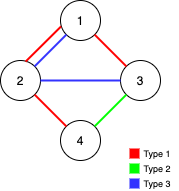
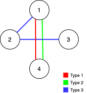
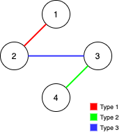

# [1579. 保证图可完全遍历](https://leetcode-cn.com/problems/remove-max-number-of-edges-to-keep-graph-fully-traversable)

[English Version](/solution/1500-1599/1579.Remove%20Max%20Number%20of%20Edges%20to%20Keep%20Graph%20Fully%20Traversable/README_EN.md)

## 题目描述

<!-- 这里写题目描述 -->
<p>Alice 和 Bob 共有一个无向图，其中包含 n 个节点和 3&nbsp; 种类型的边：</p>

<ul>
	<li>类型 1：只能由 Alice 遍历。</li>
	<li>类型 2：只能由 Bob 遍历。</li>
	<li>类型 3：Alice 和 Bob 都可以遍历。</li>
</ul>

<p>给你一个数组 <code>edges</code> ，其中 <code>edges[i] = [type<sub>i</sub>, u<sub>i</sub>, v<sub>i</sub>]</code>&nbsp;表示节点 <code>u<sub>i</sub></code> 和 <code>v<sub>i</sub></code> 之间存在类型为 <code>type<sub>i</sub></code> 的双向边。请你在保证图仍能够被 Alice和 Bob 完全遍历的前提下，找出可以删除的最大边数。如果从任何节点开始，Alice 和 Bob 都可以到达所有其他节点，则认为图是可以完全遍历的。</p>

<p>返回可以删除的最大边数，如果 Alice 和 Bob 无法完全遍历图，则返回 -1 。</p>

<p>&nbsp;</p>

<p><strong>示例 1：</strong></p>



<pre><strong>输入：</strong>n = 4, edges = [[3,1,2],[3,2,3],[1,1,3],[1,2,4],[1,1,2],[2,3,4]]
<strong>输出：</strong>2
<strong>解释：</strong>如果删除<strong> </strong>[1,1,2] 和 [1,1,3] 这两条边，Alice 和 Bob 仍然可以完全遍历这个图。再删除任何其他的边都无法保证图可以完全遍历。所以可以删除的最大边数是 2 。
</pre>

<p><strong>示例 2：</strong></p>



<pre><strong>输入：</strong>n = 4, edges = [[3,1,2],[3,2,3],[1,1,4],[2,1,4]]
<strong>输出：</strong>0
<strong>解释：</strong>注意，删除任何一条边都会使 Alice 和 Bob 无法完全遍历这个图。
</pre>

<p><strong>示例 3：</strong></p>



<pre><strong>输入：</strong>n = 4, edges = [[3,2,3],[1,1,2],[2,3,4]]
<strong>输出：</strong>-1
<strong>解释：</strong>在当前图中，Alice 无法从其他节点到达节点 4 。类似地，Bob 也不能达到节点 1 。因此，图无法完全遍历。</pre>

<p>&nbsp;</p>

<p><strong>提示：</strong></p>

<ul>
	<li><code>1 &lt;= n &lt;= 10^5</code></li>
	<li><code>1 &lt;= edges.length &lt;= min(10^5, 3 * n * (n-1) / 2)</code></li>
	<li><code>edges[i].length == 3</code></li>
	<li><code>1 &lt;= edges[i][0] &lt;= 3</code></li>
	<li><code>1 &lt;= edges[i][1] &lt; edges[i][2] &lt;= n</code></li>
	<li>所有元组 <code>(type<sub>i</sub>, u<sub>i</sub>, v<sub>i</sub>)</code> 互不相同</li>
</ul>

## 解法

<!-- 这里可写通用的实现逻辑 -->

<!-- tabs:start -->

### **Python3**

<!-- 这里可写当前语言的特殊实现逻辑 -->

```python

```

### **Java**

<!-- 这里可写当前语言的特殊实现逻辑 -->

```java
class Solution {
    // https://oi-wiki.org/ds/dsu/#_3
    private boolean[] used;

    public int maxNumEdgesToRemove(int n, int[][] edges) {
        used = new boolean[edges.length];
        // type 为倒序，3, 2, 1
        Arrays.sort(edges, (a, b) -> Integer.compare(b[0], a[0]));
        if (!unionFind(n, edges, 1)) return -1;
        if (!unionFind(n, edges, 2)) return -1;
        int result = 0;
        for (boolean u : used) {
            result += u ? 0 : 1;
        }
        return result;
    }

    private boolean unionFind(int n, int[][] edges, int excludedType) {
        int[] union = new int[n + 1];
        for (int i = 1; i <= n; i++) {
            union[i] = i;
        }
        int cnt = 0;
        for (int i = 0; i < edges.length; i++) {
            int[] edge = edges[i];
            if (edge[0] == excludedType) continue;
            int rootA = findRoot(union, edge[1]);
            int rootB = findRoot(union, edge[2]);
            if (rootA != rootB) {
                cnt += 1;
                union[rootA] = rootB;
                used[i] = true;
            }
            if (cnt == n - 1) return true;
        }
        return false;
    }

    private int findRoot(int[] union, int idx) {
        if (union[idx] != idx) {
            int root = findRoot(union, union[idx]);
            union[idx] = root;
            return root;
        }
        return idx;
    }
}
```

### **...**

```

```

<!-- tabs:end -->
