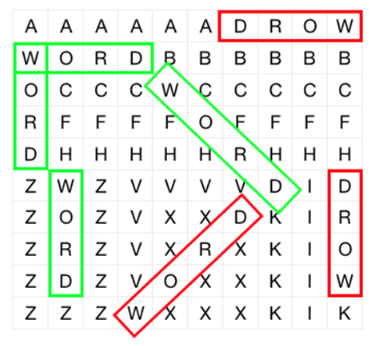

```
题号	题目	知识点	难度	通过率
WY1	奖学金	动态规划模拟	较难	12.84%
WY2	路灯	动态规划	较难	14.22%
WY3	小易的升级之路	递归模拟	简单	20.03%
WY4	炮台攻击		简单	18.14%
WY5	扫描透镜	贪心模拟穷举	较难	15.89%
WY6	合唱团	动态规划	较难	14.33%
WY7	地牢逃脱	队列	简单	17.68%
WY8	下厨房	字符串	入门	34.60%
WY9	分田地	动态规划	中等	15.98%
WY10	分苹果	贪心	入门	23.24%
WY11	星际穿越		入门	22.45%
WY12	藏宝图	字符串动态规划	入门	29.40%
WY13	数列还原	穷举	入门	28.29%
WY14	混合颜料	贪心	中等	19.77%
WY15	幸运的袋子	穷举	中等	18.28%
WY16	不要二	贪心	入门	31.89%
WY17	解救小易	排序	入门	37.25%
WY18	统计回文	字符串模拟穷举	入门	30.61%
WY19	饥饿的小易	数学	中等	17.28%
WY20	两种排序方法	排序字符串	入门	25.74%
WY21	小易喜欢的单词	字符串	入门	33.88%
WY22	Fibonacci数列	模拟	入门	36.00%
WY23	数字游戏	排序	入门	26.94%
WY24	洗牌	排序模拟穷举	简单	18.19%
WY25	构造队列	模拟队列	入门	30.20%
WY26	回文序列	贪心模拟	入门	23.90%
WY27	优雅的点	计算几何	入门	16.57%
WY28	跳石板	动态规划贪心	中等	14.40%
WY29	暗黑的字符串	动态规划	入门	24.79%
WY30	数字翻转	模拟	入门	35.38%
WY31	最大的奇约数	模拟穷举	中等	12.31%
WY32	买苹果	贪心动态规划	入门	32.79%
WY33	计算糖果	穷举	入门	28.65%
WY34	彩色的砖块	字符串模拟	中等	27.28%
WY35	等差数列	贪心排序	中等	27.09%
WY36	交错01串	字符串	中等	27.70%
WY37	操作序列	模拟队列	中等	16.57%
WY38	独立的小易	贪心模拟	中等	28.98%
WY39	堆棋子	模拟	中等	17.93%
WY40	疯狂队列	贪心	中等	22.08%
WY41	小易喜欢的数列	动态规划	中等	19.22%
WY42	时钟	字符串模拟	中等	23.00%
WY43	字符迷阵	字符串模拟	中等	29.76%
WY44	会话列表	模拟栈	中等	33.87%
WY45	牛牛找工作	排序贪心模拟	中等	10.00%
WY46	被3整除	数学	简单	14.33%
WY47	安置路灯	字符串数组模拟贪心	简单	27.06%
WY48	迷路的牛牛	字符串模拟	入门	31.09%
WY49	数对	数学	简单	13.75%
WY50	矩形重叠	穷举	简单	22.02%
WY51	牛牛的闹钟		入门	24.32%
WY52	牛牛的背包问题	穷举	中等	15.12%
WY53	一封奇怪的信	字符串模拟	入门	25.12%
WY54	糖果谜题	贪心模拟哈希	中等	25.02%
WY55	最小众倍数	递归穷举	简单	29.90%
WY56	缩写	字符串模拟	简单	47.81%
WY57	工作方案	数学	较难	20.75%
WY58	数位重排	数组模拟穷举	中等	38.32%
WY59	数轴	贪心模拟	中等	24.85%
WY60	骰子游戏	动态规划	较难	21.25%
WY61	俄罗斯方块	数组模拟贪心	入门	30.59%
WY62	瞌睡	数组贪心	简单	14.78%
WY63	丰收	数组	简单	17.48%
WY64	整理房间	模拟穷举	中等	29.27%
WY65	表达式求值	动态规划	入门	42.67%
WY66	塔	排序贪心模拟	简单	22.04%
WY67	小易的字典		中等	16.81%
WY68	代价	排序穷举	入门	42.30%
WY69	访友	贪心	入门	44.24%
WY70	翻转翻转		简单	11.66%
WY71	买房	贪心	简单	28.09%
WY72	香槟塔	数组	较难	24.35%
WY73	社团主席选举	排序贪心模拟穷举	中等	18.58%
WY74	橡皮泥斑马	字符串模拟	简单	34.37%
WY75	篮球队	递归动态规划穷举	中等	18.01%
WY76	字母卡片	排序字符串贪心	简单	16.62%
WY77	相等序列	排序贪心穷举数组	简单	24.79%
WY78	N-GCD	动态规划	中等	20.82%
WY79	分贝壳		简单	21.73%
WY80	美妙的约会	排序动态规划贪心	入门	34.23%
WY81	模数求和	数学	入门	40.85%
```

## WY1 奖学金

### 题目描述

小v今年有n门课，每门都有考试，为了拿到奖学金，小v必须让自己的平均成绩至少为avg。每门课由平时成绩和考试成绩组成，满分为r。现在他知道每门课的平时成绩为ai ,若想让这门课的考试成绩多拿一分的话，小v要花bi
的时间复习，不复习的话当然就是0分。同时我们显然可以发现复习得再多也不会拿到超过满分的分数。为了拿到奖学金，小v至少要花多少时间复习。

##### 输入描述:

第一行三个整数n,r,avg(n大于等于1小于等于1e5，r大于等于1小于等于1e9,avg大于等于1小于等于1e6)，接下来n行，每行两个整数ai和bi，均小于等于1e6大于等于1

#### 输出描述:

一行输出答案。

#### 示例1

#### 输入

```
5 10 9 0 5 9 1 8 1 0 1 9 100
```

#### 输出

```
43
```

```java
import java.util.*;
import java.io.*;

//贪心
public class Main {
    public static void main(String[] args) throws Exception {
        BufferedReader bf = new BufferedReader(new InputStreamReader(System.in));
        String str;
        while ((str = bf.readLine()) != null) {
            String[] strs = str.split(" ");
            int n = Integer.parseInt(strs[0]);  //科目数
            int r = Integer.parseInt(strs[1]);  //每科满分
            int avg = Integer.parseInt(strs[2]);  //达标的平均成绩
            int cur_total = 0;
            Queue<Course> prQue = new PriorityQueue<>();
            for (int i = 0; i < n; i++) {
                String[] strs2 = bf.readLine().split(" ");
                Course temp = new Course(Integer.parseInt(strs2[0]), Integer.parseInt(strs2[1]));
                prQue.add(temp);
                cur_total += Integer.parseInt(strs2[0]);
            }
            long res = func(n, r, avg, cur_total, prQue);
            System.out.println(res);
        }
    }

    public static long func(int n, int r, int avg, int cur_total, Queue<Course> prQue) {
        long res = 0;
        while (cur_total < n * avg) {
            int gap = n * avg - cur_total;
            Course top = prQue.poll();
            if (gap > r - top.a_score) {
                res += (long) top.b_time * (r - top.a_score);
                cur_total += r - top.a_score;
            } else {
                res += (long) top.b_time * gap;
                cur_total += gap;
            }
        }
        return res;
    }
}

class Course implements Comparable<Course> {
    int a_score;
    int b_time;

    public Course(int a_score, int b_time) {
        this.a_score = a_score;
        this.b_time = b_time;
    }

    @Override
    public int compareTo(Course o) {
        if (this.b_time > o.b_time) return 1;
        else return -1;
    }
}
```

## WY2 路灯

### 题目描述

一条长l的笔直的街道上有n个路灯，若这条街的起点为0，终点为l，第i个路灯坐标为ai ，每盏灯可以覆盖到的最远距离为d，为了照明需求，所有灯的灯光必须覆盖整条街，但是为了省电，要使这个d最小，请找到这个最小的d。

#### 输入描述:

每组数据第一行两个整数n和l（n大于0小于等于1000，l小于等于1000000000大于0）。第二行有n个整数(均大于等于0小于等于l)，为每盏灯的坐标，多个路灯可以在同一点。

#### 输出描述:

输出答案，保留两位小数。

#### 示例1

#### 输入

```
7 15 15 5 3 7 9 14 0
```

#### 输出

```
2.50
```

```java
import java.util.*;
import java.io.*;

public class Main {
    public static void main(String[] args) throws IOException {
        BufferedReader reader = new BufferedReader(new InputStreamReader(System.in));
        String line;
        int[] pos;
        while ((line = reader.readLine()) != null) {
            String[] temp = line.split(" ");
            int n = Integer.parseInt(temp[0]);
            int l = Integer.parseInt(temp[1]);
            line = reader.readLine();
            temp = line.split(" ");
            pos = new int[n];
            for (int i = 0; i < n; i++) {
                pos[i] = Integer.parseInt(temp[i]);
            }
            Arrays.sort(pos);
            double max_gap = Math.max(pos[0], l - pos[n - 1]);
            for (int i = 0; i < n - 1; i++) {
                double gap = (pos[i + 1] - pos[i]) / 2.0;
                max_gap = Math.max(gap, max_gap);
            }
            // double ans = max_gap / 2.0;
            System.out.printf("%.2f%n", max_gap);
        }
    }
}
```

## WY3 小易的升级之路

### 题目描述

小易经常沉迷于网络游戏.有一次,他在玩一个打怪升级的游戏,他的角色的初始能力值为 a.在接下来的一段时间内,他将会依次遇见n个怪物,每个怪物的防御力为b1,b2,b3...bn.
如果遇到的怪物防御力bi小于等于小易的当前能力值c,那么他就能轻松打败怪物,并 且使得自己的能力值增加bi;如果bi大于c,那他也能打败怪物,但他的能力值只能增加bi
与c的最大公约数.那么问题来了,在一系列的锻炼后,小易的最终能力值为多少?

#### 输入描述:

对于每组数据,第一行是两个整数n(1≤n<100000)表示怪物的数量和a表示小易的初始能力值. 第二行n个整数,b1,b2...bn(1≤bi≤n)表示每个怪物的防御力

#### 输出描述:

对于每组数据,输出一行.每行仅包含一个整数,表示小易的最终能力值

#### 示例1

#### 输入

```
3 50 50 105 200 5 20 30 20 15 40 100
```

#### 输出

```
110 205
```

```java
import java.util.*;
import java.io.*;

public class Main {
    public static void main(String[] args) throws IOException {
        BufferedReader br = new BufferedReader(new InputStreamReader(System.in));
        String str;
        while ((str = br.readLine()) != null) {
            String[] s = str.split(" ");
            int n = Integer.parseInt(s[0]);
            int c = Integer.parseInt(s[1]);
            int[] b = new int[n];
            for (int i = 0; i < n; i++) {
                str = br.readLine();
                b[i] = Integer.parseInt(str);
                if (b[i] <= c) {
                    c += b[i];
                } else {
                    c += getGCD(b[i], c);
                }
            }
            System.out.println(c);
        }
    }

    public static int getGCD(int a, int b) {   //a>b
        while (b != 0) {
            int temp = b;
            b = a % b;
            a = temp;
        }
        return a;
    }
}
```

## WY4 炮台攻击

### 题目描述

兰博教训提莫之后,然后和提莫讨论起约德尔人,谈起约德尔人,自然少不了一个人,那 就是黑默丁格------约德尔人历史上最伟大的科学家. 提莫说,黑默丁格最近在思考一个问题:黑默丁格有三个炮台,炮台能攻击到距离它R的敌人 (
两点之间的距离为两点连续的距离,例如(3,0),(0,4)之间的距离是5),如果一个炮台能攻击 到敌人,那么就会对敌人造成1×的伤害.黑默丁格将三个炮台放在N*M方格中的点上,并且给出敌人 的坐标. 问:那么敌人受到伤害会是多大?

#### 输入描述:

第一行9个整数,R,x1,y1,x2,y2,x3,y3,x0,y0.R代表炮台攻击的最大距离,(x1,y1),(x2,y2), (x3,y3)代表三个炮台的坐标.(x0,y0)代表敌人的坐标.

#### 输出描述:

输出一行,这一行代表敌人承受的最大伤害,(如果每个炮台都不能攻击到敌人,输出0×)

#### 示例1

#### 输入

```
1 1 1 2 2 3 3 1 2
```

#### 输出

```
2x
```

```java
import java.util.*;
import java.io.*;

public class Main {
    public static void main(String[] args) throws IOException {
        BufferedReader br = new BufferedReader(new InputStreamReader(System.in));
        String str = null;
        while ((str = br.readLine()) != null) {
            String[] t = str.split(" ");
            int r = Integer.parseInt(t[0]);
            int x1 = Integer.parseInt(t[1]);
            int y1 = Integer.parseInt(t[2]);
            int x2 = Integer.parseInt(t[3]);
            int y2 = Integer.parseInt(t[4]);
            int x3 = Integer.parseInt(t[5]);
            int y3 = Integer.parseInt(t[6]);
            int x0 = Integer.parseInt(t[7]);
            int y0 = Integer.parseInt(t[8]);
            int cnt = 0;
            if (Math.pow((x1 - x0), 2) + Math.pow((y1 - y0), 2) <= r * r) {
                cnt++;
            }
            if (Math.pow((x2 - x0), 2) + Math.pow((y2 - y0), 2) <= r * r) {
                cnt++;
            }
            if (Math.pow((x3 - x0), 2) + Math.pow((y3 - y0), 2) <= r * r) {
                cnt++;
            }
            System.out.println(cnt + "x");
        }
    }
}
```

## WY5 扫描透镜

### 题目描述

在N*M的草地上,提莫种了K个蘑菇,蘑菇爆炸的威力极大,兰博不想贸然去闯,而且蘑菇是隐形的.只 有一种叫做扫描透镜的物品可以扫描出隐形的蘑菇,于是他回了一趟战争学院,买了2个扫描透镜,一个 扫描透镜可以扫描出(3*3)
方格中所有的蘑菇,然后兰博就可以清理掉一些隐形的蘑菇. 问:兰博最多可以清理多少个蘑菇? 注意：每个方格被扫描一次只能清除掉一个蘑菇。

#### 输入描述:

第一行三个整数:N,M,K,(1≤N,M≤20,K≤100),N,M代表了草地的大小; 接下来K行,每行两个整数x,y(1≤x≤N,1≤y≤M).代表(x,y)处提莫种了一个蘑菇. 一个方格可以种无穷个蘑菇.

#### 输出描述:

输出一行,在这一行输出一个整数,代表兰博最多可以清理多少个蘑菇.

```java
import java.util.*;
import java.io.*;

public class Main {
    public static int[][] sudoku = {{-1, -1}, {0, -1}, {0, 1}, {1, -1}, {1, 1}, {-1, 0}, {1, 0}, {-1, 1}};

    public static int clearMushroom(int[][] mushroom) {
        int max = 0;
        int maxI = 0;
        int maxJ = 0;
        for (int i = 1; i < mushroom.length - 1; i++) {
            for (int j = 1; j < mushroom[0].length - 1; j++) {
                int tmp = 0;
                if (mushroom[i][j] > 0) {
                    tmp += 1;
                }
                for (int k = 0; k < 8; k++) {
                    if (mushroom[i + sudoku[k][0]][j + sudoku[k][1]] > 0)
                        tmp += 1;
                }
                if (tmp > max) {
                    max = tmp;
                    maxI = i;
                    maxJ = j;
                }
            }
        }
        mushroom[maxI][maxJ] -= 1;
        for (int k = 0; k < 8; k++) {
            mushroom[maxI + sudoku[k][0]][maxJ + sudoku[k][1]] -= 1;
        }
        return max;
    }

    public static void main(String[] args) throws Exception {
        BufferedReader br = new BufferedReader(new InputStreamReader(System.in));
        String str;
        while ((str = br.readLine()) != null) {
            String[] strs = str.split(" ");
            int N = Integer.parseInt(strs[0]);
            int M = Integer.parseInt(strs[1]);
            int K = Integer.parseInt(strs[2]);
            int[][] mushroom = new int[N][M];
            int x;
            int y;
            for (int i = 0; i < K; i++) {
                str = br.readLine();
                strs = str.split(" ");
                x = Integer.parseInt(strs[0]) - 1;
                y = Integer.parseInt(strs[1]) - 1;
                mushroom[x][y] += 1;
            }
            System.out.println(clearMushroom(mushroom) + clearMushroom(mushroom));
        }
    }
}
```

## WY6 合唱团

### 题目描述

有 n 个学生站成一排，每个学生有一个能力值，牛牛想从这 n 个学生中按照顺序选取 k 名学生，要求相邻两个学生的位置编号的差不超过 d，使得这 k 个学生的能力值的乘积最大，你能返回最大的乘积吗？

#### 输入描述:

每个输入包含 1 个测试用例。每个测试数据的第一行包含一个整数 n (1 <= n <= 50)，表示学生的个数，接下来的一行，包含 n 个整数，按顺序表示每个学生的能力值 ai（-50 <= ai <=
50）。接下来的一行包含两个整数，k 和 d (1 <= k <= 10, 1 <= d <= 50)。

#### 输出描述:

输出一行表示最大的乘积。

#### 示例1

#### 输入

```
3 7 4 7 2 50
```

#### 输出

```
49
```

```java
import java.io.BufferedReader;
import java.io.InputStreamReader;

public class Main {
    public static void main(String[] args) throws Exception {
        BufferedReader br = new BufferedReader(new InputStreamReader(System.in));
        String line;
        while ((line = br.readLine()) != null) {
            int n = Integer.parseInt(line.trim());
            line = br.readLine();
            int[] nums = new int[n];
            String[] s = line.trim().split(" ");
            for (int i = 0; i < n; i++) {
                nums[i] = Integer.parseInt(s[i]);  //a[i]表示学生的能力值
            }
            line = br.readLine();
            String[] s1 = line.trim().split(" ");
            int k = Integer.parseInt(s1[0]);  //选取k个学生
            int d = Integer.parseInt(s1[1]);  //编号之差不超过d
            long[][] max = new long[k][n];
            long[][] min = new long[k][n];
            for (int i = 0; i < k; i++) {
                for (int j = 0; j < n; j++) {
                    max[i][j] = 1;
                    min[i][j] = 1;
                    if (i == 0) {
                        min[i][j] = nums[j];
                        max[i][j] = nums[j];
                    }
                }
            }
            for (int i = 1; i < k; i++) {
                for (int j = 0; j < n; j++) {
                    for (int m = 1; m <= d; m++) {
                        if (j - m >= 0) {
                            if (nums[j] > 0) {
                                min[i][j] = Math.min(min[i][j], min[i - 1][j - m] * nums[j]);
                                max[i][j] = Math.max(max[i][j], max[i - 1][j - m] * nums[j]);
                            } else {
                                min[i][j] = Math.min(min[i][j], max[i - 1][j - m] * nums[j]);
                                max[i][j] = Math.max(max[i][j], min[i - 1][j - m] * nums[j]);
                            }
                        }
                    }
                }
            }
            long res = 0;
            for (int i = 0; i < n; i++) {
                if (i >= k - 1) {
                    res = Math.max(res, max[k - 1][i]);
                }
            }
            System.out.println(res);
        }
    }
}
```

## WY7 地牢逃脱

### 题目描述

给定一个 n 行 m 列的地牢，其中 '.' 表示可以通行的位置，'X' 表示不可通行的障碍，牛牛从 (x0 , y0 )
位置出发，遍历这个地牢，和一般的游戏所不同的是，他每一步只能按照一些指定的步长遍历地牢，要求每一步都不可以超过地牢的边界，也不能到达障碍上。地牢的出口可能在任意某个可以通行的位置上。牛牛想知道最坏情况下，他需要多少步才可以离开这个地牢。

#### 输入描述:

每个输入包含 1 个测试用例。每个测试用例的第一行包含两个整数 n 和 m（1 <= n, m <= 50），表示地牢的长和宽。接下来的 n 行，每行 m 个字符，描述地牢，地牢将至少包含两个 '.'。接下来的一行，包含两个整数 x0,
y0，表示牛牛的出发位置（0 <= x0 < n, 0 <= y0 < m，左上角的坐标为 （0, 0），出发位置一定是 '.'）。之后的一行包含一个整数 k（0 < k <= 50）表示牛牛合法的步长数，接下来的 k 行，每行两个整数
dx, dy 表示每次可选择移动的行和列步长（-50 <= dx, dy <= 50）

#### 输出描述:

输出一行一个数字表示最坏情况下需要多少次移动可以离开地牢，如果永远无法离开，输出 -1。以下测试用例中，牛牛可以上下左右移动，在所有可通行的位置.上，地牢出口如果被设置在右下角，牛牛想离开需要移动的次数最多，为3次。

#### 示例1

#### 输入

```
3 3 ... ... ... 0 1 4 1 0 0 1 -1 0 0 -1
```

#### 输出

```
3
```

```java
import java.util.*;

public class Main {
    public static void main(String[] args) {
        Scanner in = new Scanner(System.in);
        while (in.hasNext()) {
            //注意while处理多个case
            int x = in.nextInt();
            int y = in.nextInt();
            char[][] points = new char[x][y];
            int[][] tar = new int[x][y];
            for (int i = 0; i < x; i++) {
                String str = in.next();
                points[i] = str.toCharArray();
            }
            int startx = in.nextInt();
            int starty = in.nextInt();
            int k = in.nextInt();
            int[] stepx = new int[k];
            int[] stepy = new int[k];
            for (int i = 0; i < k; i++) {
                stepx[i] = in.nextInt();
                stepy[i] = in.nextInt();
            }
            Queue<Integer> xqueue = new LinkedList<Integer>();
            Queue<Integer> yqueue = new LinkedList<Integer>();
            //引入队列是为了遍历到最后不能走为止
            xqueue.add(startx);
            yqueue.add(starty);
            tar[startx][starty] = 1;  //起始点访问标记；1表示已经访问
            while (!xqueue.isEmpty() && !yqueue.isEmpty()) {
                startx = xqueue.remove();    //取队首
                starty = yqueue.remove();
                for (int i = 0; i < k; i++) {
                    if (startx + stepx[i] < x && startx + stepx[i] >= 0 && starty + stepy[i] < y && starty + stepy[i] >= 0)   //不出界
                        if (tar[startx + stepx[i]][starty + stepy[i]] == 0) {
                            if (points[startx + stepx[i]][starty + stepy[i]] == '.') {
                                tar[startx + stepx[i]][starty + stepy[i]] = tar[startx][starty] + 1;
                                xqueue.add(startx + stepx[i]);
                                yqueue.add(starty + stepy[i]);
                            } else
                                tar[startx + stepx[i]][starty + stepy[i]] = -1;  //访问点为X
                        }
                }
            }
            int max = 0;
            int getRoad = 1;
            for (int i = 0; i < x; i++)
                for (int j = 0; j < y; j++) {
                    if (points[i][j] == '.' && tar[i][j] == 0) {
                        getRoad = 0;   //有存在没有被访问的“.”说明不能遍历完全，有些出口到不了。
                    }
                    max = Math.max(max, tar[i][j]);
                }
            if (getRoad == 0)
                System.out.println(-1);
            else
                System.out.println(max - 1);
        }
    }
}
```

## WY8 下厨房

### 题目描述

牛牛想尝试一些新的料理，每个料理需要一些不同的材料，问完成所有的料理需要准备多少种不同的材料。

#### 输入描述:

每个输入包含 1 个测试用例。每个测试用例的第 i 行，表示完成第 i 件料理需要哪些材料，各个材料用空格隔开，输入只包含大写英文字母和空格，输入文件不超过 50 行，每一行不超过 50 个字符。

#### 输出描述:

输出一行一个数字表示完成所有料理需要多少种不同的材料。

#### 示例1

#### 输入

```
BUTTER FLOUR HONEY FLOUR EGG
```

#### 输出

```
4
```

```java
import java.util.*;
import java.io.*;

public class Main {
    public static void main(String[] args)
            throws IOException {
        HashSet<String> set = new HashSet<>();
        BufferedReader rd = new BufferedReader(new InputStreamReader(System.in));
        String str = rd.readLine();
        while (str != null) {
            String[] arr = str.trim().split(" ");
            set.addAll(Arrays.asList(arr));
            str = rd.readLine();
        }
        System.out.println(set.size());
    }
}
```

## WY9 分田地

### 题目描述

牛牛和 15 个朋友来玩打土豪分田地的游戏，牛牛决定让你来分田地，地主的田地可以看成是一个矩形，每个位置有一个价值。分割田地的方法是横竖各切三刀，分成 16 份，作为领导干部，牛牛总是会选择其中总价值最小的一份田地，
作为牛牛最好的朋友，你希望牛牛取得的田地的价值和尽可能大，你知道这个值最大可以是多少吗？

#### 输入描述:

每个输入包含 1 个测试用例。每个测试用例的第一行包含两个整数 n 和 m（1 <= n, m <= 75），表示田地的大小，接下来的 n 行，每行包含 m 个 0-9 之间的数字，表示每块位置的价值。

#### 输出描述:

输出一行表示牛牛所能取得的最大的价值。

#### 示例1

#### 输入

```
4 4 3332 3233 3332 2323
```

#### 输出

```
2
```

```java
import java.util.*;

public class Main {
    static int n;
    static int m;
    static int[][] data;

    public static void main(String[] args) {
        Scanner scan = new Scanner(System.in);
        while (scan.hasNext()) {
            n = scan.nextInt();
            m = scan.nextInt();
            data = new int[n + 1][m + 1];
            for (int i = 1; i <= n; i++) {
                String str = scan.next();
                char[] strchar = str.toCharArray();
                for (int j = 1; j <= m; j++) {
                    data[i][j] = strchar[j - 1] - '0';
                }
            }
            for (int i = 1; i <= n; i++) {
                for (int j = 1; j <= m; j++) {
                    data[i][j] = data[i - 1][j] + data[i][j - 1] - data[i - 1][j - 1] + data[i][j];
                }
            }
            int l = 0;
            int r = data[n][m];
            int mid = r = (l + r) >> 3;
            int res = 0;
            while (l <= r) {
                mid = (l + r) >> 1;
                if (check(mid)) {
                    l = mid + 1;
                    res = mid;
                } else {
                    r = mid - 1;
                }
            }
            System.out.println(res);
        }
    }

    private static boolean check(int mid) {
        for (int i = 1; i <= n - 3; i++) {
            for (int j = i + 1; j <= n - 2; j++) {
                for (int k = j + 1; k <= n - 1; k++) {
                    int last = 0;
                    int count = 0;
                    for (int h = 1; h <= m; h++) {
                        int sum1 = getSum(0, i, last, h);
                        int sum2 = getSum(i, j, last, h);
                        int sum3 = getSum(j, k, last, h);
                        int sum4 = getSum(k, n, last, h);
                        if (mid <= sum1 && mid <= sum2 && mid <= sum3 && mid <= sum4) {
                            last = h;
                            count++;
                        }
                    }
                    if (count >= 4) {
                        return true;
                    }
                }
            }
        }
        return false;
    }

    private static int getSum(int startx, int x, int starty, int y) {
        return data[x][y] - data[startx][y] - data[x][starty] + data[startx][starty];
    }
}
```

## WY10 分苹果

### 题目描述

n 只奶牛坐在一排，每个奶牛拥有 ai 个苹果，现在你要在它们之间转移苹果，使得最后所有奶牛拥有的苹果数都相同，每一次，你只能从一只奶牛身上拿走恰好两个苹果到另一个奶牛上，问最少需要移动多少次可以平分苹果，如果方案不存在输出 -1。

#### 输入描述:

每个输入包含一个测试用例。每个测试用例的第一行包含一个整数 n（1 <= n <= 100），接下来的一行包含 n 个整数 ai（1 <= ai <= 100）。

#### 输出描述:

输出一行表示最少需要移动多少次可以平分苹果，如果方案不存在则输出 -1。

#### 示例1

#### 输入

```
4 7 15 9 5
```

#### 输出

```
3
```

```java
import java.io.BufferedReader;
import java.io.InputStreamReader;

public class Main {
    public static void main(String[] args) throws Exception {
        BufferedReader br = new BufferedReader(new InputStreamReader(System.in));
        String line = null;
        while ((line = br.readLine()) != null) {
            int n = Integer.parseInt(line);
            int[] a = new int[n];
            line = br.readLine();
            String[] s = line.trim().split(" ");
            for (int i = 0; i < n; i++) {
                a[i] = Integer.parseInt(s[i]);
            }
            int sum = 0;
            for (int i = 0; i < n; i++) {
                sum += a[i];
            }
            if (sum % n != 0) {
                System.out.println(-1);
                return;
            }
            int avg = sum / n;
            for (int i = 0; i < n; i++) {
                if (Math.abs(a[i] - avg) % 2 != 0) {
                    System.out.println(-1);
                    return;
                }
            }
            int count = 0;
            for (int i = 0; i < n; i++) {
                if (a[i] < avg) {
                    count += (avg - a[i]) / 2;
                }
            }
            System.out.println(count);
        }
    }
}
```

## WY11 星际穿越

### 题目描述

航天飞行器是一项复杂而又精密的仪器，飞行器的损耗主要集中在发射和降落的过程，科学家根据实验数据估计，如果在发射过程中，产生了 x 程度的损耗，那么在降落的过程中就会产生 x2
程度的损耗，如果飞船的总损耗超过了它的耐久度，飞行器就会爆炸坠毁。问一艘耐久度为 h 的飞行器，假设在飞行过程中不产生损耗，那么为了保证其可以安全的到达目的地，只考虑整数解，至多发射过程中可以承受多少程度的损耗？

#### 输入描述:

每个输入包含一个测试用例。每个测试用例包含一行一个整数 h （1 <= h <= 10^18）。

#### 输出描述:

输出一行一个整数表示结果。

#### 示例1

#### 输入

```
10
```

#### 输出

```
2
```

```java
import java.io.*;

public class Main {
    public static void main(String[] args) throws IOException {
        BufferedReader reder = new BufferedReader(new InputStreamReader(System.in));
        String str = reder.readLine();
        long h = Long.parseLong(str);
        long x = (long) (-1 + Math.sqrt(1 + 4 * h)) / 2;
        System.out.println(x);
    }
}
```

## WY12 藏宝图

### 题目描述

牛牛拿到了一个藏宝图，顺着藏宝图的指示，牛牛发现了一个藏宝盒，藏宝盒上有一个机关，机关每次会显示两个字符串 s 和 t，根据古老的传说，牛牛需要每次都回答 t 是否是 s 的子序列。注意，子序列不要求在原字符串中是连续的，例如串
abc，它的子序列就有 {空串, a, b, c, ab, ac, bc, abc} 8 种。

#### 输入描述:

每个输入包含一个测试用例。每个测试用例包含两行长度不超过 10 的不包含空格的可见 ASCII 字符串。

#### 输出描述:

输出一行 “Yes” 或者 “No” 表示结果。

#### 示例1

#### 输入

```
x.nowcoder.com ooo
```

#### 输出

```
Yes
```

```java
import java.io.BufferedReader;
import java.io.InputStreamReader;

public class Main {
    public static void main(String[] args) throws Exception {
        BufferedReader br = new BufferedReader(new InputStreamReader(System.in));
        String s1 = br.readLine();
        String s2 = br.readLine();
        char[] brr = s2.toCharArray();
        String result = "Yes";
        for (char c : brr) {
            int m = s1.indexOf(c);
            if (m != -1) {
                s1 = s1.substring(m + 1);
                continue;
            }
            result = "No";
        }
        System.out.println(result);
    }
}
```

## WY13 数列还原

### 题目描述

牛牛的作业薄上有一个长度为 n 的排列 A，这个排列包含了从1到n的n个数，但是因为一些原因，其中有一些位置（不超过 10 个）看不清了，但是牛牛记得这个数列顺序对的数量是 k，顺序对是指满足 i < j 且 A[i] < A[j]
的对数，请帮助牛牛计算出，符合这个要求的合法排列的数目。

#### 输入描述:

每个输入包含一个测试用例。每个测试用例的第一行包含两个整数 n 和 k（1 <= n <= 100, 0 <= k <= 1000000000），接下来的 1 行，包含 n 个数字表示排列 A，其中等于0的项表示看不清的位置（不超过 10
个）。

#### 输出描述:

输出一行表示合法的排列数目。

#### 示例1

#### 输入

```
5 5 4 0 0 2 0
```

#### 输出

```
2
```

```java
import java.io.BufferedReader;
import java.io.InputStreamReader;
import java.util.ArrayList;
import java.util.Arrays;
import java.util.List;

public class Main {
    //全排列
    public static void prem(List<List<Integer>> prem, List<Integer> temp, List<Integer> num) {
        if (temp.size() == num.size()) {
            prem.add(new ArrayList<>(temp));
        } else {
            for (int i = 0; i < num.size(); i++) {
                if (temp.contains(num.get(i))) continue;
                temp.add(num.get(i));
                prem(prem, temp, num);
                temp.remove(temp.size() - 1);
            }
        }
    }

    //统计丢失数据的顺序对，和丢失数据和原有数据的顺序对
    public static int calculate(List<Integer> list, int[] array) {
        int val = 0;
        int j = 0;
        for (int i = 0; i < array.length; i++) {
            if (array[i] == 0) {
                array[i] = list.get(j++);
                for (int k = 0; k < i; k++) {
                    if (array[k] != 0 && array[k] < array[i]) {
                        val++;
                    }
                }
                for (int k = i + 1; k < array.length; k++) {
                    if (array[k] != 0 && array[k] > array[i]) {
                        val++;
                    }
                }
            }
        }
        return val;
    }

    public static void main(String[] args) throws Exception {
        BufferedReader bf = new BufferedReader(new InputStreamReader(System.in));
        String[] factor = bf.readLine().trim().split(" ");
        int len = Integer.parseInt(factor[0]);
        int num = Integer.parseInt(factor[1]);
        //得到数组
        int[] array = new int[len];
        //缺失标记
        boolean[] flags = new boolean[len + 1];
        String[] nums = bf.readLine().trim().split(" ");
        for (int i = 0; i < len; i++) {
            array[i] = Integer.parseInt(nums[i]);
            if (array[i] != 0) {
                flags[array[i]] = true;
            }
        }
        //缺失数组
        List<Integer> lost = new ArrayList<>();
        for (int i = 1; i <= len; i++) {
            if (!flags[i]) {
                lost.add(i);
            }
        }
        List<List<Integer>> premutation = new ArrayList<>();
        prem(premutation, new ArrayList<>(), lost);
        //统计已有数据顺序对
        int count = 0;
        for (int i = 0; i < len; i++) {
            if (array[i] != 0) {
                for (int j = i + 1; j < len; j++) {
                    if (array[j] != 0 && array[i] < array[j]) {
                        count++;
                    }
                }
            }
        }
        int res = 0;
        //遍历丢失数字全排列
        for (List<Integer> temp : premutation) {
            int val = count;
            int[] temp_array = Arrays.copyOf(array, len);
            val += calculate(temp, temp_array);
            if (val == num) res++;
        }
        System.out.println(res);
    }
}
```

## WY14 混合颜料

### 题目描述

你就是一个画家！你现在想绘制一幅画，但是你现在没有足够颜色的颜料。为了让问题简单，我们用正整数表示不同颜色的颜料。你知道这幅画需要的n种颜色的颜料，你现在可以去商店购买一些颜料，但是商店不能保证能供应所有颜色的颜料，所以你需要自己混合一些颜料。混合两种不一样的颜色A和颜色B颜料可以产生(
A XOR B)这种颜色的颜料(新产生的颜料也可以用作继续混合产生新的颜色,XOR表示异或操作)。本着勤俭节约的精神，你想购买更少的颜料就满足要求，所以兼职程序员的你需要编程来计算出最少需要购买几种颜色的颜料？

#### 输入描述:

第一行为绘制这幅画需要的颜色种数n (1 ≤ n ≤ 50)
第二行为n个数xi(1 ≤ xi ≤ 1,000,000,000)，表示需要的各种颜料.

#### 输出描述:

输出最少需要在商店购买的颜料颜色种数，注意可能购买的颜色不一定会使用在画中，只是为了产生新的颜色。

#### 示例1

#### 输入

```
3 1 7 3
```

#### 输出

```
3
```

```java
import java.io.InputStreamReader;
import java.util.Arrays;
import java.io.BufferedReader;
import java.io.IOException;

public class Main {
    public static void main(String[] args) throws IOException {
        BufferedReader br = new BufferedReader(new InputStreamReader(System.in));
        int n = Integer.parseInt(br.readLine());
        int cnt = 0;
        String[] str = br.readLine().split(" ");
        int[] arr = new int[n];
        for (int i = 0; i < n; i++) {
            arr[i] = Integer.parseInt(str[i]);
        }
        Arrays.sort(arr);
        for (int i = n - 1; i > 0; i--) {
            for (int j = i - 1; j >= 0; j--) {
                if ((arr[i] ^ arr[j]) < arr[j]) {
                    arr[j] ^= arr[i];
                }
            }
            Arrays.sort(arr);
        }
        int count = 0;
        for (int i = 0; i < n; i++)
            if (arr[i] != 0) {
                count++;
            }
        System.out.println(count);
    }
}
```

## WY15 幸运的袋子

### 题目描述

一个袋子里面有n个球，每个球上面都有一个号码(拥有相同号码的球是无区别的)。如果一个袋子是幸运的当且仅当所有球的号码的和大于所有球的号码的积。 例如：如果袋子里面的球的号码是{1, 1, 2, 3}，这个袋子就是幸运的，因为1 + 1 +
2 + 3 > 1 * 1 * 2 * 3 你可以适当从袋子里移除一些球(可以移除0个,但是别移除完)，要使移除后的袋子是幸运的。现在让你编程计算一下你可以获得的多少种不同的幸运的袋子。

#### 输入描述:

第一行输入一个正整数n(n ≤ 1000)
第二行为n个数正整数xi(xi ≤ 1000)

#### 输出描述:

输出可以产生的幸运的袋子数

#### 示例1

#### 输入

```
3 1 1 1
```

#### 输出

```
2
```

```java
import java.io.BufferedReader;
import java.io.IOException;
import java.io.InputStreamReader;
import java.util.Arrays;

public class Main {
    public static void main(String[] args) throws IOException {
        BufferedReader br = new BufferedReader(new InputStreamReader(System.in));
        br.readLine();
        String[] str = br.readLine().split(" ");
        int[] a = new int[str.length];
        for (int i = 0; i < str.length; i++) {
            a[i] = Integer.parseInt(str[i]);
        }
        Arrays.sort(a);
        System.out.println(isOK(a, 0, 0, 1));
    }

    private static int isOK(int[] a, int index, long sum, long multi) {
        int count = 0;
        for (int i = index; i < a.length; i++) {
            sum += a[i];
            multi *= a[i];
            if (sum > multi) {
                count = count + 1 + isOK(a, i + 1, sum, multi);
            } else if (a[i] == 1) {
                //处理待判断的序列第一个数为1的时候，
                //那个1虽然不满足和大于积，但是要保留，继续往下考虑
                count = count + isOK(a, i + 1, sum, multi);
            } else {
                break;
            }
            sum -= a[i];        //sum和multi在下一循环中还会用到
            multi /= a[i];
            for (; i < a.length - 1 && a[i] == a[i + 1]; i++) {
                //    i++;            //拥有相同号码的球是无区别的，因此跳过
            }
        }
        return count;
    }
}
```

## WY16 不要二

### 题目描述

二货小易有一个W*H的网格盒子，网格的行编号为0~H-1，网格的列编号为0~W-1。每个格子至多可以放一块蛋糕，任意两块蛋糕的欧几里得距离不能等于2。 对于两个格子坐标(x1,y1),(x2,y2)的欧几里得距离为:
( (x1-x2) * (x1-x2) + (y1-y2) * (y1-y2) ) 的算术平方根 小易想知道最多可以放多少块蛋糕在网格盒子里。

#### 输入描述:

每组数组包含网格长宽W,H，用空格分割.(1 ≤ W、H ≤ 1000)

#### 输出描述:

输出一个最多可以放的蛋糕数

#### 示例1

#### 输入

```
3 2
```

#### 输出

```
4
```

```java
import java.io.BufferedReader;
import java.io.IOException;
import java.io.InputStreamReader;

public class Main {
    public static void main(String[] args) throws IOException {
        BufferedReader in = new BufferedReader(new InputStreamReader(System.in));
        String line = in.readLine();
        String[] s = line.split(" ");
        int w = Integer.parseInt(s[0]), h = Integer.parseInt(s[1]);
        int res = 0;
        int w_yu = w % 4, h_yu = h % 4;
        res = (w - w_yu) * (h - h_yu) / 2;
        //横向多余
        res += w_yu * (h - h_yu) / 2;
        //竖向多余
        res += h_yu * (w - w_yu) / 2;
        //  System.out.println(w_yu + ", " + h_yu);
        //重叠多余
        if (w_yu == 1 || w_yu == 2) {
            if (h_yu == 1) {
                res += w_yu;
            } else if (h_yu >= 2) {
                res += 2 * w_yu;
            }
        } else if (w_yu == 3) {
            if (h_yu <= 2) {
                res += 2 * h_yu;
            } else {
                res += (h_yu - 2) * (w_yu - 2) + 4;
            }
        }
        System.out.println(res);
    }
}
```

## WY17 解救小易

### 题目描述

有一片1000*1000的草地，小易初始站在(1,1)(最左上角的位置)。小易在每一秒会横向或者纵向移动到相邻的草地上吃草(小易不会走出边界)。大反派超超想去捕捉可爱的小易，他手里有n个陷阱。第i个陷阱被安置在横坐标为xi ，纵坐标为yi
的位置上，小易一旦走入一个陷阱，将会被超超捕捉。你为了去解救小易，需要知道小易最少多少秒可能会走入一个陷阱，从而提前解救小易。

#### 输入描述:

第一行为一个整数n(n ≤ 1000)，表示超超一共拥有n个陷阱。 第二行有n个整数xi，表示第i个陷阱的横坐标 第三行有n个整数yi，表示第i个陷阱的纵坐标 保证坐标都在草地范围内。

#### 输出描述:

输出一个整数,表示小易最少可能多少秒就落入超超的陷阱

#### 示例1

#### 输入

```
3 4 6 8 1 2 1
```

#### 输出

```
3
```

```java
import java.io.*;
import java.util.*;

public class Main {
    private static StreamTokenizer in = new StreamTokenizer(new BufferedReader(new InputStreamReader(System.in)));

    public static void main(String[] args) throws IOException {
        in.nextToken();
        int n = (int) in.nval;
        int[] x = new int[n];
        int[] y = new int[n];
        for (int i = 0; i < n; i++) {
            in.nextToken();
            x[i] = (int) in.nval;
        }
        for (int j = 0; j < n; j++) {
            in.nextToken();
            y[j] = (int) in.nval;
        }
        int tal = Integer.MAX_VALUE;
        for (int i = 0; i < n; i++) {
            tal = Math.min((x[i] - 1) + (y[i] - 1), tal);
        }
        System.out.println(tal);
    }
}
```

## WY18 统计回文

### 题目描述

“回文串”是一个正读和反读都一样的字符串，比如“level”或者“noon”等等就是回文串。花花非常喜欢这种拥有对称美的回文串，生日的时候她得到两个礼物分别是字符串A和字符串B。现在她非常好奇有没有办法将字符串B插入字符串A使产生的字符串是一个回文串。你接受花花的请求，帮助她寻找有多少种插入办法可以使新串是一个回文串。如果字符串B插入的位置不同就考虑为不一样的办法。
例如： A = “aba”，B = “b”。这里有4种把B插入A的办法：

* 在A的第一个字母之前: "baba" 不是回文
* 在第一个字母‘a’之后: "abba" 是回文
* 在字母‘b’之后: "abba" 是回文
* 在第二个字母'a'之后 "abab" 不是回文 所以满足条件的答案为2

#### 输入描述:

每组输入数据共两行。 第一行为字符串A 第二行为字符串B 字符串长度均小于100且只包含小写字母

#### 输出描述:

输出一个数字，表示把字符串B插入字符串A之后构成一个回文串的方法数

#### 示例1

#### 输入

```
aba b
```

#### 输出

```
2
```

```java
import java.io.BufferedReader;
import java.io.IOException;
import java.io.InputStreamReader;

public class Main {
    public static void main(String[] args) throws IOException {
        BufferedReader br = new BufferedReader(new InputStreamReader(System.in));
        String a = br.readLine();
        String b = br.readLine();
        int count = 0;
        StringBuffer s1 = new StringBuffer(a);
        for (int i = 0; i < s1.length(); i++) {
            StringBuffer s2 = new StringBuffer(a);
            s2.insert(i, b);
            if (isPalindrome(s2)) {
                count++;
            }
        }
        s1.append(b);
        if (isPalindrome(s1)) {
            count++;
        }
        System.out.println(count);
    }

    static boolean isPalindrome(StringBuffer s1) {
        for (int i = 0, j = s1.length() - 1; i - j < 0; i++, j--) {
            if (s1.charAt(i) != s1.charAt(j)) return false;
        }
        return true;
    }
}
```

## WY19 饥饿的小易

### 题目描述

小易总是感觉饥饿，所以作为章鱼的小易经常出去寻找贝壳吃。最开始小易在一个初始位置x_0。对于小易所处的当前位置x，他只能通过神秘的力量移动到 4 * x + 3或者8 * x +
7。因为使用神秘力量要耗费太多体力，所以它只能使用神秘力量最多100,000次。贝壳总生长在能被1,000,000,007整除的位置(比如：位置0，位置1,000,000,007，位置2,000,000,014等)
。小易需要你帮忙计算最少需要使用多少次神秘力量就能吃到贝壳。

#### 输入描述:

输入一个初始位置x_0,范围在1到1,000,000,006

#### 输出描述:

输出小易最少需要使用神秘力量的次数，如果使用次数使用完还没找到贝壳，则输出-1

#### 示例1

#### 输入

```
125000000
```

#### 输出

```
1
```

```java
import java.util.*;

/*
    4x+3和8x+7的数学操作，可以用二进制的左移和补1表示
    y=4x+3，相当于x的二进制左移2位，然后空位补1
    y=8x+7，相当于x的二进制左移3位，然后空位补1
    最终可以表达成4x+3操作进行了m次，8x+7操作进行了n次
    即x的二进制后面增加了（2m+3n）个1
    初始位置为0时，直接满足，需移动0次
    初始位置不为0，则记times = (2m+3n)，其中m和n取[1, 100000]
    所以，times的取值范围为[2, 300000]
*/
public class Main {
    // 最多搜索次数
    public static final long LIMIT = 300000;
    // 求余
    public static final long N = 1000000007;

    public static void main(String[] args) {
        Scanner sc = new Scanner(System.in);
        while (sc.hasNext()) {
            long init = sc.nextLong();
            System.out.println(move(init));
        }
    }

    private static long move(long location) {
        if (location == 0) return 0L;
        long temp = location;
        for (int i = 1; i <= LIMIT; i++) {
            temp = (temp * 2 + 1) % N;
            if (temp % N == 0) {
                // i是符合条件的最小偏移，然后对其进行分解
                // 此时2m + 3n == i，结果需返回m+n的值
                for (int j = 0; j <= (i / 2); j++) {
                    if ((i - 2 * j) % 3 == 0) {
                        // m=j, n=(i-2*j)/3，则m+n=(i+j)/3
                        return ((i + j) / 3);
                    }
                }
            }
        }
        // 超过最大次数还没匹配，输入-1
        return -1L;
    }
}
```

## WY20 两种排序方法

### 题目描述

考拉有n个字符串字符串，任意两个字符串长度都是不同的。考拉最近学习到有两种字符串的排序方法： 1.根据字符串的字典序排序。例如：
"car" < "carriage" < "cats" < "doggies < "koala"
2.根据字符串的长度排序。例如：
"car" < "cats" < "koala" < "doggies" < "carriage"
考拉想知道自己的这些字符串排列顺序是否满足这两种排序方法，考拉要忙着吃树叶，所以需要你来帮忙验证。

#### 输入描述:

输入第一行为字符串个数n(n ≤ 100)
接下来的n行,每行一个字符串,字符串长度均小于100，均由小写字母组成

#### 输出描述:

如果这些字符串是根据字典序排列而不是根据长度排列输出"lexicographically", 如果根据长度排列而不是字典序排列输出"lengths", 如果两种方式都符合输出"both"，否则输出"none"

#### 示例1

#### 输入

```
3 a aa bbb
```

#### 输出

```
both
```

```java
import java.io.BufferedReader;
import java.io.IOException;
import java.io.InputStreamReader;

public class Main {
    public static void main(String[] args) throws IOException {
        BufferedReader br = new BufferedReader(new InputStreamReader(System.in));
        int n = Integer.parseInt(br.readLine());
        String[] strs = new String[n];
        for (int i = 0; i < n; i++) {
            strs[i] = br.readLine();
        }
        if (isLength(strs) && isLexico(strs)) {
            System.out.println("both");
        } else if (isLength(strs)) {
            System.out.println("lengths");
        } else if (isLexico(strs)) {
            System.out.println("lexicographically");
        } else {
            System.out.println("none");
        }
    }

    private static boolean isLexico(String[] strings) {
        for (int i = 1; i < strings.length; i++) {
            if (strings[i].compareTo(strings[i - 1]) < 0) {
                return false;
            }
        }
        return true;
    }

    private static boolean isLength(String[] strings) {
        for (int i = 1; i < strings.length; i++) {
            if (strings[i].length() < strings[i - 1].length()) {
                return false;
            }
        }
        return true;
    }
}
```

## WY21 小易喜欢的单词

### 题目描述

小易喜欢的单词具有以下特性： 1.单词每个字母都是大写字母 2.单词没有连续相等的字母 3.单词没有形如“xyxy”(这里的x，y指的都是字母，并且可以相同)这样的子序列，子序列可能不连续。 例如： 小易不喜欢"ABBA"
，因为这里有两个连续的'B'
小易不喜欢"THETXH"，因为这里包含子序列"THTH"
小易不喜欢"ABACADA"，因为这里包含子序列"AAAA"
小易喜欢"A","ABA"和"ABCBA"这些单词 给你一个单词，你要回答小易是否会喜欢这个单词（只要不是不喜欢，就是喜欢）。

#### 输入描述:

输入为一个字符串，都由大写字母组成，长度小于100

#### 输出描述:

如果小易喜欢输出"Likes",不喜欢输出"Dislikes"

#### 示例1

#### 输入

```
AAA
```

#### 输出

```
Dislikes
```

```java
import java.io.BufferedReader;
import java.io.IOException;
import java.io.InputStreamReader;

public class Main {
    public static void main(String[] args) throws IOException {
        BufferedReader br = new BufferedReader(new InputStreamReader(System.in));
        String str = br.readLine();
        if (check(str)) {
            System.out.println("Likes");
        } else {
            System.out.println("Dislikes");
        }
    }

    public static boolean check(String str) {
        char[] data = str.toCharArray();
        if (data[0] > 'Z') {
            return false;
        }
        for (int i = 1; i < data.length; i++) {
            if (data[i] > 'Z' || data[i - 1] == data[i]) {
                return false;
            }
        }
        return true;
    }
}
```

## WY22	Fibonacci数列

### 题目描述

Fibonacci数列是这样定义的： F[0] = 0 F[1] = 1 for each i ≥ 2: F[i] = F[i-1] + F[i-2]
因此，Fibonacci数列就形如：0, 1, 1, 2, 3, 5, 8, 13,
...，在Fibonacci数列中的数我们称为Fibonacci数。给你一个N，你想让其变为一个Fibonacci数，每一步你可以把当前数字X变为X-1或者X+1，现在给你一个数N求最少需要多少步可以变为Fibonacci数。

#### 输入描述:

输入为一个正整数N(1 ≤ N ≤ 1,000,000)

#### 输出描述:

输出一个最小的步数变为Fibonacci数"

#### 示例1

#### 输入

```
15
```

#### 输出

```
2
```

```java
import java.io.BufferedReader;
import java.io.IOException;
import java.io.InputStreamReader;

public class Main {
    public static void main(String[] args) throws IOException {
        BufferedReader br = new BufferedReader(new InputStreamReader(System.in));
        int n = Integer.parseInt(br.readLine());
        // 计算 n 与相邻两个 Fionacci 数的最小值
        int f0 = 0;
        int f1 = 1;
        int fn = f0 + f1;
        while (fn < n) {
            f0 = f1;
            f1 = fn;
            fn = f0 + fn;
        }
        System.out.println(Math.min(fn - n, n - f1));
    }
}
```

## WY23 数字游戏

### 题目描述

小易邀请你玩一个数字游戏，小易给你一系列的整数。你们俩使用这些整数玩游戏。每次小易会任意说一个数字出来，然后你需要从这一系列数字中选取一部分出来让它们的和等于小易所说的数字。 例如：
如果{2,1,2,7}是你有的一系列数，小易说的数字是11.你可以得到方案2+2+7 = 11.如果顽皮的小易想坑你，他说的数字是6，那么你没有办法拼凑出和为6
现在小易给你n个数，让你找出无法从n个数中选取部分求和的数字中的最小数（从1开始）。

#### 输入描述:

输入第一行为数字个数n (n ≤ 20)
第二行为n个数xi (1 ≤ xi ≤ 100000)

#### 输出描述:

输出最小不能由n个数选取求和组成的数

#### 示例1

#### 输入

```
3 5 1 2
```

#### 输出

```
4
```

```java
import java.io.*;
import java.util.*;

public class Main {
    public static void main(String[] args) throws Exception {
        BufferedReader reader = new BufferedReader(new InputStreamReader(System.in));
        int n = Integer.parseInt(reader.readLine());
        String[] item = reader.readLine().split(" ");
        int[] num = new int[n];
        for (int i = 0; i < n; i++) {
            num[i] = Integer.parseInt(item[i]);
        }
        Arrays.sort(num);
        int sum = 0;
        for (int i = 0; i < n; i++) {
            if (num[i] > sum + 1) break;
            sum += num[i];
        }
        System.out.println(sum + 1);
    }
}
```

## WY24 洗牌

### 题目描述

洗牌在生活中十分常见，现在需要写一个程序模拟洗牌的过程。
现在需要洗2n张牌，从上到下依次是第1张，第2张，第3张一直到第2n张。首先，我们把这2n张牌分成两堆，左手拿着第1张到第n张（上半堆），右手拿着第n+1张到第2n张（下半堆）。接着就开始洗牌的过程，先放下右手的最后一张牌，再放下左手的最后一张牌，接着放下右手的倒数第二张牌，再放下左手的倒数第二张牌，直到最后放下左手的第一张牌。接着把牌合并起来就可以了。
例如有6张牌，最开始牌的序列是1,2,3,4,5,6。首先分成两组，左手拿着1,2,3；右手拿着4,5,6。在洗牌过程中按顺序放下了6,3,5,2,4,1。把这六张牌再次合成一组牌之后，我们按照从上往下的顺序看这组牌，就变成了序列1,4,2,5,3,6。
现在给出一个原始牌组，请输出这副牌洗牌k次之后从上往下的序列。

#### 输入描述:

第一行一个数T(T ≤ 100)，表示数据组数。对于每组数据，第一行两个数n,k(1 ≤ n,k ≤ 100)，接下来一行有2n个数a1,a2,...,a2n(1 ≤ ai ≤ 1000000000)。表示原始牌组从上到下的序列。

#### 输出描述:

对于每组数据，输出一行，最终的序列。数字之间用空格隔开，不要在行末输出多余的空格。

#### 示例1

#### 输入

```
3 3 1 1 2 3 4 5 6 3 2 1 2 3 4 5 6 2 2 1 1 1 1
```

#### 输出

```
1 4 2 5 3 6 1 5 4 3 2 6 1 1 1 1
```

```java
import java.util.Scanner;

/**
 * 每次读取一个数之后，算出他经过k次洗牌后的位置，只用一个长度为2n数组用来####输出
 * 根据当前数的位置，可以算出经过一次洗牌后的位置
 * 如果当前数小于等于n（即在左手），则他下次出现的位置是 2*当前位置-1
 * 如果当前位置大于n（即在右手）,则他下次出现的位置是 2*（当前位置 - n）
 * 个人建议在线面试题的时候如果5分钟内没想到好方法建议就使用暴力方法，
 * 毕竟测试用例不通过什么都没用
 * Created by lizo on 2016/8/20.
 */
public class Main {
    public static void main(String[] args) {
        Scanner sc = new Scanner(System.in);
        int groups = sc.nextInt();
        while (groups-- > 0) {
            int n = sc.nextInt();
            int k = sc.nextInt();
            int[] res = new int[2 * n];
            for (int i = 0; i < 2 * n; i++) {
                int tmp = i + 1;
                for (int j = 0; j < k; j++) {
                    if (tmp <= n) tmp = 2 * tmp - 1;
                    else tmp = 2 * (tmp - n);
                }
                res[tmp - 1] = sc.nextInt();
            }
            //####输出
            if (res.length > 0) System.out.print(res[0]);
            for (int i = 1; i < 2 * n; i++) {
                System.out.print(" " + res[i]);
            }
            System.out.println();
        }
    }
}
```

## WY25 构造队列

### 题目描述

小明同学把1到n这n个数字按照一定的顺序放入了一个队列Q中。现在他对队列Q执行了如下程序： while(!Q.empty())              //队列不空，执行循环 { int x=Q.front(); //取出当前队头的值x
Q.pop(); //弹出当前队头 Q.push(x); //把x放入队尾 x = Q.front(); //取出这时候队头的值 printf("%d\n",x); //输出x Q.pop(); //弹出这时候的队头 }
做取出队头的值操作的时候，并不弹出当前队头。 小明同学发现，这段程序恰好按顺序输出了1,2,3,...,n。现在小明想让你构造出原始的队列，你能做到吗？[注：原题样例第三行5有错，应该为3，以下已修正]

#### 输入描述:

第一行一个整数T（T ≤ 100）表示数据组数，每组数据输入一个数n（1 ≤ n ≤ 100000），输入的所有n之和不超过200000。

#### 输出描述:

对于每组数据，输出一行，表示原始的队列。数字之间用一个空格隔开，不要在行末输出多余的空格.

#### 示例1

#### 输入

```
4 1 2 3 10
```

#### 输出

```
1 2 1 2 1 3 8 1 6 2 10 3 7 4 9 5
```

```java
import java.util.*;

public class Main {
    public static void main(String[] args) {
        Scanner in = new Scanner(System.in);
        while (in.hasNext()) {
            int T = Integer.parseInt(in.nextLine());
            for (int i = 1; i <= T; i++) {
                int n = Integer.parseInt(in.nextLine());
                if (n == 1) {
                    System.out.println(1);
                    continue;
                }
                int[] arr = new int[n];
                arr[1] = 1;
                int index = 1;
                for (int j = 2; j <= n; j++) {
                    int count = 0;
                    while (count != 2) {
                        if (index <= n - 1) {
                            if (arr[index] != 0) {
                                index++;
                            } else if (arr[index] == 0 && count == 0) {
                                count++;
                                index++;
                            } else {
                                arr[index] = j;
                                count++;
                                index++;
                            }
                        } else {
                            index = 0;
                        }
                    }
                }
                StringBuilder sb = new StringBuilder();
                for (int a : arr) {
                    sb.append(a).append(" ");
                }
                System.out.println(sb.toString().trim());
            }
        }
    }
}
```

## WY26 回文序列

### 题目描述

如果一个数字序列逆置之后跟原序列是一样的就称这样的数字序列为回文序列。例如： {1, 2, 1}, {15, 78, 78, 15} , {112} 是回文序列, {1, 2, 2}, {15, 78, 87, 51} ,{112, 2,
11} 不是回文序列。 现在给出一个数字序列，允许使用一种转换操作： 选择任意两个相邻的数，然后从序列移除这两个数，并用这两个数字的和插入到这两个数之前的位置(只插入一个和)。 现在对于所给序列要求出最少需要多少次操作可以将其变成回文序列。

#### 输入描述:

输入为两行，第一行为序列长度n ( 1 ≤ n ≤ 50) 第二行为序列中的n个整数item[i] (1 ≤ item[i] ≤ 1000)，以空格分隔。

#### 输出描述:

输出一个数，表示最少需要的转换次数

#### 示例1

#### 输入

```
4 1 1 1 3
```

#### 输出

```
2
```

```java
import java.io.BufferedReader;
import java.io.IOException;
import java.io.InputStreamReader;

public class Main {
    public static void main(String[] args) throws IOException {
        BufferedReader bf = new BufferedReader(new InputStreamReader(System.in));
        int n = Integer.parseInt(bf.readLine());
        String[] s1 = bf.readLine().split(" ");
        int[] arr1 = new int[51];
        for (int i = 0; i < n; i++) {
            arr1[i + 1] = Integer.parseInt(s1[i]);
        }
        int left = 1;
        int right = n;
        int sum = 0;
        while (left < right) {
            if (arr1[left] < arr1[right]) {
                arr1[left + 1] += arr1[left];
                sum++;
                left++;
            } else if (arr1[left] == arr1[right]) {
                left++;
                right--;
            } else {
                arr1[right - 1] += arr1[right];
                sum++;
                right--;
            }
        }
        System.out.println(sum);
    }
}
```

## WY27 优雅的点

### 题目描述

小易有一个圆心在坐标原点的圆，小易知道圆的半径的平方。小易认为在圆上的点而且横纵坐标都是整数的点是优雅的，小易现在想寻找一个算法计算出优雅的点的个数，请你来帮帮他。 例如：半径的平方如果为25 优雅的点就有：(+/-3, +/-4), (
+/-4, +/-3), (0, +/-5) (+/-5, 0)，一共12个点。

#### 输入描述:

输入为一个整数，即为圆半径的平方,范围在32位int范围内。

#### 输出描述:

输出为一个整数，即为优雅的点的个数

#### 示例1

#### 输入

```
25
```

#### 输出

```
12
```

```java
import java.util.*;
import java.io.*;

public class Main {
    public static void main(String[] args) throws IOException {
        BufferedReader rd = new BufferedReader(new InputStreamReader(System.in));
        String line;
        while ((line = rd.readLine()) != null) {
            int n = Integer.parseInt(line);
            int count = 0;
            for (int i = 1; i <= (int) Math.sqrt(n); i++) {
                int j = (int) Math.sqrt(n - i * i);
                if (i * i + j * j == n) count++;
            }
            System.out.println(count * 4);
        }
    }
}
```

## WY28 跳石板

### 题目描述

小易来到了一条石板路前，每块石板上从1挨着编号为：1、2、3....... 这条石板路要根据特殊的规则才能前进：对于小易当前所在的编号为K的 石板，小易单次只能往前跳K的一个约数(不含1和K)步，即跳到K+X(X为K的一个非1和本身的约数)
的位置。 小易当前处在编号为N的石板，他想跳到编号恰好为M的石板去，小易想知道最少需要跳跃几次可以到达。 例如： N = 4，M = 24： 4->6->8->12->18->24 于是小易最少需要跳跃5次，就可以从4号石板跳到24号石板

#### 输入描述:

输入为一行，有两个整数N，M，以空格隔开。 (4 ≤ N ≤ 100000) (N ≤ M ≤ 100000)

#### 输出描述:

输出小易最少需要跳跃的步数,如果不能到达输出-1

#### 示例1

#### 输入

```
4 24
```

#### 输出

```
5
```

```java
import java.util.Scanner;

public class Main {
    public static void main(String[] arg) {
        Scanner scan = new Scanner(System.in);
        while (scan.hasNext()) {
            int n = scan.nextInt();
            int m = scan.nextInt();
            if (n == m) {
                System.out.println(0);
            } else {
                System.out.println(solve(n, m));
            }
        }
        scan.close();
    }

    private static int solve(int n, int m) {
        int[] dp = new int[m + 1];
        int[] slates = new int[m];
        int num = 0;
        slates[num++] = n;
        for (int k = 0; k < num; k++) {
            int x = slates[k];
            for (int i = 2, ns = (int) Math.sqrt(x); i <= ns; i++) {
                if (x % i == 0) {
                    int y = x + i;
                    if (y <= m && dp[y] == 0) {
                        dp[y] = dp[x] + 1;
                        slates[num++] = y;
                    }
                    y = x + x / i;
                    if (y <= m && dp[y] == 0) {
                        dp[y] = dp[x] + 1;
                        slates[num++] = y;
                    }
                }
            }
        }
        return dp[m] == 0 ? -1 : dp[m];
    }
}
```

## WY29 暗黑的字符串

### 题目描述

一个只包含'A'、'B'和'C'的字符串，如果存在某一段长度为3的连续子串中恰好'A'、'B'和'C'各有一个，那么这个字符串就是纯净的，否则这个字符串就是暗黑的。例如： BAACAACCBAAA 连续子串"CBA"中包含了'A','B'
,'C'各一个，所以是纯净的字符串 AABBCCAABB 不存在一个长度为3的连续子串包含'A','B','C',所以是暗黑的字符串 你的任务就是计算出长度为n的字符串(只包含'A'、'B'和'C')，有多少个是暗黑的字符串。

#### 输入描述:

输入一个整数n，表示字符串长度(1 ≤ n ≤ 30)

#### 输出描述:

输出一个整数表示有多少个暗黑字符串

#### 示例1

#### 输入

```
2 3
```

#### 输出

```
9 21
```

```java
import java.io.*;

public class Main {
    public static void main(String[] args) throws IOException {
        BufferedReader br = new BufferedReader(new InputStreamReader(System.in));
        int n = Integer.parseInt(br.readLine());
        System.out.println(calc4(n));
    }

    public static long calc4(int n) {
        long ret = 0, f1 = 3, f2 = 9;
        while (n-- > 2) {
            ret = f1 + f2 + f2;
            f1 = f2;
            f2 = ret;
        }
        return ret;
    }
}
```

## WY30 数字翻转

### 题目描述

对于一个整数X，定义操作rev(X)为将X按数位翻转过来，并且去除掉前导0。例如:
如果 X = 123，则rev(X) = 321; 如果 X = 100，则rev(X) = 1. 现在给出整数x和y,要求rev(rev(x) + rev(y))为多少？

#### 输入描述:

输入为一行，x、y(1 ≤ x、y ≤ 1000)，以空格隔开。

#### 输出描述:

输出rev(rev(x) + rev(y))的值

#### 示例1

#### 输入

```
123 100
```

#### 输出

```
223
```

```java
import java.io.*;

public class Main {
    public static void main(String[] args) throws Exception {
        BufferedReader br = new BufferedReader(new InputStreamReader(System.in));
        String[] str = br.readLine().trim().split(" ");
        int sb = Integer.parseInt(new StringBuilder(str[0]).reverse().toString());
        int sb1 = Integer.parseInt(new StringBuilder(str[1]).reverse().toString());
        String temp = sb + sb1 + "";
        System.out.println(Integer.parseInt(new StringBuilder(temp).reverse().toString()));
    }
}
```

## WY31 最大的奇约数

### 题目描述

小易是一个数论爱好者，并且对于一个数的奇数约数十分感兴趣。一天小易遇到这样一个问题： 定义函数f(x)为x最大的奇数约数，x为正整数。 例如:f(44) = 11. 现在给出一个N，需要求出 f(1) + f(2) + f(3)
.......f(N)
例如： N = 7 f(1) + f(2) + f(3) + f(4) + f(5) + f(6) + f(7) = 1 + 1 + 3 + 1 + 5 + 3 + 7 = 21 小易计算这个问题遇到了困难，需要你来设计一个算法帮助他。

#### 输入描述:

输入一个整数N (1 ≤ N ≤ 1000000000)

#### 输出描述:

输出一个整数，即为f(1) + f(2) + f(3).......f(N)

#### 示例1

#### 输入

```
7
```

#### 输出

```
21
```

```java
import java.util.*;
import java.io.*;

public class Main {
    public static void main(String[] args) throws IOException {
        BufferedReader bf = new BufferedReader(new InputStreamReader(System.in));
        String s;
        while ((s = bf.readLine()) != null) {
            long num = Integer.parseInt(s);
            long sum = 0;
            for (long i = num; i > 0; i = i / 2) {
                long temp = (i + 1) / 2;
                sum += temp * temp;
            }
            System.out.println(sum);
        }
    }
}
```

## WY32 买苹果

### 题目描述

小易去附近的商店买苹果，奸诈的商贩使用了捆绑交易，只提供6个每袋和8个每袋的包装(包装不可拆分)。 可是小易现在只想购买恰好n个苹果，小易想购买尽量少的袋数方便携带。如果不能购买恰好n个苹果，小易将不会购买。

#### 输入描述:

输入一个整数n，表示小易想购买n(1 ≤ n ≤ 100)个苹果

#### 输出描述:

输出一个整数表示最少需要购买的袋数，如果不能买恰好n个苹果则输出-1

#### 示例1

#### 输入

```
20
```

#### 输出

```
3
```

```java
import java.io.*;
import java.util.*;

public class Main {
    public static void main(String[] args) throws Exception {
        BufferedReader br = new BufferedReader(new InputStreamReader(System.in));
        String str = null;
        while ((str = br.readLine()) != null) {
            int n = Integer.parseInt(str);
            int[] arr = new int[]{6, 8};
            System.out.println(find(arr, n));
        }
    }

    public static int find(int[] arr, int aim) {
        int n = arr.length;
        int max = Integer.MAX_VALUE;
        int[][] dp = new int[n][aim + 1];
        for (int j = 1; j <= aim; j++) {
            dp[0][j] = max;
            if (j - arr[0] >= 0 && dp[0][j - arr[0]] != max) {
                dp[0][j] = dp[0][j - arr[0]] + 1;
            }
        }
        int left = 0;
        for (int i = 1; i < n; i++) {
            for (int j = 1; j <= aim; j++) {
                left = max;
                if (j - arr[i] >= 0 && dp[i][j - arr[i]] != max) {
                    left = dp[i][j - arr[i]] + 1;
                }
                dp[i][j] = Math.min(left, dp[i - 1][j]);
            }
        }
        return dp[n - 1][aim] != max ? dp[n - 1][aim] : -1;
    }
}
```

## WY33 计算糖果

### 题目描述

A,B,C三个人是好朋友,每个人手里都有一些糖果,我们不知道他们每个人手上具体有多少个糖果,但是我们知道以下的信息： A - B, B - C, A + B, B + C. 这四个数值.每个字母代表每个人所拥有的糖果数.
现在需要通过这四个数值计算出每个人手里有多少个糖果,即A,B,C。这里保证最多只有一组整数A,B,C满足所有题设条件。

#### 输入描述:

输入为一行，一共4个整数，分别为A - B，B - C，A + B，B + C，用空格隔开。 范围均在-30到30之间(闭区间)。

#### 输出描述:

输出为一行，如果存在满足的整数A，B，C则按顺序输出A，B，C，用空格隔开，行末无空格。 如果不存在这样的整数A，B，C，则输出No

#### 示例1

#### 输入

```
1 -2 3 4
```

#### 输出

```
2 1 3
```

```java
import java.io.BufferedReader;
import java.io.InputStreamReader;
import java.io.IOException;

public class Main {
    public static void main(String[] args) throws IOException {
        BufferedReader br = new BufferedReader(new InputStreamReader(System.in));
        String line;
        while ((line = br.readLine()) != null) {
            String[] strArr = line.split(" ");
            int[] arr = new int[strArr.length];
            for (int i = 0; i < arr.length; i++) arr[i] = Integer.parseInt(strArr[i]);
            // 首先要检查经过拼凑后是不是偶数，不是就无解
            int a = (arr[0] + arr[2]) % 2 == 0 ? (arr[0] + arr[2]) / 2 : -1;
            int b = (arr[1] + arr[3]) % 2 == 0 ? (arr[1] + arr[3]) / 2 : -1;
            int c = (arr[3] - arr[1]) % 2 == 0 ? (arr[3] - arr[1]) / 2 : -1;
            // 如果有解，则检查解是不是都是非负
            if (a < 0 || b < 0 || c < 0) System.out.println("No");
            else System.out.println(a + " " + b + " " + c);
        }
    }
}
```

## WY34 彩色的砖块

### 题目描述

小易有一些彩色的砖块。每种颜色由一个大写字母表示。各个颜色砖块看起来都完全一样。现在有一个给定的字符串s,s中每个字符代表小易的某个砖块的颜色。小易想把他所有的砖块排成一行。如果最多存在一对不同颜色的相邻砖块,那么这行砖块就很漂亮的。请你帮助小易计算有多少种方式将他所有砖块排成漂亮的一行。(
如果两种方式所对应的砖块颜色序列是相同的,那么认为这两种方式是一样的。)
例如: s = "ABAB",那么小易有六种排列的结果:
"AABB","ABAB","ABBA","BAAB","BABA","BBAA"
其中只有"AABB"和"BBAA"满足最多只有一对不同颜色的相邻砖块。

#### 输入描述:

输入包括一个字符串s,字符串s的长度length(1 ≤ length ≤ 50),s中的每一个字符都为一个大写字母(A到Z)。

#### 输出描述:

输出一个整数,表示小易可以有多少种方式。

#### 示例1

#### 输入

```
ABAB
```

#### 输出

```
2
```

```java
import java.io.BufferedReader;
import java.io.IOException;
import java.io.InputStreamReader;

public class Main {
    public static void main(String[] args) throws IOException {
        BufferedReader br = new BufferedReader(new InputStreamReader(System.in));
        char[] s = br.readLine().toCharArray();
        char a = s[0], b = 0;
        for (char c : s) {
            if (c != a && b == 0)
                b = c;
            else if (c != a && c != b) {
                System.out.println(0);
                return;
            }
        }
        if (b == 0) System.out.println(1);
        else System.out.println(2);
    }
}
```

## WY35 等差数列

### 题目描述

如果一个数列S满足对于所有的合法的i,都有S[i + 1] = S[i] + d, 这里的d也可以是负数和零,我们就称数列S为等差数列。
小易现在有一个长度为n的数列x,小易想把x变为一个等差数列。小易允许在数列上做交换任意两个位置的数值的操作,并且交换操作允许交换多次。但是有些数列通过交换还是不能变成等差数列,小易需要判别一个数列是否能通过交换操作变成等差数列

#### 输入描述:

输入包括两行,第一行包含整数n(2 ≤ n ≤ 50),即数列的长度。 第二行n个元素x[i](0 ≤ x[i] ≤ 1000),即数列中的每个整数。

#### 输出描述:

如果可以变成等差数列输出"Possible",否则输出"Impossible"。

#### 示例1

#### 输入

```
3 3 1 2
```

#### 输出

```
Possible
```

```java
import java.io.*;
import java.util.Arrays;

public class Main {
    public static void main(String[] args) throws IOException {
        BufferedReader br = new BufferedReader(new InputStreamReader(System.in));
        int n = Integer.parseInt(br.readLine());
        if (n == 2) {
            System.out.println("Possible");
            return;
        }
        int[] arr = new int[n];
        String[] strs = br.readLine().split(" ");
        for (int i = 0; i < n; i++) {
            arr[i] = Integer.parseInt(strs[i]);
        }
        boolean flag = true;
        Arrays.sort(arr);
        int d = arr[1] - arr[0];
        for (int i = 2; i < n; i++) {
            if (arr[i] - arr[i - 1] != d) {
                flag = false;
                break;
            }
        }
        if (flag) {
            System.out.println("Possible");
        } else {
            System.out.println("Impossible");
        }
    }
}
```

## WY36 交错01串

### 题目描述

如果一个01串任意两个相邻位置的字符都是不一样的,我们就叫这个01串为交错01串。例如: "1","10101","0101010"都是交错01串。
小易现在有一个01串s,小易想找出一个最长的连续子串,并且这个子串是一个交错01串。小易需要你帮帮忙求出最长的这样的子串的长度是多少。

#### 输入描述:

输入包括字符串s,s的长度length(1 ≤ length ≤ 50),字符串中只包含'0'和'1'

#### 输出描述:

输出一个整数,表示最长的满足要求的子串长度。

#### 示例1

#### 输入

```
111101111
```

#### 输出

```
3
```

```java
import java.io.BufferedReader;
import java.io.IOException;
import java.io.InputStreamReader;
import java.util.Arrays;

public class Main {
    public static void main(String[] args) throws IOException {
        InputStreamReader input = new InputStreamReader(System.in);
        BufferedReader bf = new BufferedReader(input);
        String str = bf.readLine();
        //System.out.println(str);
        char[] ch = str.toCharArray();
        int count = 0;
        int max = 0;
        for (int i = 0; i < ch.length - 1; i++) {
            if (ch[i] != ch[i + 1]) {
                count++;
            } else {
                count = 0;
            }
            if (count + 1 > max) {
                max = count + 1;
            }
        }
        System.out.println(max);
    }
}
```

## WY37 操作序列

### 题目描述

小易有一个长度为n的整数序列,a_1,...,a_n。然后考虑在一个空序列b上进行n次以下操作:
1、将a_i放入b序列的末尾 2、逆置b序列 小易需要你计算输出操作n次之后的b序列。

#### 输入描述:

输入包括两行,第一行包括一个整数n(2 ≤ n ≤ 2*10^5),即序列的长度。 第二行包括n个整数a_i(1 ≤ a_i ≤ 10^9),即序列a中的每个整数,以空格分割。

#### 输出描述:

在一行中输出操作n次之后的b序列,以空格分割,行末无空格。

#### 示例1

#### 输入

```
4 1 2 3 4
```

#### 输出

```
4 2 1 3
```

```java
import java.io.BufferedReader;
import java.io.IOException;
import java.io.InputStreamReader;
import java.util.Scanner;

public class Main {
    public static void main(String[] args) throws NumberFormatException, IOException {
        BufferedReader br = new BufferedReader(new InputStreamReader(System.in));
        br.readLine();
        String[] A = br.readLine().split(" ");
        StringBuilder B = new StringBuilder();
        for (int i = A.length - 1; i >= 0; i -= 2) {
            B.append(A[i]).append(" ");
        }
        for (int i = (A.length & 1) == 1 ? 1 : 0; i < A.length; i += 2) {
            B.append((A[i])).append(" ");
        }
        System.out.println(B.substring(0, B.length() - 1));
    }
}
```

## WY38 独立的小易

### 题目描述

小易为了向他的父母表现他已经长大独立了,他决定搬出去自己居住一段时间。一个人生活增加了许多花费:
小易每天必须吃一个水果并且需要每天支付x元的房屋租金。当前小易手中已经有f个水果和d元钱,小易也能去商店购买一些水果,商店每个水果售卖p元。小易为了表现他独立生活的能力,希望能独立生活的时间越长越好,小易希望你来帮他计算一下他最多能独立生活多少天。

#### 输入描述:

输入包括一行,四个整数x, f, d, p(1 ≤ x,f,d,p ≤ 2 * 10^9),以空格分割

#### 输出描述:

输出一个整数, 表示小易最多能独立生活多少天。

#### 示例1

#### 输入

```
3 5 100 10
```

#### 输出

```
11
```

```java
import java.io.*;

public class Main {
    public static void main(String[] args) throws IOException {
        BufferedReader br = new BufferedReader(new InputStreamReader(System.in));
        String[] s = br.readLine().split(" ");
        long x = Integer.parseInt(s[0]);
        long f = Integer.parseInt(s[1]);
        long d = Integer.parseInt(s[2]);
        long p = Integer.parseInt(s[3]);
        long res = 0;
        long t = d / x;
        if (t <= f) {
            res = t;
        } else {
            res = f + (d - f * x) / (x + p);
        }
        System.out.println(res);
    }
}
```

## WY39 堆棋子

### 题目描述

小易将n个棋子摆放在一张无限大的棋盘上。第i个棋子放在第x[i]行y[i]列。同一个格子允许放置多个棋子。每一次操作小易可以把一个棋子拿起并将其移动到原格子的上、下、左、右的任意一个格子中。小易想知道要让棋盘上出现有一个格子中至少有i(1
≤ i ≤ n)个棋子所需要的最少操作次数.

#### 输入描述:

输入包括三行,第一行一个整数n(1 ≤ n ≤ 50),表示棋子的个数 第二行为n个棋子的横坐标x[i](1 ≤ x[i] ≤ 10^9)
第三行为n个棋子的纵坐标y[i](1 ≤ y[i] ≤ 10^9)

#### 输出描述:

输出n个整数,第i个表示棋盘上有一个格子至少有i个棋子所需要的操作数,以空格分割。行末无空格 如样例所示:
对于1个棋子: 不需要操作 对于2个棋子: 将前两个棋子放在(1, 1)中 对于3个棋子: 将前三个棋子放在(2, 1)中 对于4个棋子: 将所有棋子都放在(3, 1)中

#### 示例1

#### 输入

```
4 1 2 4 9 1 1 1 1
```

#### 输出

```
0 1 3 10
```

```java
import java.io.BufferedReader;
import java.io.IOException;
import java.io.InputStreamReader;
import java.util.Arrays;

public class Main {
    public static void main(String[] args) throws IOException {
        BufferedReader br = new BufferedReader(new InputStreamReader(System.in));
        br.readLine();
        String[] str = br.readLine().split(" ");
        String[] str2 = br.readLine().split(" ");
        int len = str.length;
        int[] xs = new int[len];
        int[] ys = new int[len];
        int[] distance = new int[len];
        int[] result = new int[len];
        for (int i = 0; i < len; i++) {
            xs[i] = Integer.parseInt(str[i]);
            ys[i] = Integer.parseInt(str2[i]);
            result[i] = Integer.MAX_VALUE;
        }
        for (int i = 0; i < len; i++) {
            for (int j = 0; j < len; j++) {
                for (int k = 0; k < len; k++) {
                    distance[k] = Math.abs(xs[k] - xs[i]) + Math.abs(ys[k] - ys[j]);
                }
                Arrays.sort(distance);
                int temp = 0;
                for (int m = 0; m < len; m++) {
                    temp += distance[m];
                    result[m] = Math.min(result[m], temp);
                }
            }
        }
        for (int i = 0; i < len - 1; i++)
            System.out.print(result[i] + " ");
        System.out.print(result[len - 1]);
    }
}
```

## WY40 疯狂队列

### 题目描述

小易老师是非常严厉的,它会要求所有学生在进入教室前都排成一列,并且他要求学生按照身高不递减的顺序排列。有一次,n个学生在列队的时候,小易老师正好去卫生间了。学生们终于有机会反击了,于是学生们决定来一次疯狂的队列,他们定义一个队列的疯狂值为每对相邻排列学生身高差的绝对值总和。由于按照身高顺序排列的队列的疯狂值是最小的,他们当然决定按照疯狂值最大的顺序来进行列队。现在给出n个学生的身高,请计算出这些学生列队的最大可能的疯狂值。小易老师回来一定会气得半死。

#### 输入描述:

输入包括两行,第一行一个整数n(1 ≤ n ≤ 50),表示学生的人数 第二行为n个整数h[i](1 ≤ h[i] ≤ 1000),表示每个学生的身高

#### 输出描述:

输出一个整数,表示n个学生列队可以获得的最大的疯狂值。 如样例所示:
当队列排列顺序是: 25-10-40-5-25, 身高差绝对值的总和为15+30+35+20=100。 这是最大的疯狂值了。

#### 示例1

#### 输入

```
5 5 10 25 40 25
```

#### 输出

```
100
```

```java
import java.io.BufferedReader;
import java.io.InputStreamReader;
import java.io.IOException;
import java.util.Arrays;

public class Main {
    public static void main(String[] args) throws IOException {
        BufferedReader br = new BufferedReader(new InputStreamReader(System.in));
        int n = Integer.parseInt(br.readLine().trim());
        String[] strArr = br.readLine().trim().split(" ");
        int[] arr = new int[n];
        for (int i = 0; i < n; i++) arr[i] = Integer.parseInt(strArr[i]);
        Arrays.sort(arr);
        int left = 0, right = n - 1;
        int maxValue = arr[right] - arr[left];
        int preMax = arr[right];
        int preMin = arr[left];
        left++;
        right--;
        while (left < right) {
            maxValue += preMax + arr[right] - preMin - arr[left];
            preMin = arr[left];
            preMax = arr[right];
            left++;
            right--;
        }
        if (left == right) maxValue += Math.max(arr[right] - preMin, preMax - arr[left]);
        System.out.println(maxValue);
    }
}
```

## WY41 小易喜欢的数列

### 题目描述

小易非常喜欢拥有以下性质的数列:
1、数列的长度为n 2、数列中的每个数都在1到k之间(包括1和k)
3、对于位置相邻的两个数A和B(A在B前),都满足(A <= B)或(A mod B != 0)(满足其一即可)
例如,当n = 4, k = 7 那么{1,7,7,2},它的长度是4,所有数字也在1到7范围内,并且满足第三条性质,所以小易是喜欢这个数列的
但是小易不喜欢{4,4,4,2}这个数列。小易给出n和k,希望你能帮他求出有多少个是他会喜欢的数列。

#### 输入描述:

输入包括两个整数n和k(1 ≤ n ≤ 10, 1 ≤ k ≤ 10^5)

#### 输出描述:

输出一个整数,即满足要求的数列个数,因为答案可能很大,输出对1,000,000,007取模的结果。

#### 示例1

#### 输入

```
2 2
```

#### 输出

```
3
```

```java
import java.util.Scanner;

public class Main {
    public static void main(String[] args) {
        Scanner in = new Scanner(System.in);
        int n = in.nextInt();
        int k = in.nextInt();
        //dp 前i个数，最后一个数是j时 ， 小易喜欢的个数
        int[][] dp = new int[n + 1][k + 1];
        //若只有一个数，且分别用1~k结束时都只有一个喜欢的队列，用于dp初始化
        for (int i = 1; i <= k; i++) {
            dp[1][i] = 1;
        }
        for (int i = 2; i <= n; i++) {
            int sum = 0; //假设所有加一个都符合的情况数
            for (int j = 1; j <= k; j++) {
                sum += dp[i - 1][j];
                sum = sum % 1000000007;
            }
            for (int x = 1; x <= k; x++) {
                int sum2 = 0; //不符合的
                for (int j = x + x; j <= k; j = j + x) {
                    sum2 += dp[i - 1][j];
                    sum2 = sum2 % 1000000007;
                }
                dp[i][x] = (sum - sum2 + 1000000007) % 1000000007;
            }
        }
        int total = 0;
        for (int i = 1; i <= k; i++) {
            total += dp[n][i];
            total = total % 1000000007;
        }
        System.out.println(total);
    }
}
```

## WY42 时钟

### 题目描述

注意：本题允许使用C/C++/Java/python进行解答，其他编程语言提交均视作无效处理。 小W有一个电子时钟用于显示时间，显示的格式为HH:MM:SS，HH，MM，SS分别表示时，分，秒。其中时的范围为[‘00’,‘01’…‘23’]
，分的范围为[‘00’,‘01’…‘59’]，秒的范围为[‘00’,‘01’…‘59’]。 但是有一天小W发现钟表似乎坏了，显示了一个不可能存在的时间“98:23:
00”，小W希望改变最少的数字，使得电子时钟显示的时间为一个真实存在的时间，譬如“98:23:00”通过修改第一个’9’为’1’，即可成为一个真实存在的时间“18:23:
00”。修改的方法可能有很多，小W想知道，在满足改变最少的数字的前提下，符合条件的字典序最小的时间是多少。其中字典序比较为用“HHMMSS”的6位字符串进行比较。

#### 输入描述:

每个输入数据包含多个测试点。每个测试点后有一个空行。 第一行为测试点的个数T(T<=100)。 每个测试点包含1行，为一个字符串”HH:MM:SS”，表示钟表显示的时间。

#### 输出描述:

对于每个测试点，输出一行。如果钟表显示的时间为真实存在的时间，则不做改动输出该时间，否则输出一个新的”HH:MM:SS”，表示修改最少的数字情况下，字典序最小的真实存在的时间。

#### 示例1

#### 输入

```
2 19:90:23 23:59:59
```

#### 输出

```
19:00:23 23:59:59
```

```java
import java.io.BufferedReader;
import java.io.IOException;
import java.io.InputStreamReader;

public class Main {
    public static void main(String[] args) throws IOException {
        BufferedReader br = new BufferedReader(new InputStreamReader(System.in));
        int n = Integer.parseInt(br.readLine());
        StringBuilder result = new StringBuilder();
        for (int i = 0; i < n; i++) {
            char[] time = br.readLine().toCharArray();
            if (time[0] > '2' || (time[0] == '2' && time[1] > '3')) {
                time[0] = '0';
            }
            if (time[3] > '5') {
                time[3] = '0';
            }
            if (time[6] > '5') {
                time[6] = '0';
            }
            result.append(time).append("\n");
        }
        System.out.println(result);
    }
}
```

## WY43 字符迷阵

### 题目描述

注意：本题允许使用C/C++/Java/python进行解答，其他编程语言提交均视作无效处理。 字符迷阵是一种经典的智力游戏。玩家需要在给定的矩形的字符迷阵中寻找特定的单词。 在这题的规则中，单词是如下规定的：

1. 在字符迷阵中选取一个字符作为单词的开头；
2. 选取右方、下方、或右下45度方向作为单词的延伸方向；
3. 以开头的字符，以选定的延伸方向，把连续得到的若干字符拼接在一起，则称为一个单词。 以图1为例，如果要在其中寻找单词"WORD"，则绿色框所标示的都是合法的方案，而红色框所标示的都是不合法的方案。
   现在的问题是，给出一个字符迷阵，及一个要寻找的单词，问能在字符迷阵中找到多少个该单词的合法方案。注意合法方案是可以重叠的，如图1所示的字符迷阵，其中单词"WORD"的合法方案有4种。

#### 输入描述:

输入的第一行为一个正整数T，表示测试数据组数。
接下来有T组数据。每组数据的第一行包括两个整数m和n，表示字符迷阵的行数和列数。接下来有m行，每一行为一个长度为n的字符串，按顺序表示每一行之中的字符。再接下来还有一行包括一个字符串，表示要寻找的单词。 数据范围： 对于所有数据，都满足1<
=T<=9，且输入的所有位于字符迷阵和单词中的字符都为大写字母。要寻找的单词最短为2个字符，最长为9个字符。字符迷阵和行列数，最小为1，最多为99。 对于其中50%的数据文件，字符迷阵的行列数更限制为最多为20。

#### 输出描述:

对于每一组数据，输出一行，包含一个整数，为在给定的字符迷阵中找到给定的单词的合法方案数。

#### 示例1

#### 输入

```
3 10 10 AAAAAADROW WORDBBBBBB OCCCWCCCCC RFFFFOFFFF DHHHHHRHHH ZWZVVVVDID ZOZVXXDKIR ZRZVXRXKIO ZDZVOXXKIW ZZZWXXXKIK
WORD 3 3 AAA AAA AAA AA 5 8 WORDSWOR ORDSWORD RDSWORDS DSWORDSW SWORDSWO SWORD
```

#### 输出

```
4 16 5
```

```java
import java.io.*;

public class Main {
    public static void main(String[] args) throws IOException {
        BufferedReader br = new BufferedReader(new InputStreamReader(System.in));
        int t = Integer.parseInt(br.readLine());
        for (int i = 0; i < t; i++) {
            String[] line1 = br.readLine().split(" ");
            int m = Integer.parseInt(line1[0]);
            int n = Integer.parseInt(line1[1]);
            char[][] matrix = new char[m][n];
            for (int j = 0; j < m; j++) {
                matrix[j] = br.readLine().toCharArray();
            }
            String target = br.readLine();
            int count = 0;
            for (int j = 0; j < m; j++) {
                for (int k = 0; k < n; k++) {
                    if (matrix[j][k] == target.charAt(0)) {
                        for (int p = 1; p < target.length(); p++) {
                            if (p + k >= n) break;
                            if (matrix[j][p + k] != target.charAt(p)) break;
                            if (p == target.length() - 1) count++;
                        }
                        for (int p = 1; p < target.length(); p++) {
                            if (p + j >= m) break;
                            if (matrix[p + j][k] != target.charAt(p)) break;
                            if (p == target.length() - 1) count++;
                        }
                        for (int p = 1; p < target.length(); p++) {
                            if (p + j >= m || p + k >= n) break;
                            if (matrix[j + p][k + p] != target.charAt(p)) break;
                            if (p == target.length() - 1) count++;
                        }
                    }
                }
            }
            System.out.println(count);
        }
    }
}
```

## WY44 会话列表

### 题目描述

小云正在参与开发一个即时聊天工具，他负责其中的会话列表部分。 会话列表为显示为一个从上到下的多行控件，其中每一行表示一个会话，每一个会话都可以以一个唯一正整数id表示。
当用户在一个会话中发送或接收信息时，如果该会话已经在会话列表中，则会从原来的位置移到列表的最上方；如果没有在会话列表中，则在会话列表最上方插入该会话。
小云在现在要做的工作是测试，他会先把会话列表清空等待接收信息。当接收完大量来自不同会话的信息后，就输出当前的会话列表，以检查其中是否有bug。

#### 输入描述:

输入的第一行为一个正整数T（T<=10），表示测试数据组数。 接下来有T组数据。每组数据的第一行为一个正整数N（1<=N<
=200），表示接收到信息的次数。第二行为N个正整数，按时间从先到后的顺序表示接收到信息的会话id。会话id不大于1000000000。

#### 输出描述:

对于每一组数据，输出一行，按会话列表从上到下的顺序，输出会话id。 相邻的会话id以一个空格分隔，行末没有空格。

#### 示例1

#### 输入

```
3 5 1 2 3 4 5 6 1 100 1000 1000 100 1 7 1 6 3 3 1 8 1
```

#### 输出

```
5 4 3 2 1 1 100 1000 1 8 3 6
```

```java
import java.io.BufferedReader;
import java.io.IOException;
import java.io.InputStreamReader;
import java.util.*;

public class Main {
    public static void main(String[] args) throws IOException {
        BufferedReader br = new BufferedReader(new InputStreamReader(System.in));
        int T = Integer.parseInt(br.readLine());
        StringBuilder result = new StringBuilder();
        for (int i = 0; i < T; i++) {
            int N = Integer.parseInt(br.readLine());
            String[] id_str = br.readLine().split(" ");
            Set<String> set = new HashSet<>();
            for (int j = id_str.length - 1; j >= 0; j--) {
                if (set.add(id_str[j])) result.append(id_str[j]).append(" ");
            }
            result.deleteCharAt(result.length() - 1).append("\n");
        }
        System.out.println(result.toString().trim());
    }
}
```

## WY45 牛牛找工作

### 题目描述

为了找到自己满意的工作，牛牛收集了每种工作的难度和报酬。牛牛选工作的标准是在难度不超过自身能力值的情况下，牛牛选择报酬最高的工作。在牛牛选定了自己的工作后，牛牛的小伙伴们来找牛牛帮忙选工作，牛牛依然使用自己的标准来帮助小伙伴们。牛牛的小伙伴太多了，于是他只好把这个任务交给了你。

#### 输入描述:

每个输入包含一个测试用例。 每个测试用例的第一行包含两个正整数，分别表示工作的数量N(N<=100000)和小伙伴的数量M(M<=100000)。 接下来的N行每行包含两个正整数，分别表示该项工作的难度Di(Di<=1000000000)
和报酬Pi(Pi<=1000000000)。 接下来的一行包含M个正整数，分别表示M个小伙伴的能力值Ai(Ai<=1000000000)。 保证不存在两项工作的报酬相同。

#### 输出描述:

对于每个小伙伴，在单独的一行输出一个正整数表示他能得到的最高报酬。一个工作可以被多个人选择。

#### 示例1

#### 输入

```
3 3 1 100 10 1000 1000000000 1001 9 10 1000000000
```

#### 输出

```
100 1000 1001
```

```java
import java.io.BufferedOutputStream;
import java.io.IOException;
import java.io.InputStream;
import java.io.PrintWriter;
import java.util.Map;
import java.util.Set;
import java.util.TreeMap;

public class Main {
    public static void main(String[] args) {
        InputReader reader = new InputReader(System.in);
        PrintWriter writer = new PrintWriter(new BufferedOutputStream(System.out));
        int jobNumber = reader.nextInt();
        int friendNumber = reader.nextInt();
        int[] powers = new int[friendNumber];
        TreeMap<Integer, Integer> jobs = new TreeMap<>();
        for (int i = 0; i < jobNumber; i++) {
            int k = reader.nextInt(), v1 = reader.nextInt();
            Integer v2 = jobs.putIfAbsent(k, v1);
            if (v2 != null && v1 > v2)
                jobs.put(k, v2);
        }
        for (int i = 0; i < friendNumber; i++) {
            powers[i] = reader.nextInt();
            jobs.putIfAbsent(powers[i], 0);
        }
        analyseJobs(jobs);
        for (int i : powers) {
            Integer s = jobs.get(i);
            writer.println(s);
        }
        writer.flush();
    }

    private static void analyseJobs(TreeMap<Integer, Integer> jobs) {
        Set<Map.Entry<Integer, Integer>> entries = jobs.entrySet();
        Map.Entry<Integer, Integer> c = null;
        for (Map.Entry<Integer, Integer> e : entries) {
            if (c == null || c.getValue() < e.getValue()) {
                c = e;
            } else {
                e.setValue(c.getValue());
            }
        }
    }

    /**
     * @author minGW_lee
     */
    static class InputReader {
        private InputStream stream;
        private byte[] inbuf = new byte[1024];
        private int lenbuf = 0;
        private int ptrbuf = 0;

        public InputReader(InputStream stream) {
            this.stream = stream;
        }

        private int readByte() {
            if (lenbuf == -1) throw new UnknownError();
            if (ptrbuf >= lenbuf) {
                ptrbuf = 0;
                try {
                    lenbuf = stream.read(inbuf);
                } catch (IOException e) {
                    throw new UnknownError();
                }
                if (lenbuf <= 0) return -1;
            }
            return inbuf[ptrbuf++];
        }

        public int nextInt() {
            int num = 0, b;
            boolean minus = false;
            while ((b = readByte()) != -1 && !((b >= '0' && b <= '9') || b == '-')) ;
            if (b == '-') {
                minus = true;
                b = readByte();
            }
            while (true) {
                if (b >= '0' && b <= '9') {
                    num = num * 10 + (b - '0');
                } else {
                    return minus ? -num : num;
                }
                b = readByte();
            }
        }
    }
}
```

## WY46 被3整除

### 题目描述

小Q得到一个神奇的数列: 1, 12, 123,...12345678910,1234567891011...。 并且小Q对于能否被3整除这个性质很感兴趣。 小Q现在希望你能帮他计算一下从数列的第l个到第r个(包含端点)
有多少个数可以被3整除。

#### 输入描述:

输入包括两个整数l和r(1 <= l <= r <= 1e9), 表示要求解的区间两端。

#### 输出描述:

输出一个整数, 表示区间内能被3整除的数字个数。

#### 示例1

#### 输入

```
2 5
```

#### 输出

```
3 说明 12, 123, 1234, 12345... 其中12, 123, 12345能被3整除。
```

```java
import java.util.Scanner;

public class Main {
    public static int divide(int l, int r) {
        int result = 0;
        for (int i = l; i <= r; i++) {
            if (i % 3 != 1) result++;
        }
        return result;
    }

    public static void main(String[] args) {
        divide(1, 3);
    }
}
```

## WY47 安置路灯

### 题目描述

小Q正在给一条长度为n的道路设计路灯安置方案。 为了让问题更简单,小Q把道路视为n个方格,需要照亮的地方用'.'表示, 不需要照亮的障碍物格子用'X'表示。 小Q现在要在道路上设置一些路灯, 对于安置在pos位置的路灯,
这盏路灯可以照亮pos - 1, pos, pos + 1这三个位置。 小Q希望能安置尽量少的路灯照亮所有'.'区域, 希望你能帮他计算一下最少需要多少盏路灯。

#### 输入描述:

输入的第一行包含一个正整数t(1 <= t <= 1000), 表示测试用例数 接下来每两行一个测试数据, 第一行一个正整数n(1 <= n <= 1000),表示道路的长度。 第二行一个字符串s表示道路的构造,只包含'.'和'X'。

#### 输出描述:

对于每个测试用例, 输出一个正整数表示最少需要多少盏路灯。

#### 示例1

#### 输入

```
2 3 .X. 11 ...XX....XX
```

#### 输出

```
1 3
```

```java
import java.io.BufferedReader;
import java.io.IOException;
import java.io.InputStreamReader;

public class Main {
    public static void main(String[] args) throws IOException {
        BufferedReader br = new BufferedReader(new InputStreamReader(System.in));
        int t = Integer.parseInt(br.readLine());
        while (t > 0) {
            int n = Integer.parseInt(br.readLine());
            String str = br.readLine();
            int count = 0;
            for (int i = 0; i < n; i++) {
                if (str.charAt(i) == '.') {
                    count++;
                    i += 2;
                }
            }
            System.out.println(count);
            t--;
        }
    }
}
```

## WY48 迷路的牛牛

### 题目描述

牛牛去犇犇老师家补课，出门的时候面向北方，但是现在他迷路了。虽然他手里有一张地图，但是他需要知道自己面向哪个方向，请你帮帮他。

#### 输入描述:

每个输入包含一个测试用例。 每个测试用例的第一行包含一个正整数，表示转方向的次数N(N<=1000)。 接下来的一行包含一个长度为N的字符串，由L和R组成，L表示向左转，R表示向右转。

#### 输出描述:

输出牛牛最后面向的方向，N表示北，S表示南，E表示东，W表示西。

#### 示例1

#### 输入

```
3 LRR
```

#### 输出

```
E
```

```java
import java.io.BufferedReader;
import java.io.IOException;
import java.io.InputStreamReader;

public class Main {
    public static void main(String[] args) throws IOException {
        BufferedReader br = new BufferedReader(new InputStreamReader(System.in));
        String N = br.readLine();
        char[] s = br.readLine().toCharArray();
        int step = 0;
        for (char c : s) {
            step += c == 'L' ? 3 : 1;
        }
        int ret = step % 4;
        if (ret == 0)
            System.out.println("N");
        else if (ret == 1)
            System.out.println("E");
        else if (ret == 2)
            System.out.println("S");
        else
            System.out.println("W");
    }
}
```

## WY49 数对

### 题目描述

牛牛以前在老师那里得到了一个正整数数对(x, y), 牛牛忘记他们具体是多少了。 但是牛牛记得老师告诉过他x和y均不大于n, 并且x除以y的余数大于等于k。 牛牛希望你能帮他计算一共有多少个可能的数对。

#### 输入描述:

输入包括两个正整数n,k(1 <= n <= 10^5, 0 <= k <= n - 1)。

#### 输出描述:

对于每个测试用例, 输出一个正整数表示可能的数对数量。

#### 示例1

#### 输入

```
5 2
```

#### 输出

```
7 
```

```
说明 满足条件的数对有(2,3),(2,4),(2,5),(3,4),(3,5),(4,5),(5,3)
```

```java
import java.io.BufferedReader;
import java.io.IOException;
import java.io.InputStreamReader;

public class Main {
    public static void main(String[] args) throws IOException {
        BufferedReader br = new BufferedReader(new InputStreamReader(System.in));
        String[] nk = br.readLine().split(" ");
        int n = Integer.parseInt(nk[0]);
        int k = Integer.parseInt(nk[1]);
        System.out.println(calc(n, k));
    }

    /**
     * 计算法
     */
    public static long calc(int n, int k) {
        long sum = 0;
        if (k == 0)
            sum = (long) n * (long) n;
        else
            for (int y = k + 1; y <= n; y++) {
                sum += (long) ((n - y) / y + 1) * (y - k);
                int tmp = n % y - k + 1;
                if (tmp > 0)
                    sum += tmp;
            }
        return sum;
    }
}
```

## WY50 矩形重叠

### 题目描述

平面内有n个矩形, 第i个矩形的左下角坐标为(x1[i], y1[i]), 右上角坐标为(x2[i], y2[i])。 如果两个或者多个矩形有公共区域则认为它们是相互重叠的(不考虑边界和角落)。
请你计算出平面内重叠矩形数量最多的地方,有多少个矩形相互重叠。

#### 输入描述:

输入包括五行。 第一行包括一个整数n(2 <= n <= 50), 表示矩形的个数。 第二行包括n个整数x1[i](-10^9 <= x1[i] <= 10^9),表示左下角的横坐标。 第三行包括n个整数y1[i](-10^9 <=
y1[i] <= 10^9),表示左下角的纵坐标。 第四行包括n个整数x2[i](-10^9 <= x2[i] <= 10^9),表示右上角的横坐标。 第五行包括n个整数y2[i](-10^9 <= y2[i] <= 10^9)
,表示右上角的纵坐标。

#### 输出描述:

输出一个正整数, 表示最多的地方有多少个矩形相互重叠,如果矩形都不互相重叠,输出1。

#### 示例1

#### 输入

```
2 0 90 0 90 100 200 100 200
```

#### 输出

```
2
```

```java
import java.io.BufferedReader;
import java.io.IOException;
import java.io.InputStreamReader;

public class Main {
    public static void main(String[] args) throws IOException {
        BufferedReader br = new BufferedReader(new InputStreamReader(System.in));
        int n = Integer.parseInt(br.readLine());
        int[][] xy = new int[4][n];
        for (int i = 0; i < 4; i++) {
            String str = br.readLine().replace("  ", " ");
            if (str.length() > 0) {
                String[] xy_str = str.split(" ");
                for (int j = 0; j < n; j++) {
                    xy[i][j] = Integer.parseInt(xy_str[j]);
                }
            } else {
                i--;
            }
        }
        System.out.println(calc(n, xy));
    }

    public static int calc(int n, int[][] xy) {
        int tmp = 0, max = 0;
        for (int x : xy[0])
            for (int y : xy[1]) {
                for (int i = 0; i < n; i++) {
                    if (x >= xy[0][i] && x < xy[2][i] && y >= xy[1][i] && y < xy[3][i]) tmp++;
                }
                if (max < tmp) max = tmp;
                tmp = 0;
            }
        return max;
    }
}
```

## WY51 牛牛的闹钟

### 题目描述

牛牛总是睡过头，所以他定了很多闹钟，只有在闹钟响的时候他才会醒过来并且决定起不起床。从他起床算起他需要X分钟到达教室，上课时间为当天的A时B分，请问他最晚可以什么时间起床

#### 输入描述:

每个输入包含一个测试用例。 每个测试用例的第一行包含一个正整数，表示闹钟的数量N(N<=100)。 接下来的N行每行包含两个整数，表示这个闹钟响起的时间为Hi(0<=A<24)时Mi(0<=B<60)分。
接下来的一行包含一个整数，表示从起床算起他需要X(0<=X<=100)分钟到达教室。 接下来的一行包含两个整数，表示上课时间为A(0<=A<24)时B(0<=B<60)分。 数据保证至少有一个闹钟可以让牛牛及时到达教室。

#### 输出描述:

输出两个整数表示牛牛最晚起床时间。

#### 示例1

#### 输入

```
3 5 0 6 0 7 0 59 6 59
```

#### 输出

```
6 0
```

```java
import java.io.*;
import java.util.*;

public class Main {
    public static void main(String[] args) throws IOException {
        BufferedReader reader = new BufferedReader(new InputStreamReader(System.in));
        String s = null;
        while ((s = reader.readLine()) != null) {
            int n = Integer.parseInt(s);
            //把小时都转化为分钟
            int[] a = new int[n];
            for (int i = 0; i < n; i++) {
                String[] cs = reader.readLine().split(" ");
                int h = Integer.parseInt(cs[0]);
                int m = Integer.parseInt(cs[1]);
                a[i] = h * 60 + m;
            }
            Arrays.sort(a);
            int arr = Integer.parseInt(reader.readLine());
            String[] cs = reader.readLine().split(" ");
            int cla = Integer.parseInt(cs[0]) * 60 + Integer.parseInt(cs[1]);
            int depature = cla - arr;
            int res = 0;
            for (int i = a.length - 1; i >= 0; i--) {
                if (a[i] <= depature) {
                    res = a[i];
                    break;
                }
            }
            System.out.println(res / 60 + " " + res % 60);
        }
    }
}
```

## WY52 牛牛的背包问题

### 题目描述

牛牛准备参加学校组织的春游, 出发前牛牛准备往背包里装入一些零食, 牛牛的背包容量为w。 牛牛家里一共有n袋零食, 第i袋零食体积为v[i]。 牛牛想知道在总体积不超过背包容量的情况下,他一共有多少种零食放法(总体积为0也算一种放法)。

#### 输入描述:

输入包括两行 第一行为两个正整数n和w(1 <= n <= 30, 1 <= w <= 2 * 10^9),表示零食的数量和背包的容量。 第二行n个正整数v[i](0 <= v[i] <= 10^9),表示每袋零食的体积。

#### 输出描述:

输出一个正整数, 表示牛牛一共有多少种零食放法。

#### 示例1

#### 输入

```
3 10 1 2 4
```

#### 输出

```
8 
```

```
说明
三种零食总体积小于10,于是每种零食有放入和不放入两种情况，一共有2*2*2=8种情况。
```

```java
import java.io.*;
import java.util.*;

public class Main {
    static int res = 1;

    public static int bagProblem(int n, int w, int[] volume) {
        long sum = 0;
        for (int v : volume) {
            sum += v;
        }
        if (sum <= w) {
            return (int) Math.pow(2, n);
        }
        Arrays.sort(volume);
        dfs(w, volume, 0, 0);
        return res;
    }

    private static void dfs(int w, int[] volume, long sum, int start) {
        for (int i = start; i < volume.length; i++) {
            if (sum + volume[i] <= w) {
                res++;
                dfs(w, volume, sum + volume[i], i + 1);
            } else {
                return;
            }
        }
    }

    public static void main(String[] args) throws IOException {
        BufferedReader reader = new BufferedReader(new InputStreamReader(System.in));
        String[] s = reader.readLine().split(" ");
        int n = Integer.parseInt(s[0]);
        int w = Integer.parseInt(s[1]);
        int[] volume = new int[n];
        s = reader.readLine().split(" ");
        for (int i = 0; i < s.length; i++) {
            volume[i] = Integer.parseInt(s[i]);
        }
        int output = bagProblem(n, w, volume);
        System.out.println(output);
    }
}
```

## WY53 一封奇怪的信

### 题目描述

现在你需要用一台奇怪的打字机书写一封书信。信的每行只能容纳宽度为100的字符，也就是说如果写下某个字符会导致行宽超过100，那么就要另起一行书写
信的内容由a-z的26个小写字母构成，而每个字母的宽度均会事先约定。例如字符宽度约定为[1,2,3,4,5,5,5,5,5,5,5,5,5,5,5,5,5,5,5,5,5,5,5,5,5,5]，那么就代表'a'到'd'
四个字母的宽度分别是1,2,3,4，而'e'到'z'的宽度均为5 那么按照上述规则将给定内容S书写成一封信后，这封信共有几行？最后一行宽度是多少？

#### 输入描述:

输入为两行： 第一行是存储了每个字符宽度的字符串，包含26个数字，以1个空格分隔，每个数字均小于等于10 第二行是存储了待输入字符的字符串S，字符串S的长度在1到1000之间

#### 输出描述:

输出为信的行数以及最后一行字符宽度，中间以1个空格分隔

#### 示例1

#### 输入

```
5 5 5 5 5 5 5 5 5 5 5 5 5 5 5 5 5 5 5 5 5 5 5 5 5 5 helloworld
```

#### 输出

```
1 50 说明
"5 5 5 5 5 5 5 5 5 5 5 5 5 5 5 5 5 5 5 5 5 5 5 5 5 5"规定每个字符宽度为5
"helloworld"是输入的字符串S 由于S共包含10个字符，也即共占用50个字符宽度，因此可以写在同一行
```

#### 示例2

#### 输入

```
5 5 5 5 5 5 10 10 10 10 10 10 10 10 10 10 10 10 5 5 5 5 5 5 5 5 hahahahahahahaha
```

#### 输出

```
2 20 
```

```
说明
"5 5 5 5 5 5 10 10 10 10 10 10 10 10 10 10 10 10 5 5 5 5 5 5 5 5"规定了每个字符宽度
"hahahahahahahaha"是输入的字符串S 由于h宽度为10，a宽度为5，因此'hahahahahahah'占用100字符宽度可以写在第一行，‘aha’写在第二行也即最后一行。因此字符宽度为20 备注:
输入及输出均为字符串
```

```java
import java.io.BufferedReader;
import java.io.IOException;
import java.io.InputStreamReader;

public class Main {
    public static void main(String[] args) throws IOException {
        BufferedReader br = new BufferedReader(new InputStreamReader(System.in));
        String[] strings = br.readLine().split(" ");
        int[] arrays = new int[strings.length];
        for (int i = 0; i < strings.length; i++) {
            arrays[i] = Integer.parseInt(strings[i]);
        }
        String str = br.readLine();
        char[] c = str.toCharArray();
        int hang = 1;
        int lalala = 0;
        for (char value : c) {
            lalala = lalala + arrays[value - 97];
            if (lalala == 100) {
                lalala = 0;
                hang++;
            } else if (lalala > 100) {
                lalala = arrays[value - 97];
                hang++;
            }
        }
        System.out.print(hang + " " + lalala);
    }
}
```

## WY54 糖果谜题

### 题目描述

小明是幼儿园的一名老师。某天幼儿园园长给小朋友们每人发一颗糖果，小朋友们拿到后发现有一些同学拿到的糖果颜色和自己相同，有一些同学糖果颜色和自己不同。 假定每个小朋友只知道有多少同学和自己拿到了相同颜色的糖果。
上课后，有一部分小朋友兴奋的把这一结果告诉小明老师，并让小明老师猜一猜，最少有多少同学拿到了糖果。 例如有三个小朋友告诉小明老师这一结果如下：
其中第一个小朋友发现有1人和自己糖果颜色一样，第二个小朋友也发现有1人和自己糖果颜色一样，第三个小朋友发现有3人和自己糖果颜色一样。 第一二个小朋友可互相认为对方和自己颜色相同，比如红色；
第三个小朋友不可能再为红色（否则第一二个小朋友会发现有2人和自己糖果颜色相同），假设他拿到的为蓝色糖果，那么至少还有另外3位同学拿到蓝色的糖果，最终至少有6位小朋友拿到了糖果。 现在请你帮助小明老师解答下这个谜题。

#### 输入描述:

假定部分小朋友的回答用空格间隔，如 1 1 3

#### 输出描述:

直接打印最少有多少位小朋友拿到糖果 如 6

#### 示例1

#### 输入

```
1 1 3
```

#### 输出

```
6
```

#### 示例2

#### 输入

```
0 0 0
```

#### 输出

```
3 
```

```
说明 三位小朋友都没发现有人和自己的颜色相同，所以最少的情况就是三位小朋友糖果的颜色均不同 备注:
其中回答学生个数最多1000 每个学生回答的答案在[0,999]之间
```

```java
import java.io.BufferedReader;
import java.io.InputStreamReader;
import java.util.Arrays;

public class Main {
    public static void main(String[] args) throws Exception {
        BufferedReader reader = new BufferedReader(new InputStreamReader(System.in));
        String[] item = reader.readLine().split(" ");
        int len = item.length;
        int[] num = new int[len];
        for (int i = 0; i < len; i++) {
            num[i] = Integer.parseInt(item[i]);
        }
        Arrays.sort(num);
        int supposed = num[0] + 1;
        int temp = num[0];
        int count = supposed;
        for (int i = 0; i < len; i++) {
            //如果询问了所有拿到糖果的小朋友，则满足
            //num[i+1]~num[i+supposed]的值为supposed
            if (supposed == 0) {
                supposed = num[i] + 1;
                count += supposed;
                temp = num[i];
            }
            if (temp == num[i]) supposed--;
            else {
                supposed = num[i] + 1;
                count += supposed;
                temp = num[i];
            }
        }
        System.out.println(count);
    }
}
```

## WY55 最小众倍数

### 题目描述

给定5个正整数, 它们的最小的众倍数是指的能够被其中至少三个数整除的最小正整数。 给定5个不同的正整数, 请计算输出它们的最小众倍数。

#### 输入描述:

输入包括一行,一行中有五个各不相同的正整数a, b, c, d, e(1 ≤ a, b, c, d, e ≤ 100), 以空格分割

#### 输出描述:

输出一个整数,表示它们的最小众倍数

#### 示例1

#### 输入

```
1 2 3 4 5
```

#### 输出

```
4
```

```java
import java.io.BufferedReader;
import java.io.IOException;
import java.io.InputStreamReader;
import java.util.Arrays;

public class Main {
    public static void main(String[] args) throws IOException {
        BufferedReader br = new BufferedReader(new InputStreamReader(System.in));
        String[] number_str = br.readLine().split(" ");
        int[] number = new int[number_str.length];
        for (int i = 0; i < number_str.length; i++) {
            number[i] = Integer.parseInt(number_str[i]);
        }
        System.out.println(calc(number));
    }

    public static int calc(int[] number) {
        int ret = Integer.MAX_VALUE;
        // 5个选3个，只有10种组合形式
        int[][] index = {{0, 1, 2}, {0, 1, 3}, {0, 1, 4}, {0, 2, 3}, {0, 2, 4}, {0, 3, 4}, {1, 2, 3}, {1, 2, 4}, {1, 3, 4}, {2, 3, 4}};
        for (int[] i : index) {
            int a = number[i[0]];
            int b = number[i[1]];
            int c = number[i[2]];
            int ab_divisor = divisor(a, b);
            int ab = a * b / ab_divisor;
            int abc_divisor = divisor(ab, c);
            int abc = ab * c / abc_divisor;
            ret = Math.min(ret, abc);
        }
        return ret;
    }

    /*
     辗转相除法：最大公约数
     */
    public static int divisor(int a, int b) {
        int tmp = a;
        while ((tmp = a % b) > 0) {
            a = b;
            b = tmp;
        }
        return b;
    }
}
```

## WY56 缩写

### 题目描述

在英文中,我们会把一些长的名字或者短语进行缩写。例如"looks good to me"缩写为"lgtm",短语中的每个单词的首字母组成缩写。现在给出一个字符串s,字符串s中包括一个或者多个单词,单词之间以空格分割,请输出这个字符串的缩写。

#### 输入描述:

输入包括一个字符串s,字符串长度length(1 ≤ length ≤ 50),字符串中只包括小写字母('a'~'z')和空格。

#### 输出描述:

输出一个字符串,即缩写的结果。

#### 示例1

#### 输入

```
looks good to me
```

#### 输出

```
lgtm
```

```java
import java.io.*;

public class Main {
    public static void main(String[] args) throws IOException {
        BufferedReader bf = new BufferedReader(new InputStreamReader(System.in));
        String str;
        while ((str = bf.readLine()) != null) {
            String[] in = str.split(" ");
            StringBuilder sb = new StringBuilder();
            for (String s : in) sb.append(s.charAt(0));
            System.out.println(sb.toString());
        }
    }
}
```

## WY57 工作方案

### 题目描述

牛牛手中有s份工作需要完成,牛牛准备将工作分给三位员工。考虑到三位员工还有其他工作需要做,牛牛规定他们每人必须要参与的工作数量分别是a,b,c。
牛牛需要制定详细的工作方案,需要满足每份工作至少有一个人做,同一份工作可以由两个或者三个人共同参与。牛牛一下意识到可能的工作方案很多,牛牛需要你帮他计算一下一共有多少种不同的工作方案(
对于两种方案,如果某份工作分配的人或者人数不一样就考虑为不一样的工作方案)。 对于输入样例,s = 3, a = 3, b = 1, c = 1 a要参与所有三份工作,b和c各自有三种选择,所以不同的工作方案是3 * 3 * 1= 9
如果s = 3, a = 1, b = 1, c = 1 相当于对三个员工做全排列,所以不同的工作方案是3 * 2 * 1 = 6

#### 输入描述:

输入包括一行,一行包括4个正整数s,a,b,c(1 ≤ s ≤ 50, 1 ≤ a, b, c ≤ s),分别表示需要完成的工作份数,每个员工必须要参与的工作数量。

#### 输出描述:

输出一个正整数,表示不同的方案种数,答案可能很大,输出答案对1000000007取模。

#### 示例1

#### 输入

```
3 3 1 1
```

#### 输出

```
9
```

```java
import java.io.*;

public class Main {
    public static void main(String[] args) throws IOException {
        BufferedReader br = new BufferedReader(new InputStreamReader(System.in));
        String[] tmp = br.readLine().split(" ");
        int s = Integer.parseInt(tmp[0]), a = Integer.parseInt(tmp[1]), b = Integer.parseInt(tmp[2]), c = Integer.parseInt(tmp[3]);
        br.close();
        tmp = null;
        if (a + b + c < s || a > s || b > s || c > s) {
            System.out.println(0);
            return;
        }
        long res = 0;
        int from = Math.max(Math.max(s - a - c, 0), b - a), to = Math.min(b, s - a);
        for (int i = from; i <= to; i++) {
            res += calCombination(i, s - a) * calCombination(b - i, a) % 1000000007 * calCombination(c + i + a - s, a + i) % 1000000007;
            res %= 1000000007;
        }
        res *= calCombination(a, s);
        System.out.println(res % 1000000007);
    }

    private static long calCombination(int up, int down) {
        if (up == 0) return 1;
        double res = 1;
        while (up >= 1) res = res * down-- / up--;
        return Math.round(res) % 1000000007; // 注意这里的除法有精度损失，所以得四舍五入
    }
}
```

## WY58 数位重排

### 题目描述

牛牛有一个正整数x,牛牛需要把数字x中的数位进行重排得到一个新数(不同于x的数),牛牛想知道这个新数是否可能是原x的倍数。请你来帮他解决这个问题。

#### 输入描述:

输入包括t+1行,第一行包括一个整数t(1 ≤ t ≤ 10), 接下来t行,每行一个整数x(1 ≤ x ≤ 10^6)

#### 输出描述:

对于每个x,如果可能重排之后变为自己的倍数输出"Possible", 否则输出"Impossible".

#### 示例1

#### 输入

```
2 14 1035
```

#### 输出

```
Impossible Possible
```

```java
import java.io.BufferedReader;
import java.io.InputStreamReader;
import java.io.IOException;
import java.util.HashMap;

public class Main {
    public static void main(String[] args) throws IOException {
        BufferedReader br = new BufferedReader(new InputStreamReader(System.in));
        int n = Integer.parseInt(br.readLine());
        for (int i = 0; i < n; i++) {
            boolean flag = false;
            int num = Integer.parseInt(br.readLine());
            for (int times = 2; times < 10; times++) {
                int target = times * num;
                String strNum = String.valueOf(num), strTarget = String.valueOf(target);
                if (strNum.length() != strTarget.length()) break;
                flag = isSame(strNum, strTarget);
                if (flag) break;
            }
            System.out.println(flag ? "Possible" : "Impossible");
        }
    }

    private static boolean isSame(String num1, String num2) {
        HashMap<Character, Integer> map1 = new HashMap<>();
        HashMap<Character, Integer> map2 = new HashMap<>();
        for (int i = 0; i < num1.length(); i++) {
            if (!map1.containsKey(num1.charAt(i))) map1.put(num1.charAt(i), 1);
            else map1.put(num1.charAt(i), map1.get(num1.charAt(i)) + 1);
            if (!map2.containsKey(num2.charAt(i))) map2.put(num2.charAt(i), 1);
            else map2.put(num2.charAt(i), map2.get(num2.charAt(i)) + 1);
        }
        for (Character key : map1.keySet()) {
            if (!map2.containsKey(key)) return false;
            if (map1.get(key) != map2.get(key)) return false;
        }
        return true;
    }
}
```

## WY59 数轴

### 题目描述

牛牛非常喜欢和朋友们一起玩。 牛牛有n个朋友当前在一根数轴上,每个朋友当前在整数x[i]坐标位置。 牛牛向他们发出一个移动的信号,每个朋友就向左或者向右移动s距离(每个朋友的选择是独立的,都可以选择向左或者向右)。
为了在一起玩耍方便,牛牛希望移动之后最左边的朋友和最右边的朋友距离最近,牛牛想知道最近距离为多少。 例如牛牛有三个朋友分别所在数轴坐标为-7, 4, 7, s = 5 那么第一个朋友-7向右移动s,变为-2 第二个朋友4向左移动s,变为-1
第三个朋友7向左移动s,变为2。 现在最左和最右的朋友距离是4,没有比这个更优的方案了。

#### 输入描述:

输入包括两行,第一行两个正整数n和s(2 ≤ n ≤ 50, 0 ≤ s ≤ 10^8),表示朋友的个数和移动的距离。 第二行包括n个正整数x[i](-10^8 ≤ x[i] ≤ 10^8),表示初始时每个朋友所在的坐标位置。

#### 输出描述:

输出一个正整数,表示移动之后最左边的朋友和最右边的朋友最小距离为多少。

#### 示例1

#### 输入

```
3 5 4 -7 7
```

#### 输出

```
4
```

```java
import java.io.*;
import java.util.*;

public class Main {
    public static void main(String[] args) throws Exception {
        BufferedReader br = new BufferedReader(new InputStreamReader(System.in));
        String[] in = br.readLine().split(" ");
        int n = Integer.parseInt(in[0]);
        int s = Integer.parseInt(in[1]);
        in = br.readLine().split(" ");
        int[] nums = new int[in.length];
        for (int i = 0; i < n; i++) {
            nums[i] = Integer.parseInt(in[i]);
        }
        Arrays.sort(nums);
        int res = Integer.MAX_VALUE;
        int right, left;
        for (int i = 0; i < nums.length - 1; i++) {
            right = Math.max(nums[i] + s, nums[n - 1] - s);
            left = Math.min(nums[i + 1] - s, nums[0] + s);
            res = Math.min(res, right - left);
        }
        System.out.println(res);
    }
}
```

## WY60 骰子游戏

### 题目描述

小易参加了一个骰子游戏,这个游戏需要同时投掷n个骰子,每个骰子都是一个印有数字1~6的均匀正方体。 小易同时投掷出这n个骰子,如果这n个骰子向上面的数字之和大于等于x,小易就会获得游戏奖励。 小易想让你帮他算算他获得奖励的概率有多大。

#### 输入描述:

输入包括两个正整数n和x(1 ≤ n < 25, 1 ≤ x < 150),分别表示骰子的个数和可以获得奖励的最小数字和。

#### 输出描述:

输出小易可以获得奖励的概率。 如果概率为1,输出1,如果概率为0,输出0,其他以最简分数(x/y)的形式输出。

#### 示例1

#### 输入

```
3 9
```

#### 输出

```
20/27
```

```java
import java.util.*;

public class Main {
    public static void main(String[] args) {
        int n, x;
        Scanner in = new Scanner(System.in);
        n = in.nextInt();
        x = in.nextInt();
        long[][] dp = new long[155][30];
        for (int i = 1; i <= 6; i++) dp[i][0] = 1;
        for (int i = 1; i < n; i++)
            for (int j = 1; j <= 6; j++)
                for (int k = 150; k >= j; k--) dp[k][i] += dp[k - j][i - 1];
        long a = 0, b = 0;
        for (int i = 1; i <= 150; i++) {
            b += dp[i][n - 1];
            if (i >= x) a += dp[i][n - 1];
        }
        if (a == 0) System.out.println(0);
        else if (a == b) System.out.println(1);
        else System.out.println(a / gcd(a, b) + "/" + b / gcd(a, b));
    }

    private static long gcd(long a, long b) {
        if (b == 0) return a;
        return gcd(b, a % b);
    }
}
```

## WY61 俄罗斯方块

### 题目描述

小易有一个古老的游戏机，上面有着经典的游戏俄罗斯方块。因为它比较古老，所以规则和一般的俄罗斯方块不同。 荧幕上一共有 n 列，每次都会有一个 1 x 1
的方块随机落下，在同一列中，后落下的方块会叠在先前的方块之上，当一整行方块都被占满时，这一行会被消去，并得到1分。 有一天，小易又开了一局游戏，当玩到第 m 个方块落下时他觉得太无聊就关掉了，小易希望你告诉他这局游戏他获得的分数。

#### 输入描述:

第一行两个数 n, m 第二行 m 个数，c1, c2, ... , cm ， ci 表示第 i 个方块落在第几列 其中 1 <= n, m <= 1000, 1 <= ci <= n

#### 输出描述:

小易这局游戏获得的分数

#### 示例1

#### 输入

```
3 9 1 1 2 2 2 3 1 2 3
```

#### 输出

```
2
```

```java
import java.io.BufferedReader;
import java.io.IOException;
import java.io.InputStreamReader;
import java.util.Arrays;

public class Main {
    public static void main(String[] args) throws IOException {
        BufferedReader br = new BufferedReader(new InputStreamReader(System.in));
        String[] str = br.readLine().split(" ");
        int n = Integer.parseInt(str[0]);
        int m = Integer.parseInt(str[1]);
        String[] strings = br.readLine().split(" ");
        int[] num = new int[n];
        for (int i = 0; i < m; i++) {
            int index = Integer.parseInt(strings[i]) - 1;
            num[index]++;
        }
        Arrays.sort(num);
        System.out.println(num[0]);
    }
}
```

## WY62 瞌睡

### 题目描述

小易觉得高数课太无聊了，决定睡觉。不过他对课上的一些内容挺感兴趣，所以希望你在老师讲到有趣的部分的时候叫醒他一下。你知道了小易对一堂课每分钟知识点的感兴趣程度，并以分数量化，以及他在这堂课上每分钟是否会睡着，你可以叫醒他一次，这会使得他在接下来的k分钟内保持清醒。你需要选择一种方案最大化小易这堂课听到的知识点分值。

#### 输入描述:

第一行 n, k (1 <= n, k <= 105) ，表示这堂课持续多少分钟，以及叫醒小易一次使他能够保持清醒的时间。 第二行 n 个数，a1, a2, ... , an(1 <= ai <= 104)
表示小易对每分钟知识点的感兴趣评分。 第三行 n 个数，t1, t2, ... , tn 表示每分钟小易是否清醒, 1表示清醒。

#### 输出描述:

小易这堂课听到的知识点的最大兴趣值。

#### 示例1

#### 输入

```
6 3 1 3 5 2 5 4 1 1 0 1 0 0
```

#### 输出

```
16
```

```java
import java.io.*;

public class Main {
    public static void main(String[] args) throws IOException {
        try (BufferedReader br = new BufferedReader(new InputStreamReader(System.in))) {
            String[] strs = br.readLine().split(" ");
            final int n = Integer.parseInt(strs[0]);
            int k = Integer.parseInt(strs[1]);
            strs = br.readLine().split(" ");
            final int[] bonus = new int[n];
            for (int i = 0; i < n; i++) bonus[i] = Integer.parseInt(strs[i]);
            strs = br.readLine().split(" ");
            final boolean[] isWaken = new boolean[n];
            for (int i = 0; i < n; i++) isWaken[i] = strs[i].equals("1");
            int base = 0, cnt = 0;
            if (k > n) k = n;
            for (int i = 0; i < k; i++) {
                if (isWaken[i]) base += bonus[i];
                else cnt += bonus[i];
            }
            int max = cnt;
            for (int i = k; i < n; i++) {
                if (!isWaken[i - k]) cnt -= bonus[i - k];
                if (isWaken[i]) base += bonus[i];
                else if ((cnt += bonus[i]) > max) max = cnt;
            }
            System.out.println(base + max);
        }
    }
}
```

## WY63 丰收

### 题目描述

又到了丰收的季节，恰逢小易去牛牛的果园里游玩。 牛牛常说他对整个果园的每个地方都了如指掌，小易不太相信，所以他想考考牛牛。 在果园里有N堆苹果，每堆苹果的数量为ai，小易希望知道从左往右数第x个苹果是属于哪一堆的。
牛牛觉得这个问题太简单，所以希望你来替他回答。

#### 输入描述:

第一行一个数n(1 <= n <= 105)。 第二行n个数ai(1 <= ai <= 1000)，表示从左往右数第i堆有多少苹果 第三行一个数m(1 <= m <= 105)，表示有m次询问。
第四行m个数qi，表示小易希望知道第qi个苹果属于哪一堆。

#### 输出描述:

m行，第i行输出第qi个苹果属于哪一堆。

#### 示例1

#### 输入

```
5 2 7 3 4 9 3 1 25 11
```

#### 输出

```
1 5 3
```

```java
import java.io.*;
import java.util.*;

public class Main {
    public static void main(String[] args) throws IOException {
        BufferedReader rd = new BufferedReader(new InputStreamReader(System.in));
        int n = Integer.parseInt(rd.readLine());
        String[] a = rd.readLine().split(" ");
        int m = Integer.parseInt(rd.readLine());
        String[] q = rd.readLine().split(" ");
        int[] apples = new int[1 + n];
        for (int i = 0; i < n; i++) {
            apples[i + 1] = apples[i] + Integer.parseInt(a[i]);
        }
        StringBuilder sb = new StringBuilder();
        for (String str : q) {
            //若为数组的元素或者在数组的范围内，则返回索引
            //若大于数组的元素，则返回idx = -（length+1）,-(idx+1)=length
            //若小于数组的元素，则返回idx = -2
            int idx = Arrays.binarySearch(apples, Integer.parseInt(str));
            if (idx < 0) idx = -(idx + 1);
            sb.append(idx).append("\n");
        }
        System.out.print(sb.toString()); // note not println
    }
}
```

## WY64 整理房间

### 题目描述

又到了周末，小易的房间乱得一团糟。 他希望将地上的杂物稍微整理下，使每团杂物看起来都紧凑一些，没有那么乱。 地上一共有n团杂物，每团杂物都包含4个物品。第i物品的坐标用(ai,bi)表示，小易每次都可以将它绕着(xi,yi)逆时针旋转90^
\circ90 ∘ ，这将消耗他的一次移动次数。如果一团杂物的4个点构成了一个面积不为0的正方形，我们说它是紧凑的。 因为小易很懒，所以他希望你帮助他计算一下每团杂物最少需要多少步移动能使它变得紧凑。

#### 输入描述:

第一行一个数n(1 <= n <= 100)，表示杂物的团数。 接下来4n行，每4行表示一团杂物，每行4个数ai, bi，xi, yi, (-104 <= xi, yi, ai, bi <= 104)
，表示第i个物品旋转的它本身的坐标和中心点坐标。

#### 输出描述:

n行，每行1个数，表示最少移动次数。

#### 示例1

#### 输入

```
4 1 1 0 0 -1 1 0 0 -1 1 0 0 1 -1 0 0 1 1 0 0 -2 1 0 0 -1 1 0 0 1 -1 0 0 1 1 0 0 -1 1 0 0 -1 1 0 0 -1 1 0 0 2 2 0 1 -1 0
0 -2 3 0 0 -2 -1 1 -2 0
```

#### 输出

```
1 -1 3 3 说明 对于第一团杂物，我们可以旋转第二个或者第三个物品1次。
```

```java
import java.util.*;

public class Main {
    public static void main(String[] args) {
        Scanner sc = new Scanner(System.in);
        int n = sc.nextInt();
        int[][][] abxy = new int[n][4][4];
        for (int i = 0; i < n; i++) {
            for (int j = 0; j < 4; j++) {
                abxy[i][j][0] = sc.nextInt();
                abxy[i][j][1] = sc.nextInt();
                abxy[i][j][2] = sc.nextInt();
                abxy[i][j][3] = sc.nextInt();
            }
        }
        for (int index = 0; index < n; index++) {
            int min = Integer.MAX_VALUE;
            for (int i = 0; i < 4; i++) {
                for (int j = 0; j < 4; j++) {
                    for (int k = 0; k < 4; k++) {
                        for (int m = 0; m < 4; m++) {
                            if (isSquare(rotate(abxy[index][0], i), rotate(abxy[index][1], j), rotate(abxy[index][2], k), rotate(abxy[index][3], m))) {
                                min = Math.min(min, i + j + k + m);
                            }
                        }
                    }
                }
            }
            if (min == Integer.MAX_VALUE) {
                min = -1;
            }
            System.out.println(min);
        }
    }

    //绕xy旋转count次 point长度为4，固定这个长度是因为这样在调用的时候比较方便         
    public static int[] rotate(int[] point, int count) {
        int[] res = new int[]{point[2] + point[3] - point[1], point[3] - point[2] + point[0], point[2], point[3]};
        if (count == 0) {
            return point;
        } else {
            return rotate(res, count - 1);
        }
    }

    //判定正方形，一定要判定两个对角边是否相等
    public static boolean isSquare(int[] point1, int[] point2, int[] point3, int[] point4) {
        double[] sideLen = new double[]{distance(point1, point2), distance(point2, point3), distance(point3, point4), distance(point4, point1), distance(point1, point3), distance(point2, point4)};
        Arrays.sort(sideLen);
        return sideLen[0] != 0 && sideLen[0] == sideLen[1] && sideLen[1] == sideLen[2] && sideLen[2] == sideLen[3] && sideLen[3] == sideLen[0] && sideLen[4] == sideLen[5];
    }

    private static double distance(int[] fromPoint, int[] toPoint) {
        return Math.pow(fromPoint[0] - toPoint[0], 2) + Math.pow(fromPoint[1] - toPoint[1], 2);
    }
}
```

## WY65 表达式求值

### 题目描述

今天上课，老师教了小易怎么计算加法和乘法，乘法的优先级大于加法，但是如果一个运算加了括号，那么它的优先级是最高的。例如： 1 2 3 4 1+2*3=7 1*(2+3)=5 1*2*3=6
(1+2)*3=9 现在小易希望你帮他计算给定3个数a，b，c，在它们中间添加"+"， "*"， "("， ")"符号，能够获得的最大值。

#### 输入描述:

一行三个数a，b，c (1 <= a, b, c <= 10)

#### 输出描述:

能够获得的最大值

#### 示例1

#### 输入

```
1 2 3
```

#### 输出

```
9
```

```java
import java.io.*;

public class Main {
    public static void main(String[] args) throws IOException {
        BufferedReader bf = new BufferedReader(new InputStreamReader(System.in));
        String[] in = bf.readLine().split(" ");
        int a = Integer.parseInt(in[0]);
        int b = Integer.parseInt(in[1]);
        int c = Integer.parseInt(in[2]);
        int maxn = Math.max((b + c) * a, Math.max(a * b * c, (a + b) * c));
        System.out.println(maxn);
    }
}
```

## WY66 塔

### 题目描述

小易有一些立方体，每个立方体的边长为1，他用这些立方体搭了一些塔。 现在小易定义：这些塔的不稳定值为它们之中最高的塔与最低的塔的高度差。 小易想让这些塔尽量稳定，所以他进行了如下操作：每次从某座塔上取下一块立方体，并把它放到另一座塔上。
注意，小易不会把立方体放到它原本的那座塔上，因为他认为这样毫无意义。 现在小易想要知道，他进行了不超过k次操作之后，不稳定值最小是多少。

#### 输入描述:

第一行两个数n,k (1 <= n <= 100, 0 <= k <= 1000)表示塔的数量以及最多操作的次数。 第二行n个数，ai(1 <= ai <= 104)表示第i座塔的初始高度。

#### 输出描述:

第一行两个数s, m，表示最小的不稳定值和操作次数(m <= k)
接下来m行，每行两个数x,y表示从第x座塔上取下一块立方体放到第y座塔上。

#### 示例1

#### 输入

```
3 2 5 8 5
```

#### 输出

```
0 2 2 1 2 3
```

```java
import java.io.BufferedReader;
import java.io.InputStreamReader;
import java.io.IOException;
import java.util.PriorityQueue;

public class Main {
    public static void main(String[] args) throws IOException {
        BufferedReader br = new BufferedReader(new InputStreamReader(System.in));
        String[] nk = br.readLine().split(" ");
        int n = Integer.parseInt(nk[0]);
        int k = Integer.parseInt(nk[1]);
        String[] heights = br.readLine().split(" ");
        int[] hs = new int[n];
        for (int i = 0; i < n; i++) {
            hs[i] = Integer.parseInt(heights[i]);
        }
        int count = k;
        StringBuilder res = new StringBuilder();
        for (int i = 0; i < k; i++) {
            int min = 0, max = 0;
            for (int j = 0; j < n; j++) {
                if (hs[j] > hs[max]) max = j;
                if (hs[j] < hs[min]) min = j;
            }
            if (hs[min] >= hs[max]) {
                count = i;
                break;
            }
            hs[min]++;
            hs[max]--;
            res.append(max + 1).append(" ").append(min + 1).append("\n");
        }
        int min = hs[0], max = hs[0];
        for (int i = 0; i < n; i++) {
            if (hs[i] > max) max = hs[i];
            if (hs[i] < min) min = hs[i];
        }
        System.out.println(max - min + " " + count);
        System.out.println(res);
    }
}
```

## WY67 小易的字典

### 题目描述

小易在学校中学习了关于字符串的理论, 于是他基于此完成了一个字典的项目。 小易的这个字典很奇特, 字典内的每个单词都包含n个'a'和m个'z', 并且所有单词按照字典序排列。 小易现在希望你能帮他找出第k个单词是什么。

#### 输入描述:

输入包括一行三个整数n, m, k(1 <= n, m <= 100, 1 <= k <= 109), 以空格分割。

#### 输出描述:

输出第k个字典中的字符串，如果无解，输出-1。

#### 示例1

#### 输入

```
2 2 6
```

#### 输出

```
zzaa 说明 字典中的字符串依次为aazz azaz azza zaaz zaza zzaa
```

```java
import java.util.*;
import java.io.*;

public class Main {
    private static int n;
    private static int m;
    private static int k;

    public static void main(String[] args) throws IOException {
        BufferedReader br = new BufferedReader(new InputStreamReader(System.in));
        String[] line = br.readLine().split(" ");
        n = Integer.parseInt(line[0]);
        m = Integer.parseInt(line[1]);
        k = Integer.parseInt(line[2]);
        StringBuilder sb = new StringBuilder();
        while (n != 0 && m != 0) {
            long count = 1;
            for (int i = 0; i < n - 1; i++) {
                count *= (n - 1) + m - i;
                count /= (i + 1);
                if (count > k) {
                    break;
                }
            }
            if (count >= k) {
                sb.append('a');
                n--;
            } else {
                sb.append('z');
                m--;
                k -= count;
            }
        }
        if (k != 1) {
            System.out.println(-1);
            return;
        }
        while (n-- > 0) {
            sb.append('a');
        }
        while (m-- > 0) {
            sb.append('z');
        }
        System.out.println(sb.toString());
    }
}
```

## WY68 代价

### 题目描述

你有3个需要完成的任务，完成这3个任务是需要付出代价的。 首先，你可以不花任何代价的完成一个任务；然后，在完成了第i个任务之后，你可以花费|Ai - Aj|的代价完成第j个任务。|x|代表x的绝对值。 计算出完成所有任务的最小代价。

#### 输入描述:

一行3个整数A1,A2,A3，每个数字之间用一个空格分隔。所有数字都是整数，并且在[1,100]范围内。

#### 输出描述:

一个整数，代表最小的代价。

#### 示例1

#### 输入

```
1 6 3
```

#### 输出

```
5
```

#### 示例2

#### 输入

```

10 10 10

```

#### 输出

```

0

```

```java
import java.io.*;
import java.util.*;

public class Main {
    public static void main(String[] args) throws IOException {
        BufferedReader br = new BufferedReader(new InputStreamReader(System.in));
        String str;
        while ((str = br.readLine()) != null) {
            String[] s = str.split(" ");
            int n1 = Integer.parseInt(s[0]);
            int n2 = Integer.parseInt(s[1]);
            int n3 = Integer.parseInt(s[2]);
            int m1 = Math.abs(n1 - n2);
            int m2 = Math.abs(n2 - n3);
            int m3 = Math.abs(n1 - n3);
            int k1 = m1 + m2;
            int k2 = m2 + m3;
            int k3 = m1 + m3;
            int x = k1 < k2 ? (Math.min(k1, k3)) : (Math.min(k2, k3));
            System.out.println(x);
        }
    }
}
```

## WY69 访友

### 题目描述

小易准备去拜访他的朋友，他的家在0点，但是他的朋友的家在x点(x > 0)，均在一条坐标轴上。小易每一次可以向前走1，2，3，4或者5步。问小易最少走多少次可以到达他的朋友的家。

#### 输入描述:

一行包含一个数字x(1 <= x <= 1000000)，代表朋友家的位置。

#### 输出描述:

一个整数，最少的步数。

#### 示例1

#### 输入

```
4
```

#### 输出

```
1
```

#### 示例2

#### 输入

```

10

```

#### 输出

```

2

```

```java
import java.io.*;

public class Main {
    public static void main(String[] args) throws Exception {
        BufferedReader reader = new BufferedReader(new InputStreamReader(System.in));
        int x = Integer.parseInt(reader.readLine());
        if (x % 5 > 0) System.out.println(x / 5 + 1);
        else System.out.println(x / 5);
    }
}
```

## WY70 翻转翻转

### 题目描述

给定一个N*M的矩阵，在矩阵中每一块有一张牌，我们假定刚开始的时候所有牌的牌面向上。 现在对于每个块进行如下操作：
> 翻转某个块中的牌，并且与之相邻的其余八张牌也会被翻转。 XXX XXX XXX 如上矩阵所示，翻转中间那块时，这九块中的牌都会被翻转一次。 请输出在对矩阵中每一块进行如上操作以后，牌面向下的块的个数。

#### 输入描述:

输入的第一行为测试用例数t(1 <= t <= 100000), 接下来t行，每行包含两个整数N,M(1 <= N, M <= 1,000,000,000)

#### 输出描述:

对于每个用例输出包含一行，输出牌面向下的块的个数

#### 示例1

#### 输入

```
5 1 1 1 2 3 1 4 1 2 2
```

#### 输出

```
1 0 1 2 0
```

```java
import java.io.BufferedReader;
import java.io.IOException;
import java.io.InputStreamReader;
import java.util.Scanner;

public class Main {
    public static void main(String[] args) throws IOException {
        BufferedReader rd = new BufferedReader(new InputStreamReader(System.in));
        int t = Integer.parseInt(rd.readLine());
        while (t-- > 0) {
            String[] s = rd.readLine().split(" ");
            long n = Integer.parseInt(s[0]);
            long m = Integer.parseInt(s[1]);
            if (n < m) {
                long tmp = n;
                n = m;
                m = tmp;
            }
            long res = 0;
            if (m == 1) {
                res = n - 2 >= 0 ? n - 2 : 1;
            } else {
                res = (m - 2) * (n - 2);
            }
            System.out.println(res);
        }
    }
}
```

## WY71 买房

### 题目描述

在一条街上有n幢房子，标号从1到n，两个在标号上相差为1的房子视为相邻，这些房子中有k幢房子已有住户。
现你准备搬入这条街，你能搬入一幢房子的条件是这幢房子没有人住在里面，与此同时由于你非常热爱与邻居进行交流，故而你需要你所入住的房子两边上都有住户。 现要你求最小的可能符合要求的房子数，以及最大的可能符合要求的房子数。 Note:
就样例来说，#代表已有住户，-代表空位，这种情况（###---)，没有满足条件的房子，为最小，故输出0 最大的情况为(#-#-#-)，此种情况有二个位置满足条件，为最大，故输出2

#### 输入描述:

输入的一行为测试用例数t(1 <= t <= 200000)， 接下来t行，每行含两个整数n和k，(1 <= n <= 1,000,000,000，0 <= k <= n)

#### 输出描述:

对于每个用例输出最小的可能数以及最大的可能数

#### 示例1

#### 输入

```
6 1 0 1 1 2 0 2 1 2 2 6 4
```

#### 输出

```
0 0 0 0 0 0 0 0 0 0 0 2
```

```java
import java.io.BufferedReader;
import java.io.IOException;
import java.io.InputStreamReader;

public class Main {
    public static void main(String[] args) throws IOException {
        BufferedReader br = new BufferedReader(new InputStreamReader(System.in));
        int t = Integer.parseInt(br.readLine());
        StringBuilder sb = new StringBuilder();
        for (int i = 0; i < t; i++) {
            String[] nk = br.readLine().split(" ");
            int n = Integer.parseInt(nk[0]);
            int k = Integer.parseInt(nk[1]);
            if (k <= 1 || n - k <= 0) sb.append("0 0\n");
            else if (k <= n - k) sb.append("0 ").append(Math.min(k, n - k) - 1).append("\n");
            else sb.append("0 ").append(Math.min(k, n - k)).append("\n");
        }
        System.out.println(sb);
    }
}
```

## WY72 香槟塔

### 题目描述

节日到啦，牛牛和妞妞邀请了好多客人来家里做客。 他们摆出了一座高高的香槟塔，牛牛负责听妞妞指挥，往香槟塔里倒香槟。 香槟塔有个很优雅的视觉效果就是如果这一层的香槟满了，就会从边缘处往下一层流去。
妞妞会发出两种指令，指令一是往第x层塔内倒体积为v的香槟，指令二是询问第k层塔香槟的体积为多少。 告诉你香槟塔每层香槟塔的初始容量，你能帮牛牛快速回答妞妞的询问吗？

#### 输入描述:

第一行为两个整数n，m。表示香槟塔的总层数和指令条数。 第二行为n个整数ai，表示每层香槟塔的初始容量。 第三行到第2+m行有两种输入，一种输入是“2 x v”表示往第x层倒入体积为v的香槟；另一种输入是“1
k”表示询问第k层当前有多少香槟。 1 <= n, m <= 1000。 1 <= n ,m <= 200000，1 <= ai ,v <= 1000000000。

#### 输出描述:

对于每个询问，输出一个整数，表示第k层香槟的容量。

#### 示例1

#### 输入

```
1 2 8 2 1 9 1 1
```

#### 输出

```
8
```

#### 示例2

#### 输入

```

5 4 1 2 2 10 1 1 3 2 2 5 2 4 3 1 4

```

#### 输出

```

0 4

```

```java
import java.io.BufferedReader;
import java.io.IOException;
import java.io.InputStreamReader;
import java.math.BigInteger;
import java.util.*;

public class Main {
    public static void main(String[] args) throws IOException {
        //int[][] dir = {{1,0},{-1,0},{0,1},{0,-1},{1,1},{1, -1},{-1,-1},{-1,1}};
        BufferedReader br = new BufferedReader(new InputStreamReader(System.in));
        String str;
        String[] s = br.readLine().split(" ");
        int n = Integer.parseInt(s[0]), m = Integer.parseInt(s[1]);
        int[] all = new int[n];
        int[] now = new int[n];
        s = br.readLine().split(" ");
        for (int i = 0; i < n; i++) {
            all[i] = Integer.parseInt(s[i]);
        }
        for (int i = 0; i < m; i++) {
            s = br.readLine().split(" ");
            int len = s.length;
            if (len == 2) {
                System.out.println(now[Integer.parseInt(s[1]) - 1]);
            } else {
                int a = Integer.parseInt(s[1]), b = Integer.parseInt(s[2]);
                for (int j = a - 1; j < n; j++) {
                    if (b + now[j] > all[j]) {
                        b -= all[j] - now[j];
                        now[j] = all[j];
                    } else {
                        now[j] += b;
                        break;
                    }
                }
            }
        }
    }
}
```

## WY73 社团主席选举

### 题目描述

随着又一届学生的毕业，社团主席换届选举即将进行。 一共有n个投票者和m个候选人，小易知道每一个投票者的投票对象。但是，如果小易给某个投票者一些糖果，那么这个投票者就会改变他的意向，小易让他投给谁，他就会投给谁。
由于小易特别看好这些候选人中的某一个大神，这个人的编号是1，所以小易希望能尽自己的微薄之力让他当选主席，但是小易的糖果数量有限，所以请你帮他计算，最少需要花多少糖果让1号候选人当选。某个候选人可以当选的条件是他获得的票数比其他任何候选者都多。

#### 输入描述:

第一行两个整数n和m，表示投票者的个数和候选人的个数。 接下来n行，每一行两个整数x和y，x表示这个投票者的投票对象，y表示需要花多少个糖果让这个人改变意向。 满足1 <= n, m <= 3000，1 <= x <= m，1 <= y <
= 109。

#### 输出描述:

一个整数，糖果的最小花费。

#### 示例1

#### 输入

```
1 2 1 20
```

#### 输出

```
0
```

#### 示例2

#### 输入

```

5 5 2 5 3 5 4 5 5 6 5 1

```

#### 输出

```

6

```

```java
import java.util.*;

public class Main {
    public static void main(String[] args) {
        Scanner in = new Scanner(System.in);
        // 多少张票
        int voteNum = in.nextInt();
        // 多少个候选者
        int peopleNum = in.nextInt();
        // 每个候选者的票
        int[] voteNumOfPeople = new int[peopleNum];
        // 暗箱操作某个候选者的票消耗的糖果
        List<Integer>[] cost = new ArrayList[peopleNum];
        for (int i = 0; i < peopleNum; i++) {
            cost[i] = new ArrayList<>();
        }
        // 最后的结果
        long res = Integer.MAX_VALUE;
        // 读每张票，存入cost和voteNumOfPeople
        for (int i = 0; i < voteNum; i++) {
            int peopleTemp = in.nextInt() - 1;
            int costTemp = in.nextInt();
            voteNumOfPeople[peopleTemp]++;
            cost[peopleTemp].add(costTemp);
        }
        // 每个候选者暗香操作的糖果排序
        for (int i = 1; i < peopleNum; i++) {
            Collections.sort(cost[i]);
        }
        // 开始暴力枚举 这哥们至少i张票才能入选
        for (int i = 1; i <= voteNum; i++) {
            long costNum = 0;
            List<Integer> costTempList = new ArrayList<>();
            // 需要多少票
            int needVote = i - voteNumOfPeople[0];
            // 准备统计票数≥i的
            for (int j = 1; j < peopleNum; j++) {
                if (voteNumOfPeople[j] >= i) {
                    int temp = voteNumOfPeople[j] - i + 1;
                    for (int k = 0; k < temp; k++) {
                        costTempList.add(cost[j].get(k));
                    }
                }
            }
            for (Integer integer : costTempList) {
                needVote--;
                costNum += integer;
            }
            // 光削大头的就够了，就直接返回
            if (needVote <= 0) {
                res = Math.min(res, costNum);
                continue;
            }
            // 光操作≥i选票的还不行，在剩下的人中继续抽
            costTempList = new ArrayList<>();
            for (int j = 1; j < peopleNum; j++) {
                // 准备统计票数≥i的剩下的部分
                if (voteNumOfPeople[j] >= i) {
                    int temp = voteNumOfPeople[j] - i + 1;
                    for (int k = temp; k < cost[j].size(); k++) {
                        costTempList.add(cost[j].get(k));
                    }
                } else {
                    // 票数没超过i的
                    costTempList.addAll(cost[j]);
                }
            }
            Collections.sort(costTempList);
            // 票数不够继续补
            for (Integer integer : costTempList) {
                needVote--;
                costNum += integer;
                if (needVote <= 0) {
                    res = Math.min(costNum, res);
                    break;
                }
            }
        }
        System.out.println(res);
    }
}
```

## WY74 橡皮泥斑马

### 题目描述

小易很喜欢斑马，因为它们身上黑白相间的花纹。
一天小易得到了一串橡皮泥，这串橡皮泥只有黑色和白色，小易想把这串橡皮泥重新拼凑一下，让这个橡皮泥串中最长的连续的黑白相间的子串最长，但是小易有强迫症，所以他可以对橡皮泥串进行以下的操作0次或多次：
把橡皮泥串从某个地方切割开，将两个得到的两个串同时翻转，再拼接在一起。 这个橡皮泥串可能太长了，所以小易没有办法计算最终可以得到的最长的连续的黑白相间的子串的长度，希望你能帮他计算出这个长度。

#### 输入描述:

一个字符串s，只包含字母'b'和字母'w'，分别表示黑色和白色的橡皮泥块。 满足1 <= |s| <= 105，|s|代表字符串的长度。

#### 输出描述:

一个整数，表示改变之后最长的连续的黑白相间的子串的长度。

#### 示例1

#### 输入

```
bwbwb
```

#### 输出

```
5
```

#### 示例2

#### 输入

```

wwb

```

#### 输出

```

3

```

```java
import java.io.BufferedReader;
import java.io.InputStreamReader;

public class Main {
    public static void main(String[] args) throws Exception {
        BufferedReader bf = new BufferedReader(new InputStreamReader(System.in));
        String str = bf.readLine();
        String s = str.concat(str); //问题转化为两个相同子串首尾相连的最大黑白相间。
        char[] ch = s.toCharArray();
        int temp = 1;
        int max = 1;
        if (s.length() == 1) {
            System.out.println(1);
        }
        for (int i = 0; i < s.length() - 1; i++) {
            if (ch[i] != ch[i + 1]) {
                temp++;
                if (temp > max) {
                    max = temp;
                }
            } else {
                temp = 1;
            }
        }
        System.out.println(max);
    }
}
```

## WY75 篮球队

### 题目描述

小Q是篮球训练队的教练，篮球队新加入了N名队员，第i名队员的篮球水平值为ai。 小Q现在要把他们按照以下的要求分为A队和B队进行训练:
1、A队的队员水平值之和严格大于B队的队员水平值之和 2、对于A队中的任意一名队员，如果把他分配到B队，A队的水平值之和就会严格小于B队的水平值之和。 3、每个队员必须要加入一个队伍 小Q现在想知道有多少种方案可以按照以上要求完成分队。

#### 输入描述:

输入包括两行, 输入的第一行为一个正整数n(2 <= N <= 50), 表示队员的数量。 第二行包括N个正整数 ai(1 <= ai <= 6 x 104), 表示每名队员的篮球水平值, 以空格分割。

#### 输出描述:

输出一个正整数, 表示方案数。

#### 示例1

#### 输入

```
4 5 4 7 6
```

#### 输出

```
2
```

```java
import java.io.BufferedReader;
import java.io.IOException;
import java.io.InputStreamReader;
import java.util.Arrays;

public class Main {
    public static void main(String[] args) throws IOException {
        BufferedReader br = new BufferedReader(new InputStreamReader(System.in));
        br.readLine();
        String[] str = br.readLine().split(" ");
        int[] a = new int[str.length];
        int sum = 0;
        for (int i = 0; i < str.length; i++) {
            a[i] = Integer.parseInt(str[i]);
            sum += a[i];
        }
        Arrays.sort(a);
        int[] dp = new int[sum + 1];
        dp[0] = 1;
        long result = 0;
        int start = 0;
        for (int i = str.length - 1; i >= 0; --i) {
            int num = a[i];
            for (int j = start + num; j >= num; --j) {
                int t = dp[j];
                dp[j] += dp[j - num];
                if (sum - j >= j || sum - j + num <= j - num) continue;
                result += dp[j] - t;
            }
            start += num;
        }
        System.out.println(result);
    }
}
```

## WY76 字母卡片

### 题目描述

给你n张卡片，卡片上仅包含大写英文字母，现你可从这n张卡片中选出k张，要求得到尽可能高的分数。 关于分数的计算方式，在你所选择的k张卡片中，含有相同字母的卡片分数为卡片数乘以相同卡片个数。
就样例而言，选择九张D和其他任意一张，得到的结果为9*9+1 。

#### 输入描述:

输入包含两行，第一行含两个整数n，k(0<k<=n<=1,000,000） 第二行为每张卡片上的字母

#### 输出描述:

输出仅包含一行，输出尽可能高的分数

#### 示例1

#### 输入

```
15 10 DZFDFZDFDDDDDDF
```

#### 输出

```
82
```

```java
import java.io.*;
import java.util.*;

public class Main {
    public static void main(String[] args) throws IOException {
        BufferedReader bf = new BufferedReader(new InputStreamReader(System.in));
        String line;
        while ((line = bf.readLine()) != null) {
            long k = Long.parseLong(line.split(" ")[1]);
            String str2 = bf.readLine();
            System.out.println(helper(k, str2));
        }
    }

    public static long helper(long k, String str) {
        long[] arr = new long[26];
        for (int i = 0; i < str.length(); i++) {
            arr[str.charAt(i) - 'A']++;
        }
        Arrays.sort(arr);
        long count = 0;
        for (int i = arr.length - 1; i >= 0; i--) {
            if (k > arr[i]) {
                count += arr[i] * arr[i];
                k -= arr[i];
            } else {
                count += k * k;
                break;
            }
        }
        return count;
    }
}
```

## WY77 相等序列

### 题目描述

题目给定a1,a2...an，这样一个长度为n的序列，现在你可以给其中一些元素加上一个值x（只能加一次），然后可以给另外一些值减上一个值x（只能减一次），剩下的元素不能再进行操作。问最后有没有可能找到一个值x使所有元素的值相等。

#### 输入描述:

输入第一行为一个整数k，代表有k个序列(k<100)，接下来有2*k行:
偶数行为一个整数n，代表给定序列的长度(1<=n<=100,000)
奇数行包含n个元素，a1,a2...an，代表序列中的元素(0<=ai<=100,000)

#### 输出描述:

输出k行，每行一个YES或者NO

#### 示例1

#### 输入

```
1 5 1 3 3 2 1
```

#### 输出

```
YES
```

```java
import java.io.BufferedReader;
import java.io.InputStreamReader;
import java.util.Arrays;
import java.io.*;

public class Main {
    public static void main(String[] args) throws IOException {
        BufferedReader br = new BufferedReader(new InputStreamReader(System.in));
        int k = Integer.parseInt(br.readLine());
        for (int i = 0; i < k; i++) {
            int n = Integer.parseInt(br.readLine());
            int[] nums = new int[n];
            String[] str = br.readLine().split(" ");
            for (int j = 0; j < n; j++) {
                nums[j] = Integer.parseInt(str[j]);
            }
            System.out.println(equealNum(nums));
        }
    }

    public static String equealNum(int[] nums) {
        Arrays.sort(nums);
        if (nums.length <= 2) return "YES";
        int start = nums[0];
        int end = nums[nums.length - 1];
        int sum = start + end;
        int mid = sum / 2;
        for (int num : nums) {
            if (!(num == start || num == end || num == mid)) return "NO";
        }
        return "YES";
    }
}
```

## WY78	N-GCD

### 题目描述

小明很喜欢数对，又很喜欢GCD(最大公约数)。所以他想尽办法创造了一种全新的最大公约数： 给出若干个数对(ai,bi)，如果一个最大的质数x可以整除每一个数对中的至少一个数字并且这个数字大于1，那么x就称为这些数对的N-GCD。
现在小明给了你一些数对，希望你可以算出它们的N-GCD。

#### 输入描述:

第一行一个数字n，表示数对的个数。 接下来n行，每行两个数字，用一个空格分隔，表示一个数对。 满足1<=n <=150000,1<=ai,bi<=2 * 10^9。

#### 输出描述:

一个数字，这些数对的N-GCD；若N-GCD不存在，那么输出-1。

#### 示例1

#### 输入

```
3 2 2 3 6 7 8
```

#### 输出

```
2
```

#### 示例2

#### 输入

```

2 18 12 3 24

```

#### 输出

```

3

```

```java
import java.io.BufferedReader;
import java.io.IOException;
import java.io.InputStreamReader;
import java.util.ArrayList;

public class Main {
    public static void main(String[] args) throws IOException {
        BufferedReader br = new BufferedReader(new InputStreamReader(System.in));
        int eNum = Integer.parseInt(br.readLine());
        int[][] data = new int[eNum][2];
        long min = 0;
        String[] linex;
        for (int i = 0; i < eNum; i++) {
            linex = br.readLine().split(" ");
            data[i][0] = Integer.parseInt(linex[0]);
            data[i][1] = Integer.parseInt(linex[1]);
            if (i == 0) min = data[i][0];
            min = Math.min(min, data[i][0]);
            min = Math.min(min, data[i][0]);
        }
        ArrayList<Integer> prime = new ArrayList<>();
        for (int i = 2; i <= min; i++) if (isPrime(i)) prime.add(i);
        for (int i = 0; i < eNum; i++)
            for (int j = 0; j < prime.size(); j++)
                if (data[i][0] % prime.get(j) != 0 && data[i][1] % prime.get(j) != 0) prime.remove(j);
        if (prime.size() == 0) System.out.println(-1);
        else System.out.println(prime.get(prime.size() - 1));
    }

    private static boolean isPrime(int a) {
        for (int i = 2; i <= Math.sqrt(a); i++)
            if (a % i == 0) return false;
        return true;
    }
}
```

## WY79 分贝壳

### 题目描述

牛牛和妞妞去海边捡了一大袋美丽的贝壳，千辛万苦地运回家后，牛牛和妞妞打算分掉这些贝壳。
牛牛提出，他和妞妞轮流从还没有分配的贝壳中取一定数量的贝壳，直到贝壳分完为止。分配规则是牛牛每次取剩余贝壳的1/10（向下取整），妞妞每次固定取m个贝壳，妞妞先取。
妞妞想要得到不少于一半的贝壳，又不想太过分，那么她一次最少取多少个贝壳才能得到不少于一半的贝壳呢？

#### 输入描述:

一个正整数n，表示贝壳的总数量，1<=n<=1000000000000000000。

#### 输出描述:

一个正整数m，表示妞妞一次最少取的贝壳数量。

#### 示例1

#### 输入

```
10
```

#### 输出

```
1
```

#### 示例2

#### 输入

```

70

```

#### 输出

```

3

```

```java
import java.io.*;

public class Main {
    private static boolean f(long n, long m) {
        long s = 0, tn = n;
        while (tn > 0) {
            if (m >= tn) {
                s += tn;
                tn = 0;
            } else {
                s += m;
                tn -= m;
            }
            tn -= tn / 10;
        }
        return s >= n / 2;
    }

    public static void main(String[] args) throws IOException {
        BufferedReader in = new BufferedReader(new InputStreamReader(System.in));
        long n = Long.parseLong(in.readLine());
        long start = 1, end = n / 10 + 1;
        while (start <= end) {
            long mid = start + (end - start) / 2;
            boolean t = f(n, mid);
            if (t) {
                end = mid - 1;
            } else {
                start = mid + 1;
            }
        }
        System.out.print(start);
    }
}
```

## WY80 美妙的约会

### 题目描述

牛牛和妞妞在一天晚上决定一起去看一场情人节演唱会，可是由于这场演唱会实在太出名了，有很多情侣都来观看，牛牛和妞妞不小心被人流冲散了！
维持秩序的人决定，让大家排成一列，相邻两个进去的人（2k-1和2k，k为正整数）坐在相邻座位。但是现在的队伍乱糟糟的，有很多情侣都不在相邻位置。维持秩序的人同意让情侣们跟相邻的人交换位置，直到所有情侣都在2k-1和2k位置上为止。
但是维持秩序的人很没有耐心，所以需要最少的交换次数，你能帮情侣们算出这个次数吗？

#### 输入描述:

第一行一个整数n，表示一共有n对情侣，编号从1到n。同一对情侣编号相同。1<=n<=100 第二行2n个整数ai，表示编号为ai的情侣在第i个位置。1<=ai<=n

#### 输出描述:

一个整数，代表最少交换次数。

#### 示例1

#### 输入

```
3 3 3 2 2 1 1
```

#### 输出

```
0
```

#### 示例2

#### 输入

```

4 1 2 3 4 1 2 3 4

```

#### 输出

```

6

```

```java
import java.io.*;
import java.util.ArrayList;

public class Main {
    public static void main(String[] args) throws IOException {
        BufferedReader br = new BufferedReader(new InputStreamReader(System.in));
        int n = Integer.parseInt(br.readLine());
        String[] str = br.readLine().split(" ");
        ArrayList<Integer> list = new ArrayList<Integer>();
        for (int i = 0; i < 2 * n; i++) list.add(Integer.parseInt(str[i]));
        //开始计数
        int count = 0;
        int i = 0;
        while (i < list.size()) {
            int secIndex = list.lastIndexOf(list.get(i));
            count += (secIndex - i - 1);
            list.remove(secIndex);
            i++;
        }
        System.out.println(count);
    }
}
```

## WY81 模数求和

### 题目描述

现给定n个整数，并定义一个非负整数m，且令f(m) = (m%a1)+(m%a2)+...+(m%an)。 此处的X % Y的结果为X除以Y的余数。 现请你找出一个m，求出f(m)的最大值。

#### 输入描述:

输入包含两行，第一行为一正整数n，(1<n<=3000)
第二行为n个整数a1,a2,...,an ，其中(2<=ai<=10^5)

#### 输出描述:

输出仅包含一行，输出f(m)的最大值

#### 示例1

#### 输入

```
3 3 4 6
```

#### 输出

```
10 说明 就样例而言，当m取11时可取得最大值。
```

```java
import java.io.*;

public class Main {
    public static void main(String[] args) throws IOException {
        StreamTokenizer st = new StreamTokenizer(new BufferedReader(new InputStreamReader(System.in)));
        while (st.nextToken() != StreamTokenizer.TT_EOF) {
            int n = (int) st.nval;
            int ans = 0;
            for (int i = 0; i < n; i++) {
                st.nextToken();
                int x = (int) st.nval;
                ans += (x - 1);
            }
            System.out.println(ans);
        }
    }
}

```